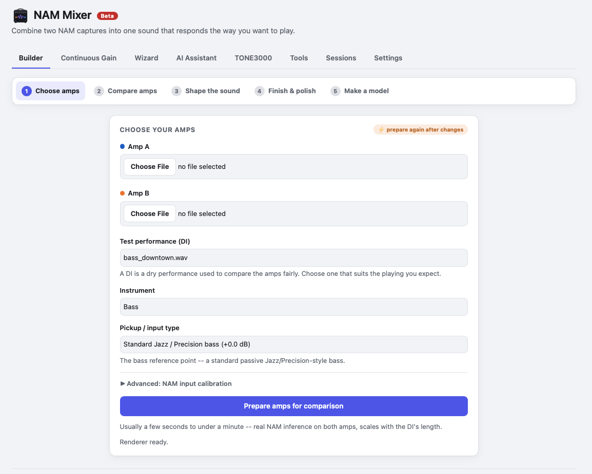

# NAM Mixer

**Make new [Neural Amp Modeler](https://github.com/sdatkinson/neural-amp-modeler) (NAM) models from the captures you already have.**

Blend two amp captures into one amp that changes character as you dig in, or
turn a pack of fixed-gain captures of one amp into a single model you sweep
with the ordinary Input knob. NAM Mixer lets you hear the result first, then
trains it into one standard `.nam` file you can load anywhere NAM runs. The
original captures aren't needed once it's trained.

**Status: Beta.** It runs on your own computer. Your captures and audio stay there unless you
choose to train on your own free Kaggle GPU account.



**[⬇ Download](#download)** · [What you can make](#what-you-can-make) ·
[How it works](#how-it-works) · [Good to know](#good-to-know) ·
[Troubleshooting](#troubleshooting) · [User guide](docs/user_guide.md) ·
[Developer guide](docs/developer_guide.md)

## What you can make

| | |
| --- | --- |
| 🎚️ **Dynamic Hybrid** | A clean amp that opens up into a crunch amp the harder you play. The change is driven by your picking, not a footswitch. |
| 🔀 **Parallel Blend** | Both amps together at one fixed ratio, like running two amps at once, whatever your playing level. |
| 🎨 **Character Blend** | One amp's tone with another amp's feel and drive, built from measured differences rather than a simple mix. |
| 🎛️ **Continuous Gain** | Several captures of *one* amp (Gain 1 … 10, say) collapsed into one model you sweep with the player's Input gain. |
| 🔈 **Cabinet** | Audition any cabinet IR, and optionally train it into the model as a full-rig capture. |
| 🧰 **NAM Tools** | Change a model's output volume or its descriptive metadata, add a cabinet, or inspect what's inside a `.nam`. Tools never overwrite your original file. |

Every trained model is checked against what you auditioned before you
download it, and you can compare the two by ear in the app.

## Download

The desktop app needs no Python or other setup:

| Platform | Download | Notes |
| --- | --- | --- |
| **macOS** (Apple Silicon) | [`NAM-Mixer-macOS-arm64.dmg`](https://github.com/daverage/nam-mixer/releases/latest/download/NAM-Mixer-macOS-arm64.dmg) | Not notarised: the first time, right-click the app and choose **Open** (or allow it in Privacy & Security). |
| **Windows** (x64) | [`setup.exe`](https://github.com/daverage/nam-mixer/releases/latest/download/NAM-Mixer-Windows-x64-setup.exe) · [`.msi`](https://github.com/daverage/nam-mixer/releases/latest/download/NAM-Mixer-Windows-x64.msi) | Installer or MSI package. |
| **Linux** (x64) | [`AppImage`](https://github.com/daverage/nam-mixer/releases/latest/download/NAM-Mixer-Linux-x64.AppImage) · [`.deb`](https://github.com/daverage/nam-mixer/releases/latest/download/NAM-Mixer-Linux-x64.deb) | Portable AppImage, or a Debian/Ubuntu package. |

Older versions and release notes are on the
[Releases page](https://github.com/daverage/nam-mixer/releases). Prefer to
run it from the source code? See [Run from source](#run-from-source).

## How it works

The Builder takes you through five steps, shown along the top of the app:

1. **Choose amps.** Pick an Amp A and an Amp B `.nam`, a test performance
   (a recorded DI riff is included), and your instrument and pickups. Then
   click **Prepare amps for comparison**. This is the only slow step.
2. **Compare amps.** Listen to Amp A, Amp B and the combined result.
   **Test gain** lets you play the clip harder or softer.
3. **Shape the sound.** Choose Dynamic Hybrid, Parallel Blend or Character
   Blend and adjust it. Changes are instant, and the levels of the two amps
   are matched for you.
4. **Finish & polish.** Optionally add a cabinet IR and set the output level.
5. **Make a model.** Create the training files, then train on a free Kaggle
   GPU (recommended) or on your own computer. When training finishes, the
   model is checked, and you can listen to it side by side with what you
   designed.

A **Tone Wizard** can suggest settings from a plain-English description
("glassy clean that breaks up into a British crunch"). It works on built-in
rules, or you can connect an AI model in **Settings**.

**Continuous Gain** has its own tab: add your captures, let it analyse and
choose which ones to train on, train, then test and export. Save your work at
any time in **Sessions**.

The [user guide](docs/user_guide.md) covers every step and control in detail.

## Good to know

**Does it merge the models' neural networks?**
No. Combining the weights of two separately trained networks doesn't produce
anything musical. NAM Mixer plays the same audio through each amp with the
real NAM engine, combines the *audio*, and trains a fresh model on that
result. [More](docs/user_guide.md#this-is-not-model-weight-merging)

**Will the trained model sound exactly like what I auditioned?**
It will be close, but it's a new model learning to imitate the result, so
always listen to it. The app reports how closely the model matches (for its
full and lite versions, and at quiet playing levels), and lets you compare
the two by ear.

**Do I need a powerful computer or a GPU?**
No. Auditioning and designing run on an ordinary computer. For training,
the free Kaggle GPU option needs only a Kaggle account with a verified phone
number ([setup](docs/user_guide.md#setting-up-kaggle-gpu-training)). Local
training works too, but it's slower without a GPU, and the first time it
needs a one-time download of about 1.4 GB.

**Where can I use the finished model?**
Anywhere that loads standard NAM models. Trained models are standard NAM A2
files. The optional experimental "Create both" cabinet export is different:
some players can't load it, so a standard head-only model always comes with
it.

**Will it line up my two amps' timing automatically?**
No. It never blindly phase-aligns amps. Different amps naturally delay
different frequencies by different amounts, and that's part of how they
sound. NAM Mixer only offers a correction when it finds the same fixed delay
on several different recordings, which is what real recording latency looks
like. Even then, correcting is your choice, and **Original** is the default.
[How the Timing check works](docs/user_guide.md#ab-timing-fixed-offsets-phase-response-and-why-nothing-is-auto-aligned)

**Is anything sent to the internet?**
Your captures and audio are never uploaded unless you choose Kaggle training,
which uses your own account. AI suggestions can run on a model on your own
computer. When it starts, NAM Mixer asks GitHub whether a newer version
exists. That's an anonymous check that sends nothing about you or your
files, and you can turn it off in **Settings → Advanced**. There's no
telemetry and no account.

**How do I update?**
When a new version is out, NAM Mixer tells you at startup and offers the
right installer for your computer. Choose **Not now** to carry on; you can
check again any time in **Settings → Updates**.

**Why does the result change when I pick a different pickup?**
The pickup (input profile) changes how hard the virtual guitar drives both
amps, so the amps are rendered again. It only affects the preview. Training
always uses the official NAM training signal.
[More](docs/user_guide.md#input-profile-vs-crossover-vs-nam-calibration--three-separate-knobs)

## Troubleshooting

- **macOS says the app can't be opened.** Releases aren't notarised yet.
  Right-click the app, choose **Open**, or allow it under **System Settings →
  Privacy & Security**.
- **"Train A2 (Kaggle)" is unavailable or has no GPU quota.** Kaggle only
  gives GPU time to accounts with a verified phone number
  ([kaggle.com/settings](https://www.kaggle.com/settings)). The **Settings →
  Getting started** checklist shows what's still missing.
- **The renderer is missing (running from source).** Use **Download
  nam_render automatically** in **Settings**, or run
  `scripts/download_nam_render.sh` (`.ps1` on Windows).
- **Windows: `nam_render.exe` flashes and closes.** That's expected. It's a
  helper the app calls, not the app itself. Start NAM Mixer with
  `scripts/run.ps1`.
- **The browser shows a 403 error on macOS (running from source).** macOS
  uses port 5000 for AirPlay. NAM Mixer uses port 5001 by default; to pick
  another, run `PORT=5003 scripts/run.sh`.
- **Loading a session doesn't play anything.** That's intentional: loading
  never renders by itself. Click **Prepare amps for comparison** to render
  the pair again.

## Run from source

Requires Python 3.10+. On macOS or Linux:

```bash
git clone https://github.com/daverage/nam-mixer.git && cd nam-mixer
python3 -m venv .venv && source .venv/bin/activate
python3 -m pip install -r requirements.txt
scripts/download_nam_render.sh     # prebuilt native NAM renderer
scripts/run.sh                     # opens http://127.0.0.1:5001/
```

For Windows, building the renderer yourself, local training, tests and the
code layout, see the [developer guide](docs/developer_guide.md).

## Documentation

| Document | What's in it |
| --- | --- |
| [User guide](docs/user_guide.md) | Every step, design mode, cabinet option, Continuous Gain, Sessions, NAM Tools and Settings in detail, plus how the blending works |
| [Developer guide](docs/developer_guide.md) | Running from source on every OS, building `nam_render`, tests, project layout, current status and limitations |
| [Continuous Gain](docs/continuous_gain_tab.md) | The design and the frozen configurations behind the Continuous Gain tab |
| [A/B timing](docs/alignment_diagnostic.md) | How the Timing check and the optional fixed-offset correction work, with measurements |
| [Release notes](RELEASE_NOTES.md) | Changes not yet in a published release |
| [Desktop app](desktop/README.md) · [Renderer](native/nam_render/README.md) · [DI clips](assets/di/README.md) | Building the desktop app, the native renderer, and credits for the bundled DI recordings |

## Status

**Beta.** NAM Mixer renders source models through real NAMCore inference and generates
trainable A2 bundles end to end. Listen to and validate each generated model
before relying on it in a performance or production setup. See
[current status and limitations](docs/developer_guide.md#current-status-and-limitations).

## License and attribution

NAM Mixer is copyright © 2026 Andrzej Marczewski and is released under the
[MIT License](LICENSE). The bundled genre/style DI recordings are credited and
documented separately in [`assets/di/README.md`](assets/di/README.md); their
upstream terms continue to apply. Neural Amp Modeler, NAMCore, and other
third-party components retain their own copyrights and licenses. The DI
clips come from the [NAMtoClo](https://github.com/Goaltoday/NamtoClo)
project; NAM Mixer shares no code with it.
