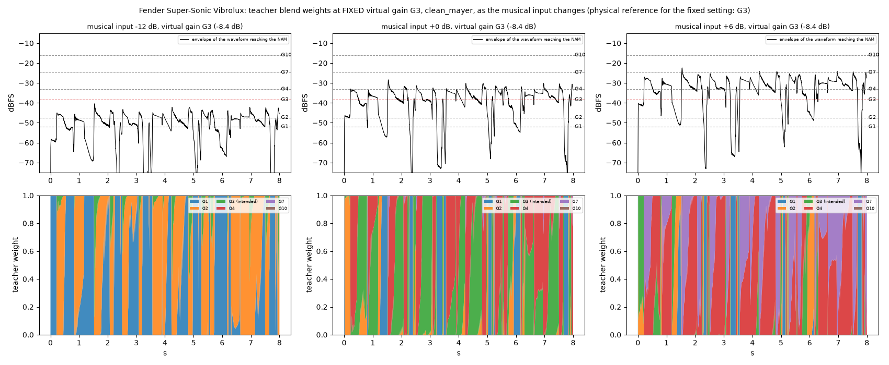
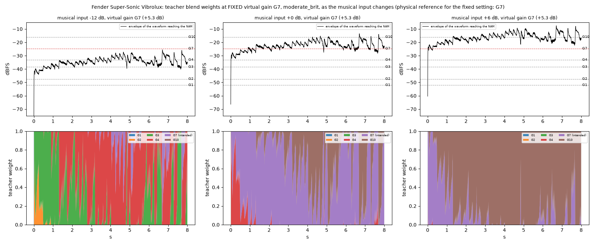
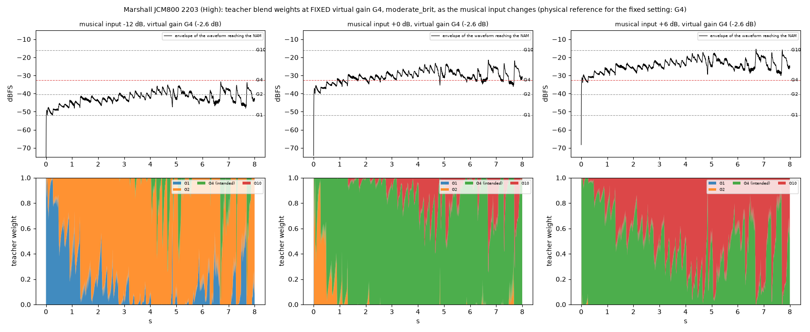
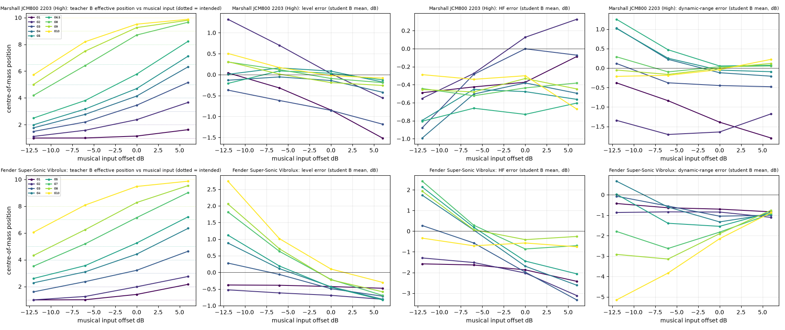
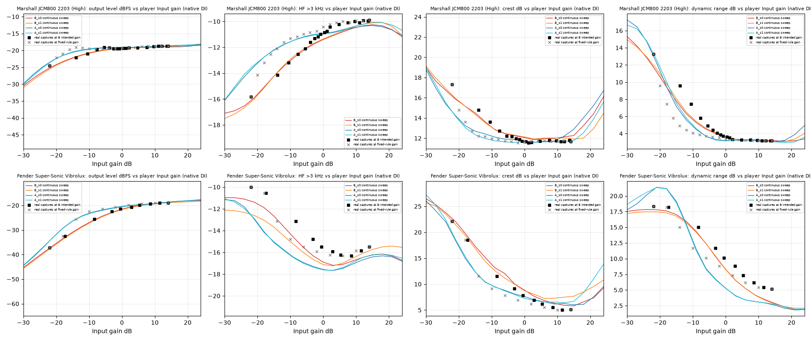

# Fixed-virtual-gain playability of the existing continuous-gain NAMs

**Scope.** Diagnostic of the EXISTING Phase 4E models; nothing was trained, no source captures or anchors changed, no Phase 4E artifact modified (new files only: `work/p4e/playability/`, `docs/phase4e/playability/`, `scripts/pl_*.py`). Human listening remains **pending**.

**Definitions.** *Virtual gain* = the ordinary NAM player's Input-gain setting. *Musical input* = the DI waveform before that control (picking, guitar volume, pickup). The NAM sees only their product (both are dB offsets on the same waveform). Playback path: musical DI -> Input gain -> ONE standard NAM -> Output gain.

## 1. Implementation review (verified from the code and data, not from comments)

Reviewed: `hybrid/multi_blend.py`, `hybrid/envelope.py`, `scripts/cg_build.py`, `scripts/p4e_build.py`, `scripts/single_nam_train.py`, `scripts/p4_model_sweep.py`, `scripts/p4e_common.py`, `scripts/p4e_real.py`, `scripts/p4e_eval.py`, `docs/CONTINUOUS_GAIN_PHASE4E_RESULTS.md`, `docs/phase4e/manifest_frozen.json`. Numerical checks: `scripts/pl_verify_path.py` -> `work/p4e/playability/path_verification.json`.

1. **Which signal drives the envelope.** `p4e_build.segment(x, chain)` computes `env = bounded_causal_envelope_db(x, SR)` on `x`, the very waveform written to `input.wav`, i.e. the waveform that reaches the NAM (DI after the level-offset augmentation). It is a causal, bounded-history (about 80 ms: 20 ms RMS, 5 ms attack average, 55 ms release window) envelope in dBFS. It is NOT computed from either amp's output. Verification: my analysis-only teacher renderer reproduces the frozen Phase 4E training targets for both configurations to 7.5e-09 (12 s compared, target RMS 0.048), so the signal path below is the builder's path.

2. **Effect of the player's Input gain on the envelope.** A gain of g dB shifts the envelope by exactly g dB (median shift and worst deviation from g over active samples: -12 dB: -12.000 dB / 3.0e-07 dB; -6 dB: -6.000 dB / 5.3e-07 dB; +6 dB: +6.000 dB / 2.6e-07 dB; +14 dB: +14.000 dB / 1.2e-07 dB). Input gain therefore moves the envelope up or down the anchor-level scale one-for-one.

3. **Effect of musical-input level at fixed Input gain.** Identical to item 2: a louder performance is the same dB offset on the same waveform (envelope difference between 'offset -6 then gain -8.4' and 'offset -14.4': 6.8e-07 dB). **By construction the teacher (and so any student trained on it) cannot distinguish virtual gain from musical intensity: the blend depends only on their sum.**

4. **How blend weights are applied.** `hybrid.multi_blend.chain_weights(env, levels_db)` gives, per sample, weight only to the two anchors whose level brackets the envelope, with a smoothstep across each gap (`smoothstep_curve`); the envelope is clipped to the outermost anchors. Capture k is rendered from `x * db(REF - L_k)` (`GainChain.input_scale_db`), i.e. the input rescaled so that when the envelope sits at the anchor level `L_k = anchor + REF` capture k is being driven at the -30 dBFS reference playing level; `multi_blend` then sums `w_k(t) * render_k(t)` in linear amplitude, per sample. The whole result is scaled by one fixed peak-ceiling constant `c` (1.0 for the Vibrolux, 0.581 for the JCM800).

5. **Does the evaluation reproduce the ordinary player's path?** Yes. `p4e_eval.py` feeds the model `DI * db(offset + T)` and divides the output by the single global constant `c`; the real reference gets `DI * db(offset)` only (Phase 4A alignment applied via `p4e_real.py`). Numerically `(DI*offset)*gain` and `DI*(offset+gain)` differ by 5.0e-07 (float precision). No per-gain or per-level output correction is applied. Caveats: the DIs are normalised guitar recordings whose median level is about -29 dBFS (reference level -30), and the official plugin's nominal Input range (about -20 dB minimum) is NOT applied here: the full intended mapping is used through NAMCore, including -22 dB.

**Consequence for the hypothesis.** Because the anchors sit at input levels, even at nominal playing the envelope of a real performance spans roughly 10 dB between its 10th and 90th percentiles (`clean_mayer` 11.2, `moderate_brit` 10.6, `bass_rollin` 5.0 dB block-level spread), so the teacher is a time-varying mixture of neighbouring captures around the selected virtual gain, and shifts systematically when the whole performance is louder or softer (section 4C).

## 2. Test design

**Models (existing exports, unchanged):** Phase 4E B seeds 0 and 1 (primary), Phase 4E A seeds 0 and 1, and v3 C3 (G1, G5, G10) for each amp; identities and hashes are in `docs/phase4e/manifest_frozen.json` and `docs/phase4e/models/`.

**Virtual-gain settings (intended mappings, dB):** B uses the response-distance mapping, A and v3 C3 the fixed rule `-22+4(N-1)`. JCM800 positions: G1 (-22.0), G2 (-10.5), G3, G4 (-2.6), G5, G6.5 (genuine half-step), G8, G9, G10 (+14.0); anchors are G1, G2, G4, G10, so G3, G5, G6.5, G8, G9 are omitted from training. Vibrolux positions: G1, G2, G3, G4, G5, G7, G8, G10; anchors are G1, G2, G3, G4, G7, G10 (-22.0, -17.4, -8.4, -3.1, +5.3, +14.0), so G5 and G8 are omitted.

**Musical input:** held-out DIs `moderate_brit`, `clean_mayer`, `bass_rollin` (first 15 s, never used in training or fitting), each at -12, -6, 0, +6 dB. At every case the Input gain is fixed at that position's intended value, the reference is the SAME physical capture, and no compensation is applied. Errors are model minus real (signed) unless stated, mean over the three DIs; seed pairs are shown as `mean (min..max)`.

**References:** the validated physical captures with Phase 4A alignment (no correction was needed for any position used). No interpolated references. **Within-recording soft/hard:** the DIs contain enough natural dynamics for a block-level comparison (250 ms blocks; 10th-90th percentile spread 5 to 11 dB), reported for output level only (section 4B); other measures are global per case. Files: `scripts/pl_common.py`, `pl_cases.py`, `pl_apparent.py`, `pl_report.py`; raw data `work/p4e/playability/cases_*.json`.

## 3. Outcome B: fixed-virtual-gain playability (primary test)

With the Input gain fixed at each position's intended value, the same held-out DI is played quieter or louder and compared with the SAME physical capture at the SAME musical level. A real amp also saturates and compresses more when played harder; the failure is the DIFFERENCE from the real amp at the same setting.

### Marshall JCM800 2203 (High)

**Native output level error (dB)** (model - real; columns = musical input offset in dB)

| Position | B -12 | B -6 | B 0 | B +6 | A -12 | A -6 | A 0 | A +6 | v3 C3 -12 | -6 | 0 | +6 |
|---|---:|---:|---:|---:|---:|---:|---:|---:|---:|---:|---:|---:|
| G1 | +0.0 (-0.2..0.3) | -0.3 (-0.6..-0.1) | -0.8 (-1.0..-0.7) | -1.5 (-1.6..-1.4) | +0.2 (+0.1..0.3) | +0.7 (+0.6..0.9) | +1.0 (+0.9..1.0) | +0.3 (+0.3..0.4) | -0.2 | -0.2 | -0.2 | -0.7 |
| G2 | +1.3 (+1.1..1.5) | +0.7 (+0.6..0.8) | +0.0 (-0.1..0.1) | -0.6 (-0.6..-0.5) | -3.1 (-3.3..-2.9) | -1.4 (-1.5..-1.3) | -0.5 (-0.5..-0.5) | -0.6 (-0.7..-0.6) | -3.8 | -2.5 | -1.7 | -1.4 |
| G3 | -0.4 (-0.5..-0.3) | -0.6 (-0.7..-0.5) | -0.9 (-0.9..-0.8) | -1.2 (-1.3..-1.1) | -3.7 (-3.8..-3.5) | -1.8 (-1.8..-1.8) | -1.2 (-1.2..-1.1) | -1.2 (-1.3..-1.2) | -4.7 | -3.0 | -2.1 | -1.8 |
| G4 | -0.1 (-0.2..-0.1) | -0.1 (-0.1..0.0) | -0.1 (-0.2..-0.1) | -0.4 (-0.5..-0.3) | -1.5 (-1.6..-1.5) | -0.3 (-0.4..-0.3) | -0.2 (-0.2..-0.1) | -0.4 (-0.5..-0.4) | -2.8 | -1.4 | -0.8 | -0.8 |
| G5 | +0.0 (-0.1..0.1) | +0.2 (+0.1..0.2) | +0.1 (+0.0..0.1) | -0.2 (-0.3..-0.1) | +0.1 (+0.1..0.1) | +0.4 (+0.4..0.5) | +0.2 (+0.2..0.3) | -0.2 (-0.2..-0.2) | -1.1 | -0.4 | -0.3 | -0.5 |
| G6.5 | -0.2 (-0.3..-0.1) | +0.1 (+0.0..0.1) | +0.0 (-0.0..0.1) | -0.1 (-0.2..-0.0) | +0.7 (+0.6..0.8) | +0.6 (+0.5..0.6) | +0.1 (+0.1..0.2) | -0.2 (-0.2..-0.1) | -0.1 | +0.1 | -0.1 | -0.3 |
| G8 | +0.3 (+0.2..0.4) | +0.1 (+0.0..0.2) | -0.1 (-0.2..0.0) | -0.2 (-0.2..-0.1) | +0.6 (+0.6..0.7) | +0.2 (+0.1..0.2) | -0.2 (-0.3..-0.1) | -0.3 (-0.5..-0.2) | +0.1 | -0.1 | -0.4 | -0.3 |
| G9 | +0.3 (+0.2..0.4) | +0.0 (-0.1..0.1) | -0.2 (-0.3..-0.1) | -0.3 (-0.3..-0.2) | +0.5 (+0.5..0.6) | -0.0 (-0.1..0.1) | -0.3 (-0.4..-0.1) | -0.4 (-0.6..-0.1) | +0.2 | -0.2 | -0.3 | -0.1 |
| G10 | +0.5 (+0.4..0.6) | +0.2 (+0.1..0.3) | -0.0 (-0.1..0.0) | -0.1 (-0.1..-0.1) | +0.6 (+0.6..0.7) | +0.2 (+0.1..0.3) | -0.0 (-0.2..0.1) | -0.1 (-0.3..0.1) | +0.4 | +0.1 | +0.1 | +0.6 |

**Spectral balance: mean absolute EQ-band error over six bands (dB)** (model - real; columns = musical input offset in dB)

| Position | B -12 | B -6 | B 0 | B +6 | A -12 | A -6 | A 0 | A +6 | v3 C3 -12 | -6 | 0 | +6 |
|---|---:|---:|---:|---:|---:|---:|---:|---:|---:|---:|---:|---:|
| G1 | 0.46 (+0.2..0.7) | 0.38 (+0.2..0.5) | 0.31 (+0.3..0.4) | 0.26 (+0.2..0.3) | 0.38 (+0.3..0.4) | 1.25 (+1.2..1.3) | 1.56 (+1.6..1.6) | 1.79 (+1.8..1.8) | 0.33 | 0.55 | 1.01 | 1.20 |
| G2 | 0.36 (+0.3..0.4) | 0.21 (+0.2..0.2) | 0.33 (+0.3..0.3) | 0.53 (+0.5..0.6) | 0.75 (+0.7..0.8) | 0.45 (+0.4..0.5) | 0.44 (+0.4..0.4) | 0.57 (+0.6..0.6) | 1.25 | 0.84 | 0.39 | 0.22 |
| G3 | 0.57 (+0.6..0.6) | 0.27 (+0.3..0.3) | 0.13 (+0.1..0.2) | 0.25 (+0.2..0.3) | 0.92 (+0.9..0.9) | 0.41 (+0.4..0.4) | 0.07 (+0.1..0.1) | 0.16 (+0.1..0.2) | 1.74 | 1.18 | 0.55 | 0.21 |
| G4 | 0.89 (+0.9..0.9) | 0.50 (+0.5..0.5) | 0.22 (+0.2..0.2) | 0.30 (+0.3..0.3) | 0.80 (+0.8..0.8) | 0.38 (+0.4..0.4) | 0.18 (+0.2..0.2) | 0.30 (+0.3..0.3) | 1.64 | 1.00 | 0.45 | 0.34 |
| G5 | 0.87 (+0.9..0.9) | 0.42 (+0.4..0.4) | 0.25 (+0.2..0.3) | 0.33 (+0.3..0.3) | 0.31 (+0.3..0.3) | 0.08 (+0.1..0.1) | 0.15 (+0.1..0.2) | 0.38 (+0.4..0.4) | 0.98 | 0.41 | 0.22 | 0.33 |
| G6.5 | 0.96 (+1.0..1.0) | 0.44 (+0.4..0.5) | 0.39 (+0.4..0.4) | 0.37 (+0.4..0.4) | 0.19 (+0.2..0.2) | 0.12 (+0.1..0.1) | 0.29 (+0.3..0.3) | 0.42 (+0.4..0.4) | 0.35 | 0.15 | 0.27 | 0.39 |
| G8 | 0.32 (+0.3..0.3) | 0.32 (+0.3..0.3) | 0.30 (+0.3..0.3) | 0.32 (+0.3..0.3) | 0.17 (+0.1..0.2) | 0.28 (+0.3..0.3) | 0.41 (+0.4..0.4) | 0.40 (+0.4..0.4) | 0.25 | 0.29 | 0.41 | 0.44 |
| G9 | 0.30 (+0.3..0.3) | 0.28 (+0.3..0.3) | 0.21 (+0.2..0.2) | 0.28 (+0.3..0.3) | 0.18 (+0.2..0.2) | 0.28 (+0.3..0.3) | 0.31 (+0.3..0.3) | 0.33 (+0.3..0.4) | 0.20 | 0.28 | 0.30 | 0.38 |
| G10 | 0.19 (+0.2..0.2) | 0.19 (+0.2..0.2) | 0.17 (+0.2..0.2) | 0.41 (+0.4..0.4) | 0.14 (+0.1..0.1) | 0.16 (+0.1..0.2) | 0.22 (+0.2..0.2) | 0.43 (+0.3..0.5) | 0.17 | 0.14 | 0.25 | 0.61 |

**HF >3 kHz energy error (dB; negative = darker than the real amp)** (model - real; columns = musical input offset in dB)

| Position | B -12 | B -6 | B 0 | B +6 | A -12 | A -6 | A 0 | A +6 | v3 C3 -12 | -6 | 0 | +6 |
|---|---:|---:|---:|---:|---:|---:|---:|---:|---:|---:|---:|---:|
| G1 | -0.5 (-0.8..-0.2) | -0.4 (-0.6..-0.3) | -0.4 (-0.4..-0.3) | -0.1 (-0.1..-0.1) | -0.0 (-0.1..0.0) | +1.3 (+1.2..1.3) | +2.2 (+2.1..2.2) | +2.1 (+2.0..2.1) | -0.5 | +0.0 | +0.9 | +1.3 |
| G2 | -0.6 (-0.6..-0.5) | -0.3 (-0.3..-0.3) | +0.1 (+0.1..0.2) | +0.3 (+0.3..0.4) | -0.3 (-0.4..-0.3) | +0.2 (+0.1..0.3) | +0.4 (+0.4..0.4) | +0.5 (+0.5..0.5) | -1.3 | -1.1 | -0.5 | +0.1 |
| G3 | -0.9 (-0.9..-0.9) | -0.3 (-0.3..-0.2) | -0.0 (-0.1..0.0) | -0.1 (-0.1..-0.0) | -0.7 (-0.8..-0.6) | -0.2 (-0.2..-0.1) | +0.0 (+0.0..0.0) | -0.1 (-0.1..-0.1) | -2.1 | -1.3 | -0.6 | -0.3 |
| G4 | -1.0 (-1.0..-1.0) | -0.5 (-0.6..-0.4) | -0.4 (-0.4..-0.4) | -0.5 (-0.5..-0.5) | -0.5 (-0.6..-0.5) | -0.2 (-0.2..-0.2) | -0.3 (-0.3..-0.3) | -0.5 (-0.6..-0.5) | -1.8 | -1.0 | -0.6 | -0.6 |
| G5 | -0.8 (-0.8..-0.8) | -0.5 (-0.5..-0.4) | -0.5 (-0.5..-0.5) | -0.6 (-0.6..-0.5) | +0.1 (+0.1..0.1) | +0.1 (+0.1..0.1) | -0.2 (-0.2..-0.2) | -0.7 (-0.7..-0.6) | -0.9 | -0.4 | -0.3 | -0.6 |
| G6.5 | -0.8 (-0.9..-0.7) | -0.7 (-0.7..-0.6) | -0.7 (-0.8..-0.7) | -0.6 (-0.6..-0.6) | +0.3 (+0.3..0.4) | -0.0 (-0.0..0.0) | -0.5 (-0.5..-0.5) | -0.7 (-0.7..-0.7) | -0.1 | -0.1 | -0.5 | -0.6 |
| G8 | -0.4 (-0.5..-0.4) | -0.5 (-0.6..-0.5) | -0.4 (-0.5..-0.4) | -0.4 (-0.5..-0.3) | +0.0 (-0.0..0.0) | -0.5 (-0.5..-0.4) | -0.7 (-0.7..-0.6) | -0.5 (-0.6..-0.5) | -0.1 | -0.4 | -0.5 | -0.5 |
| G9 | -0.5 (-0.5..-0.4) | -0.5 (-0.5..-0.4) | -0.3 (-0.4..-0.3) | -0.4 (-0.6..-0.3) | -0.1 (-0.1..-0.1) | -0.5 (-0.5..-0.5) | -0.5 (-0.5..-0.4) | -0.4 (-0.6..-0.3) | -0.1 | -0.4 | -0.4 | -0.5 |
| G10 | -0.3 (-0.3..-0.3) | -0.3 (-0.4..-0.3) | -0.3 (-0.4..-0.2) | -0.7 (-0.8..-0.5) | -0.0 (-0.0..0.0) | -0.3 (-0.3..-0.2) | -0.3 (-0.4..-0.3) | -0.7 (-0.9..-0.5) | +0.1 | -0.2 | -0.3 | -0.8 |

**Spectral tilt error (dB)** (model - real; columns = musical input offset in dB)

| Position | B -12 | B -6 | B 0 | B +6 | A -12 | A -6 | A 0 | A +6 | v3 C3 -12 | -6 | 0 | +6 |
|---|---:|---:|---:|---:|---:|---:|---:|---:|---:|---:|---:|---:|
| G1 | -0.7 (-1.0..-0.3) | -0.8 (-1.0..-0.6) | -0.7 (-0.7..-0.6) | -0.3 (-0.4..-0.3) | +0.3 (+0.2..0.4) | +0.2 (+0.0..0.4) | -0.1 (-0.2..-0.0) | +0.5 (+0.5..0.6) | -0.5 | -0.6 | -0.5 | -0.1 |
| G2 | -0.8 (-0.9..-0.8) | -0.5 (-0.5..-0.5) | -0.1 (-0.2..-0.1) | +0.3 (+0.2..0.3) | +0.8 (+0.7..0.9) | +0.2 (-0.0..0.3) | -0.1 (-0.1..-0.0) | +0.4 (+0.3..0.4) | +0.0 | -0.3 | -0.6 | -0.1 |
| G3 | -0.3 (-0.3..-0.3) | -0.2 (-0.3..-0.1) | +0.0 (-0.0..0.1) | -0.1 (-0.1..-0.1) | +0.7 (+0.5..0.9) | -0.2 (-0.2..-0.1) | -0.0 (-0.1..0.0) | -0.1 (-0.1..-0.1) | +0.1 | -0.6 | -0.6 | -0.3 |
| G4 | -0.4 (-0.5..-0.4) | -0.5 (-0.6..-0.4) | -0.3 (-0.4..-0.3) | -0.5 (-0.5..-0.5) | -0.1 (-0.2..-0.0) | -0.3 (-0.4..-0.3) | -0.3 (-0.3..-0.2) | -0.4 (-0.5..-0.4) | -0.5 | -1.0 | -0.6 | -0.5 |
| G5 | -0.4 (-0.5..-0.3) | -0.4 (-0.5..-0.3) | -0.4 (-0.4..-0.4) | -0.5 (-0.5..-0.4) | -0.1 (-0.1..-0.0) | +0.0 (-0.0..0.1) | -0.2 (-0.2..-0.2) | -0.5 (-0.5..-0.5) | -0.6 | -0.5 | -0.3 | -0.4 |
| G6.5 | -0.6 (-0.7..-0.5) | -0.5 (-0.5..-0.4) | -0.4 (-0.4..-0.3) | -0.1 (-0.2..-0.1) | +0.3 (+0.3..0.4) | +0.0 (-0.0..0.0) | -0.3 (-0.3..-0.3) | -0.2 (-0.2..-0.2) | -0.1 | -0.1 | -0.3 | -0.1 |
| G8 | -0.1 (-0.1..-0.0) | -0.1 (-0.1..-0.0) | -0.0 (-0.1..0.0) | +0.0 (-0.1..0.2) | +0.2 (+0.2..0.3) | -0.1 (-0.1..-0.1) | -0.1 (-0.1..-0.1) | +0.0 (-0.0..0.1) | +0.1 | -0.0 | +0.0 | +0.1 |
| G9 | -0.1 (-0.1..-0.1) | -0.1 (-0.1..-0.0) | -0.1 (-0.1..0.0) | -0.3 (-0.5..-0.1) | +0.1 (+0.1..0.1) | -0.2 (-0.2..-0.1) | -0.1 (-0.2..-0.1) | -0.2 (-0.3..-0.1) | +0.1 | -0.0 | -0.0 | -0.1 |
| G10 | +0.0 (-0.0..0.0) | -0.1 (-0.2..-0.1) | -0.2 (-0.3..-0.1) | -0.6 (-0.9..-0.4) | +0.0 (-0.0..0.0) | -0.2 (-0.2..-0.2) | -0.2 (-0.3..-0.2) | -0.4 (-0.5..-0.3) | +0.1 | -0.1 | -0.1 | -0.3 |

**Crest factor error (dB)** (model - real; columns = musical input offset in dB)

| Position | B -12 | B -6 | B 0 | B +6 | A -12 | A -6 | A 0 | A +6 | v3 C3 -12 | -6 | 0 | +6 |
|---|---:|---:|---:|---:|---:|---:|---:|---:|---:|---:|---:|---:|
| G1 | -1.1 (-1.2..-1.1) | -1.1 (-1.2..-1.0) | -1.1 (-1.2..-1.1) | -0.4 (-0.4..-0.3) | -0.7 (-1.1..-0.4) | -1.5 (-1.7..-1.4) | -2.7 (-2.7..-2.7) | -2.4 (-2.5..-2.3) | -1.2 | -1.0 | -1.5 | -1.2 |
| G2 | -0.8 (-0.8..-0.7) | -0.4 (-0.4..-0.4) | -0.4 (-0.5..-0.4) | -0.5 (-0.5..-0.5) | +1.8 (+1.7..1.9) | +0.3 (+0.2..0.3) | -0.5 (-0.6..-0.4) | -0.7 (-0.9..-0.4) | +1.9 | +1.4 | +0.8 | -0.1 |
| G3 | +0.7 (+0.6..0.7) | +0.5 (+0.4..0.5) | +0.2 (+0.2..0.2) | +0.2 (+0.2..0.2) | +2.2 (+2.1..2.3) | +0.9 (+0.8..1.0) | +0.2 (-0.1..0.4) | +0.0 (-0.1..0.2) | +3.1 | +2.1 | +1.0 | +0.5 |
| G4 | +1.1 (+1.0..1.2) | +0.3 (+0.3..0.3) | +0.3 (+0.3..0.3) | +0.3 (+0.3..0.3) | +1.4 (+1.4..1.4) | +0.2 (+0.1..0.3) | +0.0 (-0.2..0.2) | +0.2 (+0.0..0.3) | +2.6 | +1.4 | +0.6 | +0.3 |
| G5 | +1.2 (+1.1..1.2) | +0.4 (+0.4..0.5) | +0.4 (+0.4..0.5) | +0.3 (+0.3..0.3) | +0.5 (+0.4..0.6) | +0.1 (-0.1..0.3) | +0.0 (-0.1..0.2) | +0.1 (+0.1..0.1) | +1.8 | +0.7 | +0.4 | +0.1 |
| G6.5 | +0.8 (+0.8..0.8) | +0.5 (+0.5..0.5) | +0.3 (+0.3..0.4) | +0.3 (+0.2..0.4) | -0.0 (-0.3..0.2) | -0.1 (-0.2..0.1) | +0.1 (+0.1..0.1) | +0.0 (-0.0..0.1) | +0.5 | +0.3 | +0.2 | +0.5 |
| G8 | +0.6 (+0.5..0.6) | +0.2 (+0.2..0.2) | +0.2 (+0.2..0.3) | +0.4 (+0.2..0.7) | +0.1 (-0.0..0.2) | -0.0 (-0.0..-0.0) | -0.1 (-0.1..-0.1) | +0.2 (-0.0..0.5) | +0.5 | +0.0 | +0.4 | +0.6 |
| G9 | +0.4 (+0.4..0.5) | +0.2 (+0.2..0.3) | +0.4 (+0.4..0.5) | +1.0 (+0.4..1.7) | +0.1 (-0.0..0.1) | -0.1 (-0.2..-0.1) | +0.1 (-0.1..0.2) | +0.9 (+0.3..1.6) | +0.1 | +0.2 | +0.5 | +1.8 |
| G10 | +0.2 (+0.2..0.3) | +0.2 (+0.2..0.3) | +0.4 (+0.3..0.4) | +1.5 (+0.7..2.2) | -0.1 (-0.1..-0.1) | -0.1 (-0.1..-0.1) | +0.5 (+0.0..0.9) | +2.4 (+1.6..3.1) | +0.1 | +0.5 | +1.0 | +3.4 |

**Dynamic-range error (dB)** (model - real; columns = musical input offset in dB)

| Position | B -12 | B -6 | B 0 | B +6 | A -12 | A -6 | A 0 | A +6 | v3 C3 -12 | -6 | 0 | +6 |
|---|---:|---:|---:|---:|---:|---:|---:|---:|---:|---:|---:|---:|
| G1 | -0.4 (-0.7..-0.0) | -0.8 (-0.9..-0.7) | -1.4 (-1.5..-1.3) | -1.8 (-2.0..-1.6) | +0.3 (-0.0..0.6) | +1.3 (+1.1..1.5) | -0.0 (-0.2..0.1) | -2.2 (-2.4..-2.0) | -0.4 | -0.2 | -0.7 | -1.9 |
| G2 | -1.3 (-1.4..-1.2) | -1.7 (-1.9..-1.5) | -1.6 (-1.7..-1.6) | -1.2 (-1.2..-1.1) | +3.5 (+3.2..3.8) | +4.3 (+4.2..4.3) | +2.3 (+2.0..2.6) | +0.3 (+0.2..0.4) | +2.1 | +3.2 | +2.3 | +0.6 |
| G3 | +0.1 (-0.1..0.3) | -0.4 (-0.5..-0.3) | -0.4 (-0.5..-0.4) | -0.5 (-0.5..-0.5) | +6.7 (+6.6..6.8) | +5.0 (+4.7..5.2) | +1.8 (+1.7..1.9) | +0.2 (+0.2..0.2) | +5.3 | +4.6 | +2.2 | +0.7 |
| G4 | +1.0 (+0.9..1.2) | +0.2 (+0.2..0.3) | -0.1 (-0.2..-0.1) | -0.2 (-0.2..-0.2) | +6.6 (+6.4..6.7) | +3.0 (+2.8..3.3) | +0.8 (+0.8..0.9) | -0.2 (-0.2..-0.1) | +5.9 | +3.3 | +1.2 | +0.2 |
| G5 | +1.0 (+0.9..1.1) | +0.3 (+0.2..0.3) | -0.1 (-0.1..-0.0) | -0.1 (-0.1..-0.1) | +4.0 (+3.7..4.3) | +1.2 (+1.1..1.3) | -0.1 (-0.1..-0.0) | -0.2 (-0.2..-0.2) | +4.0 | +1.6 | +0.4 | -0.0 |
| G6.5 | +1.3 (+1.2..1.3) | +0.5 (+0.4..0.5) | +0.1 (+0.0..0.1) | +0.1 (+0.0..0.1) | +1.3 (+1.2..1.4) | -0.0 (-0.0..-0.0) | -0.2 (-0.2..-0.1) | +0.1 (+0.0..0.1) | +1.7 | +0.5 | -0.0 | +0.2 |
| G8 | +0.3 (+0.3..0.3) | -0.1 (-0.1..-0.1) | +0.0 (+0.0..0.1) | +0.1 (+0.0..0.1) | +0.0 (+0.0..0.1) | -0.2 (-0.3..-0.2) | +0.0 (+0.0..0.1) | +0.1 (+0.0..0.1) | +0.5 | -0.1 | +0.2 | +0.3 |
| G9 | -0.1 (-0.1..-0.0) | -0.2 (-0.2..-0.1) | -0.0 (-0.0..0.0) | +0.1 (+0.1..0.1) | -0.4 (-0.4..-0.4) | -0.2 (-0.2..-0.2) | +0.0 (-0.0..0.0) | +0.1 (+0.0..0.1) | -0.1 | -0.1 | +0.2 | +0.5 |
| G10 | -0.2 (-0.2..-0.2) | -0.2 (-0.2..-0.2) | -0.0 (-0.1..0.0) | +0.2 (+0.2..0.3) | -0.4 (-0.4..-0.4) | -0.2 (-0.2..-0.2) | -0.1 (-0.1..-0.1) | +0.3 (-0.0..0.7) | -0.4 | -0.1 | +0.2 | +1.2 |

**Transient rise (p95 of positive 5 ms envelope steps) error (dB)** (model - real; columns = musical input offset in dB)

| Position | B -12 | B -6 | B 0 | B +6 | A -12 | A -6 | A 0 | A +6 | v3 C3 -12 | -6 | 0 | +6 |
|---|---:|---:|---:|---:|---:|---:|---:|---:|---:|---:|---:|---:|
| G1 | -0.16 (-0.2..-0.1) | -0.07 (-0.2..0.1) | -0.23 (-0.4..-0.1) | -0.29 (-0.3..-0.2) | -0.10 (-0.8..0.6) | +0.20 (-0.1..0.5) | -0.65 (-0.7..-0.6) | -1.74 (-1.7..-1.7) | -0.58 | -0.03 | -0.29 | -1.12 |
| G2 | -0.24 (-0.4..-0.1) | -0.24 (-0.3..-0.2) | -0.36 (-0.5..-0.3) | -0.52 (-0.6..-0.5) | +0.77 (+0.3..1.2) | +0.47 (+0.4..0.5) | -0.06 (-0.1..-0.0) | -0.39 (-0.4..-0.3) | +0.50 | +0.67 | +0.50 | -0.00 |
| G3 | +0.42 (+0.3..0.6) | +0.32 (+0.3..0.4) | +0.04 (-0.0..0.1) | -0.09 (-0.1..-0.0) | +1.48 (+1.3..1.6) | +0.99 (+0.9..1.0) | +0.34 (+0.3..0.3) | +0.18 (+0.2..0.2) | +1.39 | +1.47 | +0.80 | +0.35 |
| G4 | +0.99 (+0.9..1.0) | +0.52 (+0.4..0.7) | +0.24 (+0.2..0.3) | +0.06 (+0.0..0.1) | +1.55 (+1.5..1.6) | +0.71 (+0.7..0.7) | +0.36 (+0.3..0.4) | +0.14 (+0.1..0.1) | +1.91 | +1.33 | +0.69 | +0.24 |
| G5 | +1.09 (+1.1..1.1) | +0.62 (+0.6..0.7) | +0.21 (+0.2..0.3) | +0.14 (+0.1..0.2) | +0.84 (+0.8..0.9) | +0.37 (+0.3..0.4) | +0.15 (+0.2..0.2) | +0.12 (+0.1..0.2) | +1.41 | +0.75 | +0.23 | +0.11 |
| G6.5 | +1.27 (+1.2..1.4) | +0.62 (+0.6..0.6) | +0.25 (+0.2..0.3) | +0.13 (+0.1..0.1) | +0.36 (+0.3..0.4) | +0.15 (+0.1..0.2) | +0.12 (+0.1..0.2) | +0.04 (+0.0..0.1) | +0.75 | +0.22 | +0.11 | +0.08 |
| G8 | +0.44 (+0.4..0.5) | +0.08 (+0.1..0.1) | +0.09 (+0.1..0.1) | +0.18 (+0.2..0.2) | +0.18 (+0.2..0.2) | +0.04 (-0.0..0.1) | -0.00 (-0.0..0.0) | +0.07 (+0.1..0.1) | +0.25 | +0.03 | +0.03 | +0.04 |
| G9 | +0.17 (+0.1..0.2) | +0.08 (+0.1..0.1) | -0.12 (-0.1..-0.1) | -0.01 (-0.2..0.1) | -0.00 (-0.0..0.0) | -0.01 (-0.0..0.0) | -0.16 (-0.2..-0.2) | -0.07 (-0.2..0.0) | +0.01 | -0.01 | -0.17 | -0.10 |
| G10 | +0.06 (+0.1..0.1) | +0.05 (+0.0..0.1) | +0.01 (-0.0..0.0) | +0.21 (-0.0..0.4) | -0.10 (-0.1..-0.1) | -0.03 (-0.0..-0.0) | -0.01 (-0.1..0.1) | +0.31 (+0.2..0.4) | -0.13 | -0.00 | -0.03 | +0.30 |

**Output-level change for +18 dB more musical input (level at +6 minus level at -12; real amp is the target):**

| Position | real | teacher B | student B s0 | B s1 | A s0 | A s1 | v3 C3 |
|---|---:|---:|---:|---:|---:|---:|---:|
| G1 | 13.0 | 11.4 | 11.3 | 11.7 | 13.0 | 13.4 | 12.5 |
| G2 | 7.7 | 5.5 | 5.7 | 6.0 | 9.9 | 10.4 | 10.1 |
| G3 | 4.7 | 4.0 | 3.8 | 3.9 | 6.9 | 7.3 | 7.5 |
| G4 | 3.2 | 3.1 | 3.0 | 3.0 | 4.3 | 4.5 | 5.2 |
| G5 | 2.6 | 2.6 | 2.5 | 2.4 | 2.3 | 2.4 | 3.2 |
| G6.5 | 1.7 | 1.9 | 1.8 | 1.8 | 0.8 | 0.8 | 1.5 |
| G8 | 1.3 | 0.9 | 0.8 | 0.8 | 0.3 | 0.5 | 0.9 |
| G9 | 1.3 | 0.8 | 0.6 | 0.7 | 0.2 | 0.6 | 1.0 |
| G10 | 1.2 | 0.7 | 0.6 | 0.7 | 0.3 | 0.7 | 1.4 |

**Saturation and harmonics from the existing sine-probe path (110/440 Hz sine at the four musical-input levels; THD error in dB, floor -80 dB; B mean of seeds; no music-derived THD is claimed):**

| Position | THD err @-42 | @-30 | @-18 | @-6 | H2/H3 err @-18 | IO slope err (-54..-30 / -30..0) | A THD mean | v3 C3 THD mean |
|---|---:|---:|---:|---:|---:|---:|---:|---:|
| G1 | +9.0 | +2.1 | +0.3 | +1.4 | 2.3 | -1.0 / -6.0 | +7.8 | +5.3 |
| G2 | +1.9 | +0.7 | +1.0 | +0.0 | 1.8 | -1.8 / -2.5 | +0.4 | -1.5 |
| G3 | -3.9 | +0.5 | -0.6 | -0.0 | 4.5 | +0.2 / -0.8 | -2.9 | -4.3 |
| G4 | -6.8 | -0.2 | -0.4 | -0.1 | 2.7 | +1.8 / -1.3 | -3.3 | -3.9 |
| G5 | -7.1 | -0.4 | +0.0 | -0.8 | 3.3 | +2.0 / -0.0 | -1.1 | -2.0 |
| G6.5 | -7.5 | -0.2 | -0.0 | -2.5 | 6.5 | +2.5 / +2.2 | -0.1 | -0.6 |
| G8 | -0.9 | -0.5 | -1.0 | -7.4 | 5.2 | -0.9 / +10.1 | -0.6 | -0.3 |
| G9 | -0.3 | -0.1 | -1.4 | -9.0 | 1.8 | -1.7 / +9.8 | -1.0 | -0.1 |
| G10 | -0.2 | -0.3 | -2.4 | -10.4 | 3.8 | -1.9 / +12.6 | -1.3 | -0.5 |

**Within-recording soft versus hard playing (native DI dynamics, output level only):** the model-minus-real block-level error in the softest, middle and loudest third of each recording's blocks (250 ms), and the error slope in dB per dB of musical-input block level (0 = the model follows the real amp's level response within the performance). Mean of three DIs.

| Position | teacher B slope [soft/mid/hard] | student B s0 | A s0 | v3 C3 |
|---|---|---|---|---|
| G1 | -0.08 [-0.1/-0.3/-0.8] | -0.11 [+0.1/-0.4/-0.9] | +0.01 [+1.1/+1.4/+0.9] | -0.04 [+0.1/-0.0/-0.3] |
| G2 | -0.12 [+0.6/-0.1/-0.3] | -0.13 [+0.8/+0.1/-0.2] | +0.15 [-1.3/-0.4/-0.5] | +0.19 [-2.7/-1.6/-1.4] |
| G3 | -0.02 [-0.7/-0.8/-0.9] | -0.04 [-0.5/-0.8/-0.9] | +0.12 [-1.9/-1.1/-1.2] | +0.21 [-3.1/-1.9/-1.8] |
| G4 | -0.01 [-0.0/-0.1/-0.2] | -0.03 [+0.1/-0.1/-0.2] | +0.03 [-0.4/-0.1/-0.3] | +0.09 [-1.3/-0.7/-0.8] |
| G5 | -0.02 [+0.2/+0.2/+0.0] | -0.03 [+0.3/+0.2/-0.0] | -0.04 [+0.3/+0.2/+0.0] | +0.01 [-0.3/-0.2/-0.3] |
| G6.5 | -0.03 [+0.2/+0.1/-0.1] | -0.03 [+0.2/+0.1/-0.0] | -0.07 [+0.4/+0.0/-0.1] | -0.04 [+0.0/-0.2/-0.3] |
| G8 | -0.02 [+0.1/-0.1/-0.1] | -0.03 [+0.1/-0.1/-0.1] | -0.05 [-0.0/-0.4/-0.4] | -0.03 [-0.2/-0.5/-0.4] |
| G9 | -0.02 [-0.0/-0.2/-0.1] | -0.03 [+0.0/-0.2/-0.2] | -0.05 [-0.2/-0.5/-0.5] | -0.01 [-0.3/-0.4/-0.3] |
| G10 | -0.02 [+0.2/+0.0/+0.0] | -0.04 [+0.2/-0.0/-0.1] | -0.06 [+0.0/-0.3/-0.4] | -0.00 [+0.1/+0.0/+0.1] |

### Fender Super-Sonic Vibrolux

**Native output level error (dB)** (model - real; columns = musical input offset in dB)

| Position | B -12 | B -6 | B 0 | B +6 | A -12 | A -6 | A 0 | A +6 | v3 C3 -12 | -6 | 0 | +6 |
|---|---:|---:|---:|---:|---:|---:|---:|---:|---:|---:|---:|---:|
| G1 | -0.4 (-0.6..-0.2) | -0.4 (-0.6..-0.2) | -0.4 (-0.6..-0.2) | -0.5 (-0.6..-0.3) | +0.3 (+0.3..0.4) | +1.0 (+0.8..1.1) | +2.7 (+2.7..2.7) | +4.2 (+4.1..4.2) | -0.3 | -0.2 | +0.6 | +2.0 |
| G2 | -0.5 (-0.7..-0.3) | -0.6 (-0.8..-0.4) | -0.7 (-0.9..-0.5) | -0.8 (-1.0..-0.7) | -0.1 (-0.1..-0.0) | +1.2 (+1.1..1.3) | +3.1 (+3.1..3.2) | +3.1 (+3.0..3.1) | -1.0 | -0.6 | +0.7 | +1.8 |
| G3 | +0.3 (+0.1..0.5) | -0.1 (-0.2..0.1) | -0.5 (-0.6..-0.3) | -0.7 (-0.8..-0.6) | -3.4 (-3.5..-3.2) | -1.3 (-1.3..-1.2) | -0.0 (-0.1..0.0) | -0.6 (-0.7..-0.5) | -4.8 | -3.6 | -1.9 | -0.9 |
| G4 | +0.9 (+0.7..1.0) | +0.1 (-0.0..0.3) | -0.4 (-0.5..-0.3) | -0.8 (-0.9..-0.7) | -2.4 (-2.4..-2.4) | -0.6 (-0.7..-0.6) | -0.8 (-0.8..-0.7) | -1.6 (-1.7..-1.5) | -4.5 | -2.9 | -1.5 | -1.4 |
| G5 | +1.1 (+1.0..1.3) | +0.2 (+0.1..0.3) | -0.4 (-0.5..-0.3) | -0.8 (-0.9..-0.7) | +0.8 (+0.7..0.8) | +0.8 (+0.7..0.8) | -0.6 (-0.7..-0.5) | -1.3 (-1.3..-1.2) | -1.6 | -0.6 | -0.5 | -1.5 |
| G7 | +1.8 (+1.7..1.9) | +0.6 (+0.5..0.7) | -0.2 (-0.3..-0.1) | -0.7 (-0.8..-0.6) | +3.5 (+3.4..3.6) | +1.1 (+1.0..1.2) | -0.3 (-0.3..-0.2) | -1.1 (-1.2..-1.0) | +2.7 | +1.2 | -0.7 | -1.3 |
| G8 | +2.1 (+2.0..2.2) | +0.7 (+0.6..0.8) | -0.2 (-0.3..-0.1) | -0.6 (-0.7..-0.4) | +3.2 (+3.1..3.3) | +1.0 (+0.9..1.1) | -0.4 (-0.5..-0.4) | -0.9 (-0.9..-0.8) | +3.3 | +0.7 | -0.8 | -0.9 |
| G10 | +2.7 (+2.6..2.8) | +1.0 (+0.9..1.1) | +0.1 (-0.0..0.2) | -0.3 (-0.5..-0.1) | +3.5 (+3.5..3.6) | +1.1 (+1.0..1.2) | +0.2 (+0.1..0.2) | -0.0 (-0.0..-0.0) | +3.1 | +0.8 | +0.1 | -0.1 |

**Spectral balance: mean absolute EQ-band error over six bands (dB)** (model - real; columns = musical input offset in dB)

| Position | B -12 | B -6 | B 0 | B +6 | A -12 | A -6 | A 0 | A +6 | v3 C3 -12 | -6 | 0 | +6 |
|---|---:|---:|---:|---:|---:|---:|---:|---:|---:|---:|---:|---:|
| G1 | 1.05 (+0.7..1.4) | 1.09 (+0.7..1.5) | 1.30 (+0.8..1.8) | 1.60 (+1.2..2.0) | 0.78 (+0.8..0.8) | 0.85 (+0.7..1.0) | 1.40 (+1.4..1.4) | 2.66 (+2.6..2.7) | 0.78 | 1.01 | 1.67 | 2.48 |
| G2 | 0.78 (+0.4..1.2) | 0.98 (+0.5..1.4) | 1.37 (+1.0..1.8) | 1.84 (+1.6..2.1) | 0.61 (+0.5..0.7) | 0.85 (+0.7..1.0) | 2.10 (+2.0..2.2) | 2.94 (+2.9..3.0) | 0.64 | 1.12 | 2.09 | 2.60 |
| G3 | 0.47 (+0.3..0.7) | 0.59 (+0.4..0.8) | 1.16 (+1.0..1.3) | 1.74 (+1.7..1.8) | 0.79 (+0.8..0.8) | 0.59 (+0.6..0.6) | 1.29 (+1.2..1.3) | 1.72 (+1.7..1.7) | 0.48 | 0.58 | 1.00 | 1.37 |
| G4 | 1.07 (+0.7..1.4) | 0.47 (+0.5..0.5) | 0.89 (+0.8..0.9) | 1.27 (+1.3..1.3) | 1.55 (+1.5..1.6) | 0.40 (+0.4..0.4) | 0.73 (+0.7..0.7) | 1.20 (+1.2..1.2) | 1.29 | 0.59 | 0.48 | 0.87 |
| G5 | 1.22 (+1.0..1.5) | 0.53 (+0.5..0.6) | 0.73 (+0.7..0.7) | 0.98 (+0.9..1.0) | 1.19 (+1.1..1.3) | 0.46 (+0.4..0.5) | 0.75 (+0.7..0.8) | 1.16 (+1.1..1.2) | 1.24 | 0.35 | 0.42 | 0.80 |
| G7 | 1.02 (+0.9..1.1) | 0.51 (+0.5..0.5) | 0.40 (+0.4..0.4) | 0.36 (+0.3..0.4) | 0.88 (+0.8..0.9) | 0.59 (+0.6..0.6) | 0.56 (+0.5..0.6) | 0.74 (+0.7..0.8) | 1.04 | 0.51 | 0.67 | 0.65 |
| G8 | 0.86 (+0.8..0.9) | 0.44 (+0.4..0.5) | 0.34 (+0.3..0.4) | 0.27 (+0.2..0.3) | 0.82 (+0.8..0.8) | 0.44 (+0.4..0.5) | 0.55 (+0.5..0.6) | 0.54 (+0.5..0.6) | 1.10 | 0.71 | 0.61 | 0.44 |
| G10 | 0.64 (+0.6..0.6) | 0.48 (+0.5..0.5) | 0.33 (+0.2..0.4) | 0.49 (+0.3..0.7) | 0.80 (+0.8..0.8) | 0.56 (+0.6..0.6) | 0.43 (+0.4..0.5) | 0.65 (+0.6..0.7) | 0.80 | 0.40 | 0.20 | 0.42 |

**HF >3 kHz energy error (dB; negative = darker than the real amp)** (model - real; columns = musical input offset in dB)

| Position | B -12 | B -6 | B 0 | B +6 | A -12 | A -6 | A 0 | A +6 | v3 C3 -12 | -6 | 0 | +6 |
|---|---:|---:|---:|---:|---:|---:|---:|---:|---:|---:|---:|---:|
| G1 | -1.6 (-2.1..-1.1) | -1.6 (-2.2..-1.0) | -1.9 (-2.5..-1.3) | -2.4 (-3.0..-1.9) | -1.1 (-1.3..-0.9) | -1.3 (-1.3..-1.3) | -2.5 (-2.5..-2.5) | -4.3 (-4.3..-4.3) | -1.0 | -1.5 | -2.5 | -4.0 |
| G2 | -1.3 (-1.9..-0.7) | -1.5 (-2.1..-0.9) | -2.0 (-2.6..-1.5) | -3.1 (-3.5..-2.7) | -0.9 (-0.9..-0.8) | -1.7 (-1.7..-1.6) | -3.6 (-3.6..-3.5) | -4.7 (-4.7..-4.6) | -1.0 | -1.7 | -3.3 | -4.2 |
| G3 | +0.3 (-0.3..0.9) | -0.6 (-1.1..-0.1) | -2.0 (-2.3..-1.7) | -3.3 (-3.5..-3.2) | +0.9 (+0.8..1.0) | -0.6 (-0.6..-0.5) | -2.2 (-2.2..-2.1) | -3.4 (-3.4..-3.4) | +0.7 | -0.4 | -1.8 | -2.6 |
| G4 | +1.7 (+1.2..2.3) | +0.1 (-0.3..0.4) | -1.7 (-1.9..-1.5) | -2.6 (-2.6..-2.6) | +2.4 (+2.3..2.4) | +0.2 (+0.1..0.2) | -1.5 (-1.5..-1.4) | -2.6 (-2.7..-2.6) | +2.4 | +0.5 | -0.9 | -1.9 |
| G5 | +2.1 (+1.7..2.6) | +0.2 (-0.1..0.4) | -1.4 (-1.6..-1.3) | -2.1 (-2.1..-2.0) | +1.9 (+1.9..2.0) | +0.0 (+0.0..0.1) | -1.5 (-1.5..-1.5) | -2.6 (-2.6..-2.5) | +2.2 | +0.5 | -0.7 | -1.8 |
| G7 | +2.4 (+2.2..2.7) | +0.3 (+0.2..0.4) | -0.9 (-0.9..-0.8) | -0.7 (-0.9..-0.5) | +1.8 (+1.7..1.8) | -0.0 (-0.1..0.0) | -1.4 (-1.4..-1.4) | -1.5 (-1.5..-1.4) | +2.4 | +0.7 | -0.8 | -0.9 |
| G8 | +1.9 (+1.8..2.1) | +0.1 (+0.0..0.1) | -0.4 (-0.5..-0.3) | -0.3 (-0.5..-0.0) | +1.4 (+1.3..1.4) | -0.3 (-0.3..-0.3) | -1.1 (-1.2..-1.1) | -0.8 (-0.9..-0.7) | +2.1 | +0.4 | -0.6 | -0.2 |
| G10 | -0.3 (-0.4..-0.3) | -0.7 (-0.8..-0.6) | -0.6 (-0.8..-0.3) | -0.8 (-1.2..-0.3) | -0.8 (-0.8..-0.8) | -1.1 (-1.1..-1.0) | -0.9 (-1.0..-0.8) | -1.2 (-1.3..-1.1) | -0.1 | -0.5 | -0.2 | -0.6 |

**Spectral tilt error (dB)** (model - real; columns = musical input offset in dB)

| Position | B -12 | B -6 | B 0 | B +6 | A -12 | A -6 | A 0 | A +6 | v3 C3 -12 | -6 | 0 | +6 |
|---|---:|---:|---:|---:|---:|---:|---:|---:|---:|---:|---:|---:|
| G1 | -1.7 (-2.1..-1.3) | -1.8 (-2.3..-1.3) | -2.1 (-2.7..-1.5) | -2.6 (-3.1..-2.1) | -0.5 (-0.9..-0.1) | -0.7 (-0.8..-0.5) | -2.3 (-2.3..-2.2) | -5.7 (-5.7..-5.6) | -1.3 | -1.7 | -2.9 | -4.9 |
| G2 | -1.5 (-2.0..-1.0) | -1.8 (-2.4..-1.2) | -2.4 (-2.9..-1.8) | -3.2 (-3.6..-2.9) | -0.3 (-0.5..-0.0) | -1.2 (-1.2..-1.1) | -4.5 (-4.5..-4.5) | -6.2 (-6.3..-6.2) | -1.3 | -2.1 | -4.1 | -5.5 |
| G3 | +0.4 (-0.2..1.0) | -0.5 (-1.0..-0.1) | -1.8 (-2.1..-1.5) | -3.0 (-3.2..-2.8) | +1.9 (+1.9..2.0) | +0.0 (-0.0..0.0) | -2.3 (-2.4..-2.3) | -2.9 (-2.9..-2.9) | +0.9 | -0.2 | -1.5 | -2.5 |
| G4 | +1.9 (+1.4..2.4) | +0.2 (-0.1..0.5) | -1.4 (-1.6..-1.2) | -2.4 (-2.6..-2.3) | +3.5 (+3.4..3.5) | +0.4 (+0.4..0.5) | -1.0 (-1.0..-1.0) | -1.9 (-2.0..-1.9) | +2.8 | +1.2 | -0.4 | -1.4 |
| G5 | +2.4 (+2.0..2.8) | +0.5 (+0.2..0.7) | -0.9 (-1.1..-0.8) | -1.6 (-1.7..-1.6) | +2.3 (+2.3..2.3) | +0.0 (-0.0..0.1) | -0.7 (-0.7..-0.6) | -1.8 (-1.9..-1.8) | +2.7 | +0.8 | -0.3 | -0.8 |
| G7 | +2.2 (+2.0..2.5) | +0.6 (+0.4..0.7) | -0.3 (-0.3..-0.2) | -0.2 (-0.2..-0.1) | +1.0 (+0.9..1.0) | +0.3 (+0.3..0.4) | -0.6 (-0.6..-0.5) | -0.6 (-0.6..-0.6) | +1.5 | +0.8 | +0.5 | -0.1 |
| G8 | +1.6 (+1.4..1.8) | +0.4 (+0.3..0.6) | +0.2 (+0.2..0.2) | +0.2 (+0.1..0.3) | +0.8 (+0.8..0.9) | +0.2 (+0.1..0.2) | -0.2 (-0.2..-0.2) | -0.2 (-0.3..-0.1) | +1.2 | +1.2 | +0.5 | +0.3 |
| G10 | -0.9 (-1.0..-0.7) | -0.4 (-0.5..-0.4) | -0.3 (-0.3..-0.2) | -0.6 (-0.8..-0.5) | -1.3 (-1.3..-1.2) | -0.5 (-0.5..-0.5) | -0.5 (-0.5..-0.4) | -0.9 (-1.1..-0.8) | -0.2 | +0.0 | +0.0 | -0.3 |

**Crest factor error (dB)** (model - real; columns = musical input offset in dB)

| Position | B -12 | B -6 | B 0 | B +6 | A -12 | A -6 | A 0 | A +6 | v3 C3 -12 | -6 | 0 | +6 |
|---|---:|---:|---:|---:|---:|---:|---:|---:|---:|---:|---:|---:|
| G1 | -0.9 (-1.3..-0.5) | -0.6 (-0.8..-0.3) | +0.3 (+0.1..0.6) | +0.2 (-0.0..0.4) | +0.2 (-0.4..0.9) | -0.6 (-1.2..-0.0) | -2.3 (-2.5..-2.1) | -4.5 (-4.6..-4.5) | -0.6 | -0.6 | -1.0 | -2.6 |
| G2 | -0.7 (-1.1..-0.4) | +0.5 (+0.4..0.7) | +0.5 (+0.4..0.7) | +0.6 (+0.3..1.0) | -0.0 (-0.6..0.6) | -0.5 (-0.7..-0.3) | -3.3 (-3.5..-3.1) | -3.4 (-3.5..-3.4) | -0.7 | +0.2 | -1.6 | -1.9 |
| G3 | +0.7 (+0.4..1.0) | +0.7 (+0.4..0.9) | +1.1 (+0.8..1.4) | +1.4 (+1.4..1.4) | +3.2 (+2.8..3.6) | +1.2 (+1.1..1.4) | +0.1 (+0.1..0.2) | +0.9 (+0.9..0.9) | +3.9 | +2.9 | +2.1 | +1.1 |
| G4 | +0.4 (+0.1..0.6) | +0.3 (-0.0..0.6) | +0.9 (+0.8..0.9) | +0.8 (+0.6..1.0) | +3.0 (+2.8..3.2) | +0.5 (+0.5..0.6) | +0.5 (+0.5..0.6) | +1.2 (+1.1..1.2) | +4.3 | +2.5 | +1.4 | +1.0 |
| G5 | +0.1 (-0.3..0.5) | +0.6 (+0.1..1.1) | +1.2 (+1.1..1.2) | +1.4 (+1.2..1.5) | +0.1 (-0.1..0.3) | -0.8 (-0.9..-0.8) | +0.9 (+0.9..1.0) | +1.7 (+1.5..1.8) | +1.8 | +0.7 | +0.8 | +1.7 |
| G7 | -0.7 (-1.2..-0.2) | +0.4 (+0.4..0.4) | +1.0 (+0.9..1.2) | +1.7 (+1.0..2.4) | -2.9 (-3.0..-2.9) | -0.4 (-0.4..-0.3) | +0.9 (+0.8..1.0) | +1.4 (+1.3..1.6) | -2.1 | -0.6 | +1.3 | +1.9 |
| G8 | -0.7 (-0.7..-0.6) | +0.4 (+0.2..0.6) | +1.4 (+0.9..1.8) | +2.2 (+1.3..3.1) | -2.1 (-2.2..-2.0) | -0.1 (-0.3..0.1) | +1.1 (+1.1..1.1) | +1.8 (+1.7..1.9) | -2.3 | -0.0 | +1.7 | +2.2 |
| G10 | -1.3 (-1.5..-1.2) | +0.2 (-0.3..0.6) | +1.6 (+0.7..2.4) | +3.8 (+2.9..4.8) | -2.4 (-2.5..-2.2) | -0.3 (-0.4..-0.1) | +1.1 (+1.0..1.2) | +4.2 (+2.7..5.7) | -2.0 | +0.2 | +1.6 | +2.7 |

**Dynamic-range error (dB)** (model - real; columns = musical input offset in dB)

| Position | B -12 | B -6 | B 0 | B +6 | A -12 | A -6 | A 0 | A +6 | v3 C3 -12 | -6 | 0 | +6 |
|---|---:|---:|---:|---:|---:|---:|---:|---:|---:|---:|---:|---:|
| G1 | -0.4 (-0.7..-0.2) | -0.6 (-0.8..-0.5) | -0.7 (-0.9..-0.5) | -0.8 (-1.0..-0.7) | -0.1 (-0.6..0.3) | +0.7 (+0.2..1.2) | +2.8 (+2.7..2.8) | +1.9 (+1.8..2.0) | +1.0 | -0.5 | -0.0 | +0.8 |
| G2 | -0.9 (-1.0..-0.7) | -0.8 (-1.0..-0.7) | -0.8 (-1.0..-0.7) | -1.1 (-1.2..-1.0) | -0.1 (-0.5..0.4) | +1.9 (+1.7..2.1) | +2.9 (+2.9..2.9) | -1.3 (-1.3..-1.2) | -0.5 | -0.5 | +0.7 | +0.1 |
| G3 | -0.1 (-0.2..0.1) | -0.6 (-0.7..-0.4) | -1.0 (-1.1..-1.0) | -1.0 (-1.0..-1.0) | +1.9 (+1.5..2.3) | +4.2 (+4.2..4.2) | +2.9 (+2.8..3.0) | -0.6 (-0.8..-0.5) | +0.1 | +1.4 | +3.2 | +2.1 |
| G4 | +0.7 (+0.5..0.8) | -0.6 (-0.7..-0.5) | -1.3 (-1.4..-1.3) | -0.9 (-1.0..-0.9) | +4.9 (+4.8..4.9) | +5.0 (+4.8..5.1) | +1.0 (+0.9..1.1) | -0.4 (-0.5..-0.3) | +2.1 | +3.8 | +3.3 | +1.3 |
| G5 | +0.0 (-0.1..0.1) | -1.4 (-1.4..-1.4) | -1.5 (-1.6..-1.5) | -0.9 (-0.9..-0.9) | +5.1 (+5.1..5.1) | +1.3 (+1.2..1.4) | -1.8 (-1.9..-1.7) | -1.0 (-1.1..-1.0) | +2.9 | +2.7 | +0.8 | -0.7 |
| G7 | -1.8 (-1.8..-1.8) | -2.6 (-2.6..-2.6) | -1.8 (-1.8..-1.8) | -0.9 (-1.0..-0.9) | -1.9 (-2.0..-1.8) | -4.2 (-4.3..-4.2) | -3.0 (-3.0..-2.9) | -1.3 (-1.3..-1.2) | +0.3 | -2.6 | -2.6 | -1.0 |
| G8 | -2.9 (-3.0..-2.9) | -3.1 (-3.2..-3.1) | -1.9 (-1.9..-1.9) | -0.8 (-0.8..-0.7) | -5.2 (-5.2..-5.1) | -4.6 (-4.6..-4.6) | -2.8 (-2.8..-2.8) | -0.7 (-0.7..-0.7) | -2.6 | -4.3 | -2.5 | -0.5 |
| G10 | -5.2 (-5.2..-5.1) | -3.8 (-3.8..-3.8) | -2.2 (-2.2..-2.1) | -0.9 (-0.9..-0.9) | -7.8 (-7.8..-7.8) | -5.1 (-5.1..-5.1) | -2.4 (-2.4..-2.3) | -0.9 (-1.0..-0.7) | -7.4 | -4.8 | -2.2 | -0.6 |

**Transient rise (p95 of positive 5 ms envelope steps) error (dB)** (model - real; columns = musical input offset in dB)

| Position | B -12 | B -6 | B 0 | B +6 | A -12 | A -6 | A 0 | A +6 | v3 C3 -12 | -6 | 0 | +6 |
|---|---:|---:|---:|---:|---:|---:|---:|---:|---:|---:|---:|---:|
| G1 | +0.59 (+0.0..1.2) | +0.20 (+0.1..0.3) | +0.09 (+0.1..0.1) | +0.19 (+0.2..0.2) | +0.50 (-0.0..1.0) | +0.39 (+0.1..0.6) | +0.43 (+0.2..0.7) | +0.35 (+0.3..0.4) | +1.50 | +0.95 | +0.96 | +0.82 |
| G2 | +0.07 (-0.2..0.3) | -0.06 (-0.1..-0.0) | -0.02 (-0.0..-0.0) | +0.11 (+0.1..0.1) | +0.07 (-0.4..0.5) | +0.21 (-0.1..0.5) | +0.31 (+0.3..0.4) | -0.50 (-0.6..-0.4) | +0.72 | +0.73 | +0.76 | +0.29 |
| G3 | -0.32 (-0.3..-0.3) | -0.30 (-0.3..-0.3) | -0.13 (-0.1..-0.1) | +0.36 (+0.3..0.4) | -0.12 (-0.4..0.1) | +0.08 (-0.0..0.2) | -0.11 (-0.1..-0.1) | +0.29 (+0.2..0.4) | +0.40 | +0.54 | +0.48 | +0.54 |
| G4 | -0.05 (-0.1..0.0) | -0.20 (-0.3..-0.1) | +0.01 (-0.1..0.1) | +0.54 (+0.5..0.6) | +0.34 (+0.1..0.6) | +0.15 (+0.1..0.2) | +0.04 (-0.1..0.1) | +0.90 (+0.9..0.9) | +0.87 | +0.62 | +0.73 | +0.59 |
| G5 | -0.11 (-0.1..-0.1) | -0.13 (-0.1..-0.1) | +0.19 (+0.1..0.3) | +0.60 (+0.6..0.6) | +0.30 (+0.3..0.3) | -0.33 (-0.4..-0.2) | +0.17 (+0.1..0.2) | +0.90 (+0.9..0.9) | +0.75 | +0.46 | +0.14 | +0.32 |
| G7 | -0.43 (-0.4..-0.4) | -0.37 (-0.4..-0.3) | -0.08 (-0.1..-0.0) | +0.54 (+0.5..0.6) | -1.04 (-1.1..-0.9) | -0.72 (-0.7..-0.7) | -0.21 (-0.3..-0.2) | +0.86 (+0.8..0.9) | -0.35 | -1.04 | -0.64 | +0.76 |
| G8 | -0.56 (-0.6..-0.5) | -0.42 (-0.5..-0.4) | +0.00 (-0.1..0.1) | +0.36 (+0.3..0.5) | -1.17 (-1.2..-1.1) | -0.72 (-0.8..-0.7) | -0.15 (-0.2..-0.1) | +1.02 (+1.0..1.0) | -1.19 | -1.29 | -0.37 | +1.01 |
| G10 | -1.28 (-1.3..-1.2) | -0.87 (-0.9..-0.8) | -0.61 (-0.7..-0.5) | -0.25 (-0.5..-0.0) | -2.11 (-2.2..-2.1) | -1.41 (-1.4..-1.4) | -0.55 (-0.6..-0.5) | -0.08 (-0.1..-0.1) | -2.54 | -1.52 | -0.39 | +0.38 |

**Output-level change for +18 dB more musical input (level at +6 minus level at -12; real amp is the target):**

| Position | real | teacher B | student B s0 | B s1 | A s0 | A s1 | v3 C3 |
|---|---:|---:|---:|---:|---:|---:|---:|
| G1 | 17.7 | 17.3 | 17.6 | 17.6 | 21.5 | 21.5 | 20.0 |
| G2 | 17.0 | 16.4 | 16.7 | 16.8 | 20.3 | 20.1 | 19.8 |
| G3 | 14.4 | 13.0 | 13.3 | 13.5 | 17.4 | 16.9 | 18.3 |
| G4 | 12.1 | 10.4 | 10.4 | 10.5 | 13.1 | 12.9 | 15.2 |
| G5 | 10.9 | 8.9 | 8.9 | 9.0 | 8.9 | 8.8 | 11.0 |
| G7 | 8.3 | 5.8 | 5.8 | 5.8 | 3.7 | 3.8 | 4.3 |
| G8 | 7.0 | 4.5 | 4.4 | 4.3 | 2.9 | 2.9 | 2.8 |
| G10 | 5.6 | 2.9 | 2.6 | 2.5 | 2.0 | 2.1 | 2.4 |

**Saturation and harmonics from the existing sine-probe path (110/440 Hz sine at the four musical-input levels; THD error in dB, floor -80 dB; B mean of seeds; no music-derived THD is claimed):**

| Position | THD err @-42 | @-30 | @-18 | @-6 | H2/H3 err @-18 | IO slope err (-54..-30 / -30..0) | A THD mean | v3 C3 THD mean |
|---|---:|---:|---:|---:|---:|---:|---:|---:|
| G1 | -15.0 | -1.1 | +1.1 | -0.6 | 4.8 | +0.9 / -0.5 | +3.2 | +4.5 |
| G2 | -5.1 | +2.0 | +0.6 | -1.5 | 10.6 | -0.3 / -0.9 | +5.8 | +5.3 |
| G3 | -4.8 | -1.0 | -1.2 | -3.3 | 5.5 | -0.2 / -0.7 | +0.0 | -3.8 |
| G4 | -8.1 | -0.3 | -3.6 | -2.0 | 4.1 | -0.5 / -3.1 | -3.3 | -4.2 |
| G5 | -0.9 | -0.3 | -4.4 | -2.1 | 5.1 | -0.6 / -0.5 | -1.4 | -2.4 |
| G7 | +1.1 | +0.9 | -2.4 | -2.7 | 10.5 | -2.6 / +0.1 | -0.3 | -0.9 |
| G8 | +6.5 | -0.9 | -1.7 | -3.4 | 3.6 | -3.9 / +2.1 | +0.8 | -0.6 |
| G10 | +9.6 | +0.1 | -0.3 | -5.1 | 3.3 | -6.8 / +7.3 | +2.0 | +0.9 |

**Within-recording soft versus hard playing (native DI dynamics, output level only):** the model-minus-real block-level error in the softest, middle and loudest third of each recording's blocks (250 ms), and the error slope in dB per dB of musical-input block level (0 = the model follows the real amp's level response within the performance). Mean of three DIs.

| Position | teacher B slope [soft/mid/hard] | student B s0 | A s0 | v3 C3 |
|---|---|---|---|---|
| G1 | +0.01 [+0.0/+0.1/+0.0] | -0.02 [+0.1/-0.1/-0.2] | +0.27 [+1.1/+2.2/+3.0] | +0.08 [+0.3/+0.6/+0.8] |
| G2 | -0.03 [-0.1/-0.3/-0.6] | -0.02 [-0.2/-0.3/-0.5] | +0.31 [+1.6/+3.3/+3.6] | +0.15 [+0.2/+0.8/+1.0] |
| G3 | -0.06 [+0.0/-0.3/-0.5] | -0.06 [+0.2/-0.1/-0.5] | +0.23 [-1.3/+0.3/+0.1] | +0.26 [-3.5/-2.2/-1.6] |
| G4 | -0.09 [+0.1/-0.3/-0.7] | -0.09 [+0.3/-0.2/-0.5] | +0.06 [-1.0/-0.4/-0.9] | +0.26 [-3.1/-1.6/-1.2] |
| G5 | -0.10 [+0.1/-0.5/-0.7] | -0.10 [+0.3/-0.3/-0.5] | -0.17 [+0.5/-0.4/-0.9] | +0.04 [-0.7/-0.3/-0.7] |
| G7 | -0.15 [+0.5/-0.3/-0.6] | -0.15 [+0.7/-0.1/-0.4] | -0.24 [+1.1/-0.3/-0.6] | -0.30 [+0.8/-0.9/-1.3] |
| G8 | -0.16 [+0.6/-0.4/-0.6] | -0.16 [+0.7/-0.3/-0.4] | -0.25 [+0.9/-0.5/-0.8] | -0.23 [+0.3/-1.1/-1.1] |
| G10 | -0.13 [+0.9/+0.1/+0.0] | -0.14 [+1.0/+0.1/-0.0] | -0.14 [+1.0/+0.1/+0.1] | -0.12 [+0.8/+0.0/-0.0] |

**Flagged amp/position/measure combinations: 25 (22 Vibrolux, 3 JCM800). Attribution: already in the teacher 18, student only 4, both 3.**

### Where the important mismatches are (student B, mean of seeds; working flags: level 1.0, HF 1.0, crest 1.0, dynamic range 1.5 dB)

*fixed* = mean signed error over the four musical-input levels; *swing* = error at +6 minus error at -12 (change over 18 dB of playing intensity). Attribution compares the student's fixed/swing with the teacher's (a measured decomposition, not proof of cause).

| Amp | Virtual gain | Measure | fixed (dB) | swing (dB) | worst single case | teacher fixed / swing | type; where present |
|---|---|---|---:|---:|---|---|---|
| Fender Super-Sonic Vibrolux | G10 | crest | +1.1 | +5.2 | +3.8 at +6 dB | -0.8 / +2.4 | dynamic (grows with musical input); both |
| Fender Super-Sonic Vibrolux | G4 | HF | -0.6 | -4.4 | -2.6 at +6 dB | +0.1 / -5.1 | dynamic (grows with musical input); already in the teacher |
| Fender Super-Sonic Vibrolux | G5 | HF | -0.3 | -4.2 | +2.1 at -12 dB | +0.3 / -4.8 | dynamic (grows with musical input); already in the teacher |
| Fender Super-Sonic Vibrolux | G3 | HF | -1.4 | -3.6 | -3.3 at +6 dB | -0.5 / -4.4 | dynamic (grows with musical input); already in the teacher |
| Fender Super-Sonic Vibrolux | G7 | HF | +0.3 | -3.1 | +2.4 at -12 dB | +0.7 / -3.4 | dynamic (grows with musical input); already in the teacher |
| Fender Super-Sonic Vibrolux | G10 | level | +0.9 | -3.0 | +2.7 at -12 dB | +1.0 / -2.7 | dynamic (grows with musical input); already in the teacher |
| Fender Super-Sonic Vibrolux | G10 | dyn range | -3.0 | +4.3 | -5.2 at -12 dB | -2.9 / +4.5 | dynamic (grows with musical input); already in the teacher |
| Fender Super-Sonic Vibrolux | G8 | crest | +0.8 | +2.8 | +2.2 at +6 dB | -0.3 / +1.8 | dynamic (grows with musical input); already in the teacher |
| Fender Super-Sonic Vibrolux | G8 | level | +0.5 | -2.6 | +2.1 at -12 dB | +0.5 / -2.5 | dynamic (grows with musical input); already in the teacher |
| Fender Super-Sonic Vibrolux | G7 | level | +0.4 | -2.5 | +1.8 at -12 dB | +0.4 / -2.5 | dynamic (grows with musical input); already in the teacher |
| Fender Super-Sonic Vibrolux | G7 | crest | +0.6 | +2.4 | +1.7 at +6 dB | -0.4 / +1.9 | dynamic (grows with musical input); already in the teacher |
| Fender Super-Sonic Vibrolux | G8 | HF | +0.3 | -2.2 | +1.9 at -12 dB | +0.7 / -2.3 | dynamic (grows with musical input); already in the teacher |
| Fender Super-Sonic Vibrolux | G2 | HF | -2.0 | -1.8 | -3.1 at +6 dB | -0.7 / -2.7 | fixed offset (present at every input level); student only |
| Fender Super-Sonic Vibrolux | G5 | level | +0.0 | -1.9 | +1.1 at -12 dB | -0.0 / -2.0 | dynamic (grows with musical input); already in the teacher |
| Fender Super-Sonic Vibrolux | G1 | HF | -1.9 | -0.8 | -2.4 at +6 dB | -0.4 / -1.3 | fixed offset (present at every input level); student only |
| Marshall JCM800 2203 | G2 | level | +0.4 | -1.9 | +1.3 at -12 dB | +0.4 / -2.2 | dynamic (grows with musical input); already in the teacher |
| Fender Super-Sonic Vibrolux | G4 | level | -0.1 | -1.7 | +0.9 at -12 dB | -0.1 / -1.8 | dynamic (grows with musical input); already in the teacher |
| Marshall JCM800 2203 | G1 | level | -0.7 | -1.6 | -1.5 at +6 dB | -0.6 / -1.6 | dynamic (grows with musical input); already in the teacher |
| Fender Super-Sonic Vibrolux | G8 | dyn range | -2.2 | +2.2 | -3.1 at -6 dB | -2.1 / +2.5 | fixed offset (present at every input level); already in the teacher |
| Fender Super-Sonic Vibrolux | G2 | crest | +0.2 | +1.4 | -0.7 at -12 dB | +0.1 / +0.6 | dynamic (grows with musical input); both |
| Fender Super-Sonic Vibrolux | G5 | crest | +0.8 | +1.3 | +1.4 at +6 dB | +0.2 / +0.6 | dynamic (grows with musical input); both |
| Marshall JCM800 2203 | G10 | crest | +0.6 | +1.2 | +1.5 at +6 dB | +0.3 / -0.5 | dynamic (grows with musical input); student only |
| Fender Super-Sonic Vibrolux | G7 | dyn range | -1.8 | +0.9 | -2.6 at -6 dB | -1.7 / +0.9 | fixed offset (present at every input level); already in the teacher |
| Fender Super-Sonic Vibrolux | G1 | crest | -0.2 | +1.1 | -0.9 at -12 dB | -0.1 / -0.1 | dynamic (grows with musical input); student only |
| Fender Super-Sonic Vibrolux | G4 | dyn range | -0.6 | -1.6 | -1.3 at +0 dB | -0.5 / -1.7 | dynamic (grows with musical input); already in the teacher |

## 4. Outcome C: training-target behaviour (the envelope-driven teacher)

For the same DI, the fixed intended Input gain and each musical-input offset, `hybrid.multi_blend.chain_weights` on the causal envelope of the waveform reaching the NAM. Statistics use ACTIVE segments only (envelope within 30 dB of its maximum) so silence and tails do not dominate. This describes the TRAINING TARGET, not an internal state of the exported NAM.

### Marshall JCM800 2203 (High): teacher B (anchors G1, G2, G4, G10)

Mean blend weight on the intended position's nearest anchor, and the weight-averaged (centre-of-mass) physical position, by musical-input offset. A perfectly fixed-gain target would keep the centre of mass at the intended position at every offset.

| Virtual gain | nearest-anchor weight -12 / -6 / 0 / +6 | centre-of-mass position -12 / -6 / 0 / +6 | swing over 18 dB (positions) |
|---|---|---|---:|
| G1 | 1.00 / 1.00 / 0.85 / 0.40 | 1.0 / 1.0 / 1.1 / 1.6 | 0.6 |
| G2 | 0.12 / 0.56 / 0.63 / 0.22 | 1.1 / 1.6 / 2.4 / 3.7 | 2.5 |
| G3 | 0.49 / 0.68 / 0.27 / 0.08 | 1.5 / 2.2 / 3.5 / 5.2 | 3.7 |
| G4 | 0.03 / 0.42 / 0.75 / 0.55 | 1.8 / 2.8 / 4.1 / 6.3 | 4.6 |
| G5 | 0.09 / 0.58 / 0.74 / 0.44 | 2.0 / 3.2 / 4.7 / 7.1 | 5.1 |
| G6.5 | 0.30 / 0.73 / 0.62 / 0.27 | 2.5 / 3.8 / 5.8 / 8.2 | 5.7 |
| G8 | 0.09 / 0.42 / 0.79 / 0.94 | 4.2 / 6.4 / 8.7 / 9.7 | 5.5 |
| G9 | 0.20 / 0.59 / 0.88 / 0.97 | 5.0 / 7.5 / 9.3 / 9.8 | 4.8 |
| G10 | 0.31 / 0.70 / 0.92 / 0.98 | 5.7 / 8.2 / 9.5 / 9.9 | 4.1 |

Which neighbouring captures carry the weight as musical input rises (mean weights on each anchor, teacher B):

| Virtual gain | offset | G1 | G2 | G4 | G10 |
|---|---:|---:|---:|---:|---:|
| G2 | -12 | 0.88 | 0.12 | 0.00 | 0.00 |
| G2 | +0 | 0.12 | 0.63 | 0.25 | 0.00 |
| G2 | +6 | 0.03 | 0.22 | 0.71 | 0.03 |
| G5 | -12 | 0.20 | 0.71 | 0.09 | 0.00 |
| G5 | +0 | 0.01 | 0.10 | 0.74 | 0.15 |
| G5 | +6 | 0.00 | 0.03 | 0.44 | 0.53 |
| G9 | -12 | 0.01 | 0.08 | 0.71 | 0.20 |
| G9 | +0 | 0.00 | 0.00 | 0.12 | 0.88 |
| G9 | +6 | 0.00 | 0.00 | 0.03 | 0.97 |

**Apparent physical position** (supporting evidence; nearest real capture in tone + saturation + dynamics feature space at the same musical input, level excluded; median of three DIs; coarse where neighbouring captures sound alike): intended position -> apparent position at -12 / -6 / 0 / +6.

| Virtual gain | teacher B | student B s0 | student B s1 | student A s0 | v3 C3 |
|---|---|---|---|---|---|
| G1 | 1.0/1.0/1.0/1.0 | 1.0/1.0/1.0/1.0 | 1.0/1.0/1.0/1.0 | 1.0/1.0/1.5/2.0 | 1.0/1.0/1.5/1.5 |
| G2 | 2.0/2.0/2.0/2.5 | 2.0/2.0/2.0/2.5 | 2.5/2.0/2.0/2.5 | 1.5/2.0/2.0/2.5 | 1.5/1.5/2.0/2.0 |
| G3 | 2.5/3.0/3.0/2.5 | 3.0/3.0/3.0/2.5 | 3.0/3.0/3.0/3.5 | 2.0/2.5/3.0/2.5 | 2.0/2.0/2.5/2.5 |
| G4 | 3.0/3.5/3.5/3.5 | 3.0/3.0/3.5/3.5 | 3.0/3.5/3.5/5.0 | 3.0/3.5/3.5/3.5 | 2.5/3.0/3.0/3.5 |
| G5 | 3.5/4.0/3.5/6.0 | 3.5/3.5/3.5/6.0 | 3.5/3.5/4.0/6.0 | 4.0/5.0/5.0/6.0 | 3.5/3.5/4.5/5.0 |
| G6.5 | 4.0/6.0/5.0/6.5 | 4.5/5.0/5.0/6.5 | 4.5/6.0/5.0/6.0 | 6.5/6.0/6.5/6.0 | 6.0/6.5/6.5/6.0 |
| G8 | 8.0/7.0/7.5/8.5 | 7.0/7.5/7.5/9.0 | 7.5/7.0/7.0/8.5 | 9.5/7.0/7.0/7.0 | 8.0/7.0/7.0/6.5 |
| G9 | 8.0/8.5/8.5/10.0 | 7.5/8.0/8.5/8.5 | 8.0/8.0/8.5/8.5 | 9.5/7.5/8.0/7.0 | 9.5/8.0/7.0/7.0 |
| G10 | 9.5/9.0/10.0/10.0 | 7.5/8.5/8.5/8.5 | 9.5/8.5/8.5/9.0 | 10.0/10.0/9.5/9.5 | 10.0/9.0/9.5/5.0 |

### Fender Super-Sonic Vibrolux: teacher B (anchors G1, G2, G3, G4, G7, G10)

Mean blend weight on the intended position's nearest anchor, and the weight-averaged (centre-of-mass) physical position, by musical-input offset. A perfectly fixed-gain target would keep the centre of mass at the intended position at every offset.

| Virtual gain | nearest-anchor weight -12 / -6 / 0 / +6 | centre-of-mass position -12 / -6 / 0 / +6 | swing over 18 dB (positions) |
|---|---|---|---:|
| G1 | 1.00 / 0.98 / 0.61 / 0.16 | 1.0 / 1.0 / 1.4 / 2.2 | 1.2 |
| G2 | 0.00 / 0.25 / 0.56 / 0.23 | 1.0 / 1.3 / 2.0 / 2.8 | 1.7 |
| G3 | 0.05 / 0.45 / 0.49 / 0.14 | 1.6 / 2.4 / 3.2 / 4.6 | 3.0 |
| G4 | 0.01 / 0.28 / 0.56 / 0.21 | 2.3 / 3.1 / 4.4 / 6.3 | 4.1 |
| G5 | 0.05 / 0.50 / 0.43 / 0.12 | 2.6 / 3.6 / 5.2 / 7.2 | 4.6 |
| G7 | 0.04 / 0.44 / 0.62 / 0.24 | 3.5 / 5.2 / 7.1 / 9.0 | 5.5 |
| G8 | 0.20 / 0.64 / 0.42 / 0.11 | 4.3 / 6.2 / 8.3 / 9.5 | 5.2 |
| G10 | 0.05 / 0.45 / 0.85 / 0.96 | 6.1 / 8.1 / 9.5 / 9.9 | 3.8 |

Which neighbouring captures carry the weight as musical input rises (mean weights on each anchor, teacher B):

| Virtual gain | offset | G1 | G2 | G3 | G4 | G7 | G10 |
|---|---:|---:|---:|---:|---:|---:|---:|
| G2 | -12 | 1.00 | 0.00 | 0.00 | 0.00 | 0.00 | 0.00 |
| G2 | +0 | 0.23 | 0.56 | 0.21 | 0.00 | 0.00 | 0.00 |
| G2 | +6 | 0.06 | 0.23 | 0.60 | 0.11 | 0.00 | 0.00 |
| G5 | -12 | 0.08 | 0.29 | 0.57 | 0.05 | 0.00 | 0.00 |
| G5 | +0 | 0.00 | 0.02 | 0.09 | 0.43 | 0.45 | 0.01 |
| G5 | +6 | 0.00 | 0.00 | 0.03 | 0.12 | 0.62 | 0.23 |
| G8 | -12 | 0.01 | 0.04 | 0.18 | 0.57 | 0.20 | 0.00 |
| G8 | +0 | 0.00 | 0.00 | 0.01 | 0.06 | 0.42 | 0.51 |
| G8 | +6 | 0.00 | 0.00 | 0.00 | 0.02 | 0.11 | 0.87 |

**Apparent physical position** (supporting evidence; nearest real capture in tone + saturation + dynamics feature space at the same musical input, level excluded; median of three DIs; coarse where neighbouring captures sound alike): intended position -> apparent position at -12 / -6 / 0 / +6.

| Virtual gain | teacher B | student B s0 | student B s1 | student A s0 | v3 C3 |
|---|---|---|---|---|---|
| G1 | 1.0/1.0/2.0/1.0 | 2.0/2.0/2.0/2.0 | 3.0/3.0/3.0/2.0 | 3.0/3.0/3.0/4.0 | 2.0/3.0/3.0/2.0 |
| G2 | 1.0/2.0/2.0/2.0 | 2.0/2.0/2.0/4.0 | 3.0/3.0/3.0/4.0 | 3.0/3.0/3.0/4.0 | 2.0/3.0/3.0/4.0 |
| G3 | 2.0/3.0/4.0/4.0 | 3.0/4.0/4.0/4.0 | 3.0/4.0/4.0/4.0 | 3.0/4.0/4.0/4.0 | 3.0/4.0/4.0/4.0 |
| G4 | 3.0/4.0/4.0/4.0 | 3.0/4.0/4.0/5.0 | 3.0/4.0/4.0/5.0 | 3.0/4.0/4.0/5.0 | 3.0/4.0/4.0/4.0 |
| G5 | 3.0/5.0/5.0/6.0 | 3.0/4.0/5.0/5.0 | 4.0/5.0/5.0/5.0 | 4.0/5.0/6.0/5.0 | 4.0/4.0/5.0/5.0 |
| G7 | 9.0/7.0/6.0/7.0 | 9.0/7.0/6.0/6.0 | 9.0/7.0/6.0/6.0 | 9.0/7.0/6.0/6.0 | 10.0/7.0/6.0/5.0 |
| G8 | 10.0/7.0/7.0/7.0 | 9.0/7.0/6.0/8.0 | 9.0/7.0/6.0/7.0 | 9.0/7.0/6.0/6.0 | 10.0/7.0/6.0/7.0 |
| G10 | 10.0/9.0/10.0/10.0 | 10.0/8.0/7.0/8.0 | 10.0/9.0/8.0/9.0 | 10.0/8.0/7.0/8.0 | 10.0/9.0/9.0/8.0 |

### Would more anchors reduce the teacher's drift? (teacher-only test with the existing v3 C10 chain; no training)

The v3 C10 teacher uses all ten physical captures as anchors at the fixed rule (-22 + 4(N-1) dB), so every tested position is an exact anchor. Same cases, same DIs and offsets; swing = error at +6 minus error at -12 (teacher minus real).

| Amp | measure | mean |swing| teacher B (6 or 4 anchors) | mean |swing| teacher C10 (10 anchors) | C10 centre-of-mass position at -12 / 0 / +6 for a mid position |
|---|---|---:|---:|---|
| Marshall JCM800 2203 | level | 0.70 | 1.20 | G5: 2.3 / 5.1 / 6.6 |
| Marshall JCM800 2203 | HF | 0.35 | 0.72 | G5: 2.3 / 5.1 / 6.6 |
| Marshall JCM800 2203 | crest | 0.69 | 1.28 | G5: 2.3 / 5.1 / 6.6 |
| Marshall JCM800 2203 | dynamic range | 0.75 | 2.74 | G5: 2.3 / 5.1 / 6.6 |
| Fender Super-Sonic Vibrolux | level | 1.74 | 3.32 | G5: 2.3 / 5.1 / 6.6 |
| Fender Super-Sonic Vibrolux | HF | 3.01 | 3.69 | G5: 2.3 / 5.1 / 6.6 |
| Fender Super-Sonic Vibrolux | crest | 1.01 | 2.94 | G5: 2.3 / 5.1 / 6.6 |
| Fender Super-Sonic Vibrolux | dynamic range | 1.70 | 3.24 | G5: 2.3 / 5.1 / 6.6 |

## 5. Outcome D: teacher versus student versus reference

Signal paths (identical for the three): musical input `x0 = DI * db(offset)`; player Input gain `x_in = x0 * db(T)`; REFERENCE = real capture on `x0` (no player gain, Phase 4A alignment); TEACHER = `teacher(x_in)` (section 1, raw target units); STUDENT = exported NAM on `x_in`, divided by the single global constant `c`. The player gain is applied once, to `x_in`, and the builder's own rescaling (`REF - L_k`) is applied inside the teacher only. Level-matched ESR compares waveforms after matching RMS to the second argument.

### Marshall JCM800 2203 (High) (configuration B)

| Position | offset | teacher-real level / HF / crest / dyn | student-real level / HF / crest / dyn | student-teacher level / HF / crest / dyn | ESR teacher-real | ESR student-real | ESR student-teacher |
|---|---:|---|---|---|---:|---:|---:|
| G1 | -12 | +0.0 / -0.0 / -0.0 / +0.0 | +0.0 / -0.5 / -1.1 / -0.4 | +0.0 / -0.5 / -1.1 / -0.4 | 0.000 | 0.006 | 0.006 |
| G1 | +0 | -0.6 / -0.1 / -0.5 / -1.0 | -0.8 / -0.4 / -1.1 / -1.4 | -0.3 / -0.3 / -0.6 / -0.4 | 0.004 | 0.007 | 0.004 |
| G1 | +6 | -1.6 / +0.0 / +0.4 / -1.9 | -1.5 / -0.1 / -0.4 / -1.8 | +0.1 / -0.1 / -0.7 / +0.1 | 0.013 | 0.014 | 0.005 |
| G2 | -12 | +1.6 / -0.3 / -0.2 / -0.9 | +1.3 / -0.6 / -0.8 / -1.3 | -0.3 / -0.3 / -0.6 / -0.5 | 0.004 | 0.006 | 0.004 |
| G2 | +0 | -0.1 / +0.3 / -0.2 / -1.5 | +0.0 / +0.1 / -0.4 / -1.6 | +0.1 / -0.1 / -0.2 / -0.1 | 0.015 | 0.019 | 0.005 |
| G2 | +6 | -0.5 / +0.6 / +0.0 / -1.1 | -0.6 / +0.3 / -0.5 / -1.2 | -0.0 / -0.2 / -0.6 / -0.1 | 0.051 | 0.051 | 0.005 |
| G3 | -12 | -0.4 / -0.7 / +1.5 / +0.0 | -0.4 / -0.9 / +0.7 / +0.1 | +0.0 / -0.2 / -0.8 / +0.1 | 0.017 | 0.014 | 0.005 |
| G3 | +0 | -0.9 / +0.3 / +0.8 / -0.4 | -0.9 / -0.0 / +0.2 / -0.4 | +0.0 / -0.3 / -0.6 / -0.1 | 0.014 | 0.014 | 0.005 |
| G3 | +6 | -1.1 / +0.0 / +0.6 / -0.4 | -1.2 / -0.1 / +0.2 / -0.5 | -0.0 / -0.1 / -0.4 / -0.1 | 0.045 | 0.047 | 0.005 |
| G4 | -12 | -0.3 / -0.9 / +1.8 / +1.0 | -0.1 / -1.0 / +1.1 / +1.0 | +0.2 / -0.1 / -0.7 / -0.0 | 0.046 | 0.037 | 0.005 |
| G4 | +0 | -0.1 / -0.2 / +0.6 / -0.1 | -0.1 / -0.4 / +0.3 / -0.1 | -0.0 / -0.2 / -0.3 / -0.1 | 0.007 | 0.011 | 0.005 |
| G4 | +6 | -0.4 / -0.5 / +0.7 / -0.2 | -0.4 / -0.5 / +0.3 / -0.2 | -0.0 / -0.0 / -0.4 / -0.0 | 0.046 | 0.050 | 0.006 |
| G5 | -12 | -0.1 / -0.7 / +1.7 / +1.1 | +0.0 / -0.8 / +1.2 / +1.0 | +0.2 / -0.1 / -0.5 / -0.1 | 0.056 | 0.047 | 0.005 |
| G5 | +0 | +0.1 / -0.3 / +0.8 / +0.0 | +0.1 / -0.5 / +0.4 / -0.1 | -0.0 / -0.2 / -0.3 / -0.1 | 0.013 | 0.017 | 0.005 |
| G5 | +6 | -0.2 / -0.5 / +0.6 / -0.1 | -0.2 / -0.6 / +0.3 / -0.1 | -0.0 / -0.0 / -0.3 / -0.0 | 0.073 | 0.073 | 0.007 |
| G6.5 | -12 | -0.3 / -0.6 / +1.0 / +1.4 | -0.2 / -0.8 / +0.8 / +1.3 | +0.1 / -0.2 / -0.2 / -0.1 | 0.107 | 0.098 | 0.005 |
| G6.5 | +0 | +0.1 / -0.7 / +0.6 / +0.1 | +0.0 / -0.7 / +0.3 / +0.1 | -0.0 / -0.1 / -0.3 / -0.0 | 0.093 | 0.096 | 0.006 |
| G6.5 | +6 | -0.1 / -0.5 / +0.6 / +0.1 | -0.1 / -0.6 / +0.3 / +0.1 | -0.0 / -0.1 / -0.3 / -0.0 | 0.151 | 0.148 | 0.010 |
| G8 | -12 | +0.3 / -0.2 / +0.9 / +0.4 | +0.3 / -0.4 / +0.6 / +0.3 | -0.0 / -0.2 / -0.3 / -0.1 | 0.059 | 0.057 | 0.005 |
| G8 | +0 | -0.1 / -0.3 / +0.4 / +0.1 | -0.1 / -0.4 / +0.2 / +0.0 | -0.0 / -0.1 / -0.2 / -0.0 | 0.076 | 0.077 | 0.011 |
| G8 | +6 | -0.1 / -0.1 / +0.2 / -0.0 | -0.2 / -0.4 / +0.4 / +0.1 | -0.1 / -0.3 / +0.3 / +0.1 | 0.167 | 0.166 | 0.022 |
| G9 | -12 | +0.3 / -0.3 / +0.8 / +0.0 | +0.3 / -0.5 / +0.4 / -0.1 | -0.0 / -0.1 / -0.4 / -0.1 | 0.063 | 0.063 | 0.005 |
| G9 | +0 | -0.1 / -0.1 / +0.7 / -0.0 | -0.2 / -0.3 / +0.4 / -0.0 | -0.1 / -0.2 / -0.3 / +0.0 | 0.044 | 0.057 | 0.014 |
| G9 | +6 | -0.2 / +0.0 / +0.0 / -0.0 | -0.3 / -0.4 / +1.0 / +0.1 | -0.1 / -0.5 / +1.0 / +0.1 | 0.034 | 0.065 | 0.037 |
| G10 | -12 | +0.5 / -0.2 / +0.5 / -0.2 | +0.5 / -0.3 / +0.2 / -0.2 | -0.0 / -0.1 / -0.3 / -0.0 | 0.027 | 0.030 | 0.005 |
| G10 | +0 | +0.1 / -0.0 / +0.3 / -0.1 | -0.0 / -0.3 / +0.4 / -0.0 | -0.1 / -0.3 / +0.0 / +0.1 | 0.004 | 0.021 | 0.018 |
| G10 | +6 | +0.0 / -0.0 / -0.0 / -0.0 | -0.1 / -0.7 / +1.5 / +0.2 | -0.1 / -0.7 / +1.5 / +0.3 | 0.002 | 0.057 | 0.056 |

### Fender Super-Sonic Vibrolux (configuration B)

| Position | offset | teacher-real level / HF / crest / dyn | student-real level / HF / crest / dyn | student-teacher level / HF / crest / dyn | ESR teacher-real | ESR student-real | ESR student-teacher |
|---|---:|---|---|---|---:|---:|---:|
| G1 | -12 | +0.0 / +0.0 / +0.0 / -0.0 | -0.4 / -1.6 / -0.9 / -0.4 | -0.4 / -1.6 / -0.9 / -0.4 | 0.000 | 0.052 | 0.052 |
| G1 | +0 | +0.0 / -0.4 / -0.5 / +0.0 | -0.4 / -1.9 / +0.3 / -0.7 | -0.4 / -1.5 / +0.9 / -0.7 | 0.012 | 0.052 | 0.027 |
| G1 | +6 | -0.4 / -1.3 / -0.1 / -0.7 | -0.5 / -2.4 / +0.2 / -0.8 | -0.1 / -1.1 / +0.2 / -0.1 | 0.076 | 0.112 | 0.016 |
| G2 | -12 | -0.1 / +0.3 / -0.1 / -0.2 | -0.5 / -1.3 / -0.7 / -0.9 | -0.4 / -1.6 / -0.6 / -0.6 | 0.006 | 0.024 | 0.038 |
| G2 | +0 | -0.5 / -0.8 / +0.1 / -0.7 | -0.7 / -2.0 / +0.5 / -0.8 | -0.1 / -1.2 / +0.4 / -0.2 | 0.032 | 0.060 | 0.017 |
| G2 | +6 | -0.8 / -2.4 / +0.5 / -1.1 | -0.8 / -3.1 / +0.6 / -1.1 | -0.0 / -0.7 / +0.2 / +0.0 | 0.169 | 0.193 | 0.011 |
| G3 | -12 | +0.6 / +1.6 / -0.0 / +0.5 | +0.3 / +0.3 / +0.7 / -0.1 | -0.3 / -1.4 / +0.7 / -0.6 | 0.041 | 0.021 | 0.023 |
| G3 | +0 | -0.5 / -1.2 / +0.5 / -0.8 | -0.5 / -2.0 / +1.1 / -1.0 | -0.0 / -0.8 / +0.6 / -0.2 | 0.105 | 0.117 | 0.009 |
| G3 | +6 | -0.8 / -2.8 / +0.6 / -1.1 | -0.7 / -3.3 / +1.4 / -1.0 | +0.0 / -0.6 / +0.8 / +0.1 | 0.189 | 0.203 | 0.006 |
| G4 | -12 | +1.0 / +2.8 / +0.1 / +0.8 | +0.9 / +1.7 / +0.4 / +0.7 | -0.1 / -1.1 / +0.3 / -0.1 | 0.166 | 0.121 | 0.015 |
| G4 | +0 | -0.5 / -1.1 / +0.0 / -1.4 | -0.4 / -1.7 / +0.9 / -1.3 | +0.0 / -0.6 / +0.8 / +0.1 | 0.029 | 0.035 | 0.006 |
| G4 | +6 | -0.8 / -2.2 / +0.1 / -0.9 | -0.8 / -2.6 / +0.8 / -0.9 | +0.0 / -0.4 / +0.7 / -0.0 | 0.054 | 0.054 | 0.007 |
| G5 | -12 | +1.1 / +2.9 / +0.0 / +0.0 | +1.1 / +2.1 / +0.1 / +0.0 | -0.0 / -0.8 / +0.1 / +0.0 | 0.148 | 0.111 | 0.013 |
| G5 | +0 | -0.5 / -0.9 / +0.2 / -1.6 | -0.4 / -1.4 / +1.2 / -1.5 | +0.1 / -0.6 / +0.9 / +0.0 | 0.023 | 0.025 | 0.006 |
| G5 | +6 | -0.9 / -1.8 / +0.6 / -0.9 | -0.8 / -2.1 / +1.4 / -0.9 | +0.0 / -0.3 / +0.8 / +0.0 | 0.036 | 0.039 | 0.009 |
| G7 | -12 | +1.8 / +3.1 / -1.6 / -1.7 | +1.8 / +2.4 / -0.7 / -1.8 | -0.0 / -0.7 / +0.9 / -0.1 | 0.081 | 0.063 | 0.008 |
| G7 | +0 | -0.3 / -0.6 / +0.3 / -1.8 | -0.2 / -0.9 / +1.0 / -1.8 | +0.0 / -0.3 / +0.8 / +0.0 | 0.023 | 0.025 | 0.008 |
| G7 | +6 | -0.7 / -0.4 / +0.3 / -0.8 | -0.7 / -0.7 / +1.7 / -0.9 | -0.0 / -0.3 / +1.4 / -0.2 | 0.063 | 0.049 | 0.016 |
| G8 | -12 | +2.0 / +2.5 / -1.5 / -3.0 | +2.1 / +1.9 / -0.7 / -2.9 | +0.0 / -0.6 / +0.8 / +0.1 | 0.062 | 0.051 | 0.006 |
| G8 | +0 | -0.3 / -0.2 / +0.2 / -1.8 | -0.2 / -0.4 / +1.4 / -1.9 | +0.0 / -0.3 / +1.1 / -0.1 | 0.052 | 0.042 | 0.012 |
| G8 | +6 | -0.5 / +0.2 / +0.4 / -0.5 | -0.6 / -0.3 / +2.2 / -0.8 | -0.1 / -0.4 / +1.8 / -0.2 | 0.078 | 0.068 | 0.023 |
| G10 | -12 | +2.7 / +0.1 / -2.2 / -5.1 | +2.7 / -0.3 / -1.3 / -5.2 | +0.0 / -0.4 / +0.9 / -0.0 | 0.073 | 0.072 | 0.007 |
| G10 | +0 | +0.2 / -0.2 / -0.1 / -1.9 | +0.1 / -0.6 / +1.6 / -2.2 | -0.1 / -0.4 / +1.7 / -0.2 | 0.009 | 0.032 | 0.022 |
| G10 | +6 | +0.0 / -0.0 / +0.1 / -0.7 | -0.3 / -0.8 / +3.8 / -0.9 | -0.3 / -0.7 / +3.7 / -0.2 | 0.003 | 0.052 | 0.049 |

## 6. Outcome A: virtual-gain progression (secondary test; existing results reused)

With musical input fixed (native DI level), the Phase 4E evaluation already sweeps only the intended Input gain across every physical position for all three DIs. Its numbers (position-by-position errors against the real captures) are in `docs/CONTINUOUS_GAIN_PHASE4E_RESULTS.md` and its curves in `docs/phase4e/curves_*.png`; the rows at offset 0 in the tables above are the same cases. In addition a continuous sweep of the Input gain through each exported NAM (Phase 4 sweep data, 3 dB steps, four fit DIs and three held-out DIs, offset 0) shows the progression and the real captures at their intended positions:

Does the progression turn the same way as the real amp's? Continuous sweep through each exported NAM, sampled at each physical position's intended Input gain, compared step by step with the real captures (native DI, held-out DIs, offset 0; a model step smaller than 0.3 dB is not counted as a reversal):

| Amp | model | feature | steps between adjacent physical positions where the model's change at the intended Input gains has the opposite sign to the real amp's change (real step >= 0.5 dB) | of |
|---|---|---|---:|---:|
| jcm800 | B_s0 | rms_db | 0 | 4 |
| jcm800 | B_s0 | hf3k_db | 0 | 3 |
| jcm800 | B_s0 | crest_db | 0 | 4 |
| jcm800 | B_s0 | dyn_range_db | 0 | 4 |
| jcm800 | B_s1 | rms_db | 0 | 4 |
| jcm800 | B_s1 | hf3k_db | 0 | 3 |
| jcm800 | B_s1 | crest_db | 0 | 4 |
| jcm800 | B_s1 | dyn_range_db | 0 | 4 |
| jcm800 | A_s0 | rms_db | 0 | 4 |
| jcm800 | A_s0 | hf3k_db | 0 | 3 |
| jcm800 | A_s0 | crest_db | 0 | 4 |
| jcm800 | A_s0 | dyn_range_db | 0 | 4 |
| jcm800 | A_s1 | rms_db | 0 | 4 |
| jcm800 | A_s1 | hf3k_db | 0 | 3 |
| jcm800 | A_s1 | crest_db | 0 | 4 |
| jcm800 | A_s1 | dyn_range_db | 0 | 4 |
| vibrolux | B_s0 | rms_db | 0 | 7 |
| vibrolux | B_s0 | hf3k_db | 0 | 4 |
| vibrolux | B_s0 | crest_db | 0 | 7 |
| vibrolux | B_s0 | dyn_range_db | 0 | 7 |
| vibrolux | B_s1 | rms_db | 0 | 7 |
| vibrolux | B_s1 | hf3k_db | 0 | 4 |
| vibrolux | B_s1 | crest_db | 0 | 7 |
| vibrolux | B_s1 | dyn_range_db | 0 | 7 |
| vibrolux | A_s0 | rms_db | 0 | 7 |
| vibrolux | A_s0 | hf3k_db | 0 | 4 |
| vibrolux | A_s0 | crest_db | 0 | 7 |
| vibrolux | A_s0 | dyn_range_db | 0 | 7 |
| vibrolux | A_s1 | rms_db | 0 | 7 |
| vibrolux | A_s1 | hf3k_db | 0 | 4 |
| vibrolux | A_s1 | crest_db | 0 | 7 |
| vibrolux | A_s1 | dyn_range_db | 0 | 7 |

## 7. Findings

All numbers are technical measurements on two amps, held-out DIs and two seeds per B/A configuration. The "flag" thresholds (level 1.0, HF 1.0, crest 1.0, dynamic range 1.5 dB) are working values, not perceptual measurements. **Human listening is pending; nothing here is an audible claim.**

### A. Virtual-gain progression (musical input fixed, Input gain turned)

The progression works as intended. Sweeping only the Input gain through each exported NAM, level, HF energy, crest factor and dynamic range change in the same direction as the real amp at every step: **0 opposite-direction steps in all 32 model/feature combinations** (4 models x 4 features x 2 amps; 3 to 7 real steps of at least 0.5 dB each). At native musical level the Phase 4E errors are small (B, intended mapping: level 0.23 dB JCM800, 0.25 / 0.45 dB Vibrolux). This part of the product requirement is met on the two tested amps.

### B. Fixed-virtual-gain playability (Input gain fixed, musical input varied)

Turning the guitar up or down while the Input gain stays put changes the model's departure from the same physical capture, and this is where the current models are weakest.

- **Vibrolux (22 of 32 position/measure combinations flagged for B; 30 for A; 28 for v3 C3).** Dynamic departures that grow with playing intensity: HF energy error swings by -3.6 dB (G3), -4.4 (G4), -4.2 (G5), -3.1 (G7), -2.2 dB (G8) between -12 and +6 dB musical input (student, mean of seeds); output level error swings by -2.5 (G7), -2.6 (G8), -3.0 dB (G10), e.g. G10 is +2.7 dB too loud when played 12 dB softer and correct at +6 dB; at G10 the dynamic range is 5.2 dB too low at -12 dB (swing +4.3 dB) and crest factor swings by +5.2 dB (+3.8 dB too peaky at +6 dB). A fixed offset present at every input level is only seen at the cleaner end: HF 1.9-2.0 dB too dark at G1 and G2.
- **JCM800 (3 of 36 combinations flagged for B; 15 for A; 21 for v3 C3).** G4 to G10 stay within about 0.5 dB in level, 1 dB in HF, 1.3 dB in dynamic range and 1.2 dB in crest at every musical level, except G10 crest (+1.5 dB at +6 dB). Flagged: G1 and G2 level swings (-1.6 and -1.9 dB) and G10 crest (+1.2 dB swing, +1.5 dB too peaky at +6 dB).
- **B is clearly better than A and v3 C3 on this test** (largest single-case level error: 2.7 dB B vs 4.2 A vs 4.8 C3 on the Vibrolux; 1.5 vs 3.7 vs 4.7 dB on the JCM800), but not free of the effect.
- **Within a real performance** (each DI's own quiet and loud passages, 5 to 11 dB between the 10th and 90th percentile block level; output level only): the level-response error slope is small for B (|slope| up to 0.16 dB per dB, i.e. about 1.6 dB over a 10 dB passage), and larger for A and v3 C3 at low positions (up to +0.31 dB per dB). Other measures were not evaluated within recordings; that is a limitation, not a result.
- **Sine-probe saturation** (110/440 Hz at four input levels; music is not used for THD): the students under-saturate at very high input: THD 7 to 10 dB too low at -6 dBFS input for JCM800 G8-G10 (and the input/output slope over -30..0 dBFS is 10 to 12.6 dB too steep), Vibrolux G10 5.1 dB too low. These levels are far above a guitar's normal range (a -6 dBFS RMS sine is +24 dB above nominal playing level, on top of the +14 dB Input gain at G10), so they matter only for extreme playing or very hot pickups.
- **Direction of departure that is not a fixed offset:** softer playing at a given virtual gain makes the models sound like a LOWER physical gain (more level, brighter, more dynamic range in the Vibrolux mid range) and harder playing like a HIGHER one, in line with section C. The real amp also changes with intensity; the failure is the DIFFERENCE, which is what the tables show.

### C. Training-target behaviour (the envelope-driven teacher)

The hypothesis is confirmed for the target. The teacher's capture weights follow the envelope of the waveform reaching the NAM, and that envelope moves one-for-one with both the Input gain and the playing level (section 1). At a fixed virtual gain the weight-averaged physical position moves over an 18 dB change in musical input by 1.2 to 5.5 positions on the Vibrolux (G1 1.2, G2 1.7, G3 3.0, G4 4.1, G5 4.6, G7 5.5, G8 5.2, G10 3.8) and 0.6 to 5.7 on the JCM800 (G1 0.6, G3 3.7, G5 5.1, G6.5 5.7, G10 4.1). Example (Vibrolux virtual G3, plots above): softer playing puts the weight on G1 and G2, nominal playing on G4, G3 and G1, harder playing on G4 and G7. Even at nominal musical input the nearest anchor carries only 0.27 to 0.92 of the weight (0.49 at Vibrolux G3), because a real performance spans about 10 dB of envelope within itself.

The physical consequence differs by amp because it depends on how different the neighbouring captures sound: large on the Vibrolux mid range where the clean-to-breakup progression is steep, small on the JCM800 from G4 upward where neighbouring captures sound alike (G5 to G10 is the plateau found in Phase 4B).

This analyses the TRAINING TARGET, not an internal state of the exported NAM; the NAM does not contain the blend mechanism.

### D. Student generalisation

The students track the teacher closely. Level-matched ESR student vs teacher is 0.005-0.02 in nearly every case, whereas teacher vs real and student vs real reach 0.05-0.2 at mid positions (Vibrolux G3 at +6 dB: 0.189 and 0.203). **Of the 25 flagged combinations, 18 are already present in the teacher, 4 are student-only and 3 are both.**

Student-only departures: (1) at the top virtual gain with hard playing (G10, +6 dB musical input, roughly +20 dB total input) the students leave the teacher: ESR student-teacher 0.056 (JCM800) and 0.049 (Vibrolux) while the teacher tracks the real capture (teacher-real ESR 0.002-0.003), with a crest error of +3.7 to +3.8 dB; this is consistent with extrapolation beyond the level range covered in training, which is a hypothesis, not proven; (2) a fixed HF darkening at Vibrolux G1-G2 (-1.9 / -2.0 dB) that the teacher does not have (-0.4 / -0.7 dB); (3) small crest departures at JCM800 G10 and Vibrolux G1.

### Would more captures help? (teacher-only test, no training)

No. The existing v3 C10 teacher (all ten captures as anchors) shows the same weight drift (Vibrolux G5 centre of mass 2.3, 5.1, 6.6 at -12, 0, +6 dB) and LARGER fixed-gain swings than teacher B: mean |swing| level 1.20 vs 0.70 dB (JCM800) and 3.32 vs 1.74 dB (Vibrolux), dynamic range 2.74 vs 0.75 and 3.24 vs 1.70, crest 1.28 vs 0.69 and 2.94 vs 1.01. The drift is set by choosing captures from the envelope, not by how many captures there are. (C10 uses the fixed-rule anchors; B's response-distance anchors do better, but both drift.)

### Final decision

1. **Does the current approach meet the intended virtual-gain-control behaviour?** Partly. The progression through the amp's sounds as the Input gain is turned is delivered on both amps (A above). As a fixed-virtual-gain amp that keeps its identity while the guitarist plays harder or softer it is delivered for the JCM800 from G4 upward (flags only at G1, G2 and G10) and not for the Vibrolux mid and upper range (22 of 32 combinations flagged, with 2-4 dB swings).
2. **Does varying musical input at a fixed setting cause unacceptable departures?** The measured departures are not negligible on the Vibrolux (HF and level swings of 2-4.4 dB over 18 dB of playing intensity) and small on the JCM800 at G4-G10. Whether they are unacceptable to a guitarist is a listening question that has not been answered.
3. **Is the departure in the teacher or introduced by the student?** Mostly already in the teacher (18 of 25 flagged); the student adds a few specific departures (top-end hard playing, a G1-G2 HF offset). The primary cause is the target construction: the envelope conflates Input gain with playing intensity, so the blend follows their sum.
4. **Is there evidence that an additional physical capture addresses the specific remaining problem?** No; the C10 teacher shows the drift does not shrink with more anchors and is larger on these measures. G8 or another capture is not indicated by this diagnostic.
5. **Smallest justified next change.** Not more captures, a new architecture, conditioning or external DSP. A standard NAM sees only the product of Input gain and musical level, so intensity-independence can only be approached by making each virtual-gain zone wider in input level than the playing dynamics it must absorb: the anchors are 4.6 to 9.0 dB apart on the Vibrolux and 7.9 to 16.6 dB apart on the JCM800 (11.5, 7.9, 16.6), while one performance spans about 10 dB. That difference is consistent with the JCM800's stability at G4-G10 (a 16.6 dB gap between G4 and G10 lets one capture dominate over most of a performance) and the Vibrolux's drift; it is a hypothesis, because the amps also differ in how alike their neighbouring captures sound. The smallest targeted experiment is TEACHER-ONLY first (no training): for the existing anchors, compute an alternative weight function offline that holds each anchor's capture constant over a wider band of envelope level (steeper transitions concentrated between anchors), and measure (i) the reduction in fixed-gain swing on these same cases and (ii) the cost to the intermediate-gain progression. Only if the swing falls substantially with an acceptable progression would one Vibrolux model (B anchors) be trained on that modified teacher, and only after these findings are reviewed. The product decision it exposes is a trade-off between the number of virtual-gain zones and independence from playing intensity, which needs an owner's decision, not only an experiment.

**Remaining validation before any production work:** listening (package and worksheet from Phase 4E are ready and pending); behaviour in the official plugin, whose nominal Input range (about -20 dB minimum) does not reach the -22 dB endpoint used here; other guitars, pickups and playing styles than these three DIs; more than two seeds; extreme hot-input behaviour (the top-end crest/saturation departures).

### Limitations of this diagnostic

Two amps; three DIs at four global offsets plus within-recording block levels for output level only; THD and harmonic behaviour only from sine probes; the apparent-position measure is coarse where neighbouring captures sound alike; the teacher cannot be evaluated with sine probes (phase-misaligned captures would cancel), so sine-probe departures cannot be split into teacher and student; NAMCore, not the official plugin, was used for inference.
