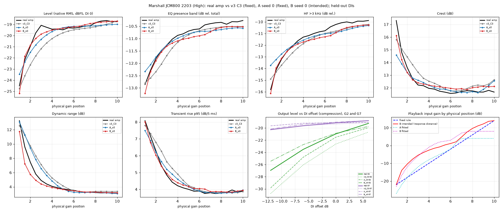
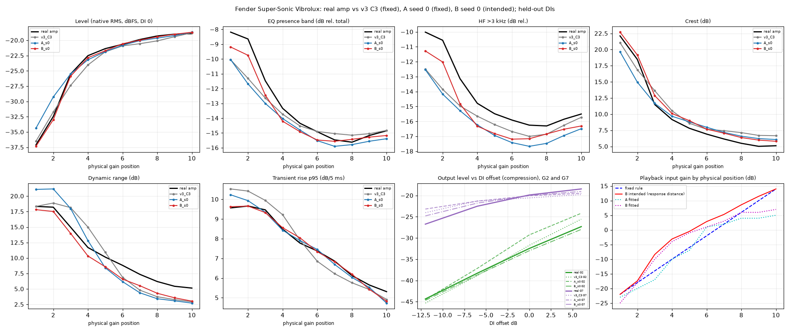

# Phase 4E results: selected captures and response-distance training anchors (JCM800, Super-Sonic Vibrolux)

**Status:** primary pilot complete (8 new models evaluated). Perceptual (listening) evaluation: **PENDING**, no human listening has happened. Frozen manifest: `docs/phase4e/manifest_frozen.json`, freeze commit `514750256a9aeeebbddd86c34c7f42b35700cd72`. Brief: `docs/CONTINUOUS_GAIN_PHASE4E_REVISED.md`.

## 1. What was run

Two pilot amps, four new configurations (A: selected captures at the original fixed physical-position anchors; B: the same captures at response-distance anchors), two predeclared seeds (0, 1) each = 8 new standard A2 `.nam` files. Existing v3 C3 (G1,G5,G10), C5 and C10 models are the baselines and were not retrained.

| Amp | training captures | A anchors (dB) | B anchors (dB) |
|---|---|---|---|
| Marshall JCM800 2203 (High) | G1, G2, G4, G10 | -22.0, -18.0, -10.0, +14.0 | -22.0, -10.5, -2.6, +14.0 |
| Fender Super-Sonic Vibrolux | G1, G2, G3, G4, G7, G10 | -22.0, -18.0, -14.0, -10.0, +2.0, +14.0 | -22.0, -17.4, -8.4, -3.1, +5.3, +14.0 |

Anchors are designated input gain in dB (level = anchor + -30 dBFS reference). The B anchors are a hypothesis, not an established knob-to-drive mapping.

**Comparison rules (frozen):** A vs v3 C3 compares a new capture SET (count and placement both change) under the original anchor rule and does not isolate placement; B vs A isolates the anchor rule within each set. A difference is conclusive only if it is larger than the seed-to-seed difference and has the same sign in both seeds; otherwise inconclusive. No composite score. Working thresholds only flag differences for examination.

**Playback mappings evaluated:** *intended* (A and v3: fixed rule `-22+4(N-1)` dB; B: linear in the response coordinate between its anchors), *fixed* (fixed rule for every model; for B this is a deliberate mismatch), *fitted* (one ordered mapping per model fitted ONLY on the fit DIs by the Phase 4C objective, level excluded, frozen for all held-out DIs and levels).

## 2. Training budget and measured time

| Model | wall-clock (concurrent) | optimiser updates (final checkpoint) | epochs run | val ESR (own teacher) | train audio (s) | audio per selected capture (s) |
|---|---:|---:|---:|---:|---:|---:|
| Marshall JCM800 2203 (High) A seed 0 | 102.9 min | 10260 | 60 | 0.0273 | 467 | 117 |
| Marshall JCM800 2203 (High) A seed 1 | 102.7 min | 10260 | 60 | 0.0253 | 467 | 117 |
| Marshall JCM800 2203 (High) B seed 0 | 102.8 min | 10260 | 60 | 0.0166 | 467 | 117 |
| Marshall JCM800 2203 (High) B seed 1 | 102.8 min | 10260 | 60 | 0.0163 | 467 | 117 |
| Fender Super-Sonic Vibrolux A seed 0 | 102.9 min | 10260 | 60 | 0.0165 | 467 | 78 |
| Fender Super-Sonic Vibrolux A seed 1 | 102.9 min | 10260 | 60 | 0.0163 | 467 | 78 |
| Fender Super-Sonic Vibrolux B seed 0 | 102.9 min | 10260 | 60 | 0.0139 | 467 | 78 |
| Fender Super-Sonic Vibrolux B seed 1 | 102.9 min | 10260 | 60 | 0.0109 | 467 | 78 |

Validation ESR is measured against each configuration's own teacher and validation clip, so it is NOT comparable between A and B or with v3; the exported file is the stock best-validation checkpoint for every model. All eight models trained concurrently on one machine (MPS), so wall-clock is inflated relative to a solo run (v3 solo timings were about 17-24 minutes per model). Every configuration receives the same number of optimiser updates because the training audio has the same length; the number of captures only changes exposure per capture, which is a disclosed confound against the v3 C3/C5/C10 baselines (which have the same audio length: 467 s for every v3 model as well).

## 3. Standard NAM verification

NAMCore (the C++ core used by the official NAM plugin) via native/nam_render is the conventional inference implementation available here; no official plugin/host was available to run.

| Model | same structure as stock v3 export | extra metadata keys | finite over -48..+36 dB input gain | max raw peak (dBFS) | input gains (dB) where raw peak > 0 dBFS |
|---|---|---|---|---:|---|
| jcm800_A_s0 | True | none | True | 3.8 | [36] |
| jcm800_A_s1 | True | none | True | 2.5 | [36] |
| jcm800_B_s0 | True | none | True | -0.2 | none |
| jcm800_B_s1 | True | none | True | 1.2 | [36] |
| vibrolux_A_s0 | True | none | True | 2.1 | [36] |
| vibrolux_A_s1 | True | none | True | 7.6 | [30, 36] |
| vibrolux_B_s0 | True | none | True | -0.7 | none |
| vibrolux_B_s1 | True | none | True | 3.0 | [36] |

Raw model output is scaled by a single training constant `c` (the peak-ceiling gain applied to the targets, identical for every configuration of an amp); evaluation divides it back out exactly as v3 did. In a player this constant is the output-level setting, not hidden DSP.

## 4. Marshall JCM800 2203 (High)

Regions (frozen): low: G1, G1.5, G2, G2.5, G3, G3.5; transition: G4, G4.5, G5, G5.5, G6; high: G6.5, G7, G7.5, G8, G8.5; plateau: G9, G9.5, G10.

### intended mapping: mean (worst-position) error against the real capture, held-out DIs, DI level 0 dB, all positions

| Model | level signed (dB) | level |err| (dB) | EQ bands (dB) | HF>3k (dB) | tilt (dB) | THD 4 levels (dB) | H2/H3 (dB) | IO slopes (dB) | DI-intensity resp. (dB) | crest (dB) | dyn range (dB) | transient rise (dB) | lm-ESR |
|---|---:|---:|---:|---:|---:|---:|---:|---:|---:|---:|---:|---:|---:|
| v3_C3 | -0.67 | 0.68 (2.09) | 0.38 (1.01) | 0.50 (1.39) | 0.49 (0.75) | 1.96 (5.34) | 2.16 (5.71) | 4.42 (8.45) | 1.02 (2.93) | 0.59 (1.50) | 0.86 (2.54) | 0.31 (0.86) | 0.062 |
| v3_C5 | -0.23 | 0.30 (0.97) | 0.40 (1.48) | 0.59 (2.49) | 0.41 (0.96) | 1.74 (6.79) | 2.84 (7.18) | 4.41 (7.56) | 1.39 (3.63) | 0.49 (2.21) | 1.14 (3.73) | 0.23 (0.61) | 0.063 |
| v3_C10 | -0.14 | 0.31 (1.07) | 0.38 (1.58) | 0.64 (2.59) | 0.46 (0.95) | 1.47 (6.90) | 2.63 (6.60) | 4.85 (9.04) | 1.48 (3.93) | 0.44 (2.30) | 1.24 (3.94) | 0.24 (0.58) | 0.058 |
| A_s0 | -0.21 | 0.38 (1.25) | 0.35 (1.57) | 0.53 (2.28) | 0.39 (1.10) | 1.56 (7.55) | 2.75 (6.58) | 4.07 (6.72) | 1.14 (2.48) | 0.45 (2.72) | 0.73 (2.03) | 0.22 (0.59) | 0.064 |
| A_s1 | -0.08 | 0.32 (1.12) | 0.34 (1.56) | 0.49 (2.29) | 0.39 (0.97) | 1.88 (7.97) | 2.48 (6.63) | 3.93 (5.79) | 1.19 (2.95) | 0.38 (2.71) | 0.85 (2.58) | 0.23 (0.71) | 0.063 |
| B_s0 | -0.07 | 0.23 (0.79) | 0.25 (0.41) | 0.40 (0.75) | 0.32 (0.63) | 2.34 (3.56) | 4.69 (10.57) | 2.63 (6.22) | 0.70 (2.42) | 0.44 (1.18) | 0.52 (2.35) | 0.15 (0.39) | 0.053 |
| B_s1 | -0.23 | 0.26 (1.01) | 0.25 (0.39) | 0.34 (0.71) | 0.31 (0.69) | 1.99 (3.06) | 3.50 (8.62) | 3.58 (8.45) | 0.63 (2.09) | 0.50 (1.07) | 0.47 (2.10) | 0.21 (0.47) | 0.054 |

### fixed physical-position mapping: mean (worst-position) error against the real capture, held-out DIs, DI level 0 dB, all positions

| Model | level signed (dB) | level |err| (dB) | EQ bands (dB) | HF>3k (dB) | tilt (dB) | THD 4 levels (dB) | H2/H3 (dB) | IO slopes (dB) | DI-intensity resp. (dB) | crest (dB) | dyn range (dB) | transient rise (dB) | lm-ESR |
|---|---:|---:|---:|---:|---:|---:|---:|---:|---:|---:|---:|---:|---:|
| v3_C3 | -0.67 | 0.68 (2.09) | 0.38 (1.01) | 0.50 (1.39) | 0.49 (0.75) | 1.96 (5.34) | 2.16 (5.71) | 4.42 (8.45) | 1.02 (2.93) | 0.59 (1.50) | 0.86 (2.54) | 0.31 (0.86) | 0.062 |
| v3_C5 | -0.23 | 0.30 (0.97) | 0.40 (1.48) | 0.59 (2.49) | 0.41 (0.96) | 1.74 (6.79) | 2.84 (7.18) | 4.41 (7.56) | 1.39 (3.63) | 0.49 (2.21) | 1.14 (3.73) | 0.23 (0.61) | 0.063 |
| v3_C10 | -0.14 | 0.31 (1.07) | 0.38 (1.58) | 0.64 (2.59) | 0.46 (0.95) | 1.47 (6.90) | 2.63 (6.60) | 4.85 (9.04) | 1.48 (3.93) | 0.44 (2.30) | 1.24 (3.94) | 0.24 (0.58) | 0.058 |
| A_s0 | -0.21 | 0.38 (1.25) | 0.35 (1.57) | 0.53 (2.28) | 0.39 (1.10) | 1.56 (7.55) | 2.75 (6.58) | 4.07 (6.72) | 1.14 (2.48) | 0.45 (2.72) | 0.73 (2.03) | 0.22 (0.59) | 0.064 |
| A_s1 | -0.08 | 0.32 (1.12) | 0.34 (1.56) | 0.49 (2.29) | 0.39 (0.97) | 1.88 (7.97) | 2.48 (6.63) | 3.93 (5.79) | 1.19 (2.95) | 0.38 (2.71) | 0.85 (2.58) | 0.23 (0.71) | 0.063 |
| B_s0 | -0.86 | 0.88 (2.78) | 0.79 (1.63) | 1.12 (1.97) | 0.79 (1.53) | 4.27 (7.71) | 3.35 (6.92) | 3.40 (6.09) | 1.15 (2.59) | 0.84 (2.01) | 1.00 (2.51) | 0.74 (1.94) | 0.113 |
| B_s1 | -1.03 | 1.03 (2.93) | 0.78 (1.63) | 1.06 (2.00) | 0.75 (1.35) | 3.77 (6.62) | 2.86 (6.97) | 4.23 (8.36) | 1.22 (2.92) | 0.84 (1.91) | 1.07 (2.84) | 0.69 (1.88) | 0.113 |

### model-specific FITTED mapping (fit DIs only): mean (worst-position) error against the real capture, held-out DIs, DI level 0 dB, all positions

| Model | level signed (dB) | level |err| (dB) | EQ bands (dB) | HF>3k (dB) | tilt (dB) | THD 4 levels (dB) | H2/H3 (dB) | IO slopes (dB) | DI-intensity resp. (dB) | crest (dB) | dyn range (dB) | transient rise (dB) | lm-ESR |
|---|---:|---:|---:|---:|---:|---:|---:|---:|---:|---:|---:|---:|---:|
| v3_C3 | -0.56 | 0.57 (1.55) | 0.32 (0.61) | 0.45 (0.85) | 0.43 (0.81) | 1.13 (2.72) | 2.49 (5.55) | 3.11 (4.90) | 0.47 (1.51) | 0.35 (0.66) | 0.42 (1.43) | 0.16 (0.41) | 0.107 |
| v3_C5 | -0.36 | 0.46 (2.77) | 0.39 (0.96) | 0.59 (1.65) | 0.44 (1.33) | 1.15 (3.72) | 3.57 (8.43) | 2.65 (3.77) | 1.31 (3.39) | 0.32 (0.84) | 0.83 (3.47) | 0.19 (0.43) | 0.117 |
| v3_C10 | -0.22 | 0.46 (3.03) | 0.39 (0.96) | 0.54 (1.49) | 0.51 (1.27) | 1.22 (6.67) | 3.34 (7.14) | 2.90 (4.73) | 1.45 (3.80) | 0.34 (0.66) | 0.98 (3.93) | 0.21 (0.48) | 0.107 |
| A_s0 | -0.41 | 0.50 (2.63) | 0.36 (0.65) | 0.55 (1.13) | 0.50 (0.89) | 1.07 (2.56) | 2.48 (7.78) | 2.72 (4.79) | 1.15 (3.41) | 0.26 (0.47) | 0.81 (3.59) | 0.20 (0.78) | 0.108 |
| A_s1 | -0.18 | 0.40 (2.96) | 0.30 (0.71) | 0.41 (1.13) | 0.39 (1.03) | 1.68 (6.02) | 2.83 (7.77) | 3.51 (5.36) | 1.02 (3.32) | 0.33 (0.87) | 0.78 (3.35) | 0.18 (0.52) | 0.056 |
| B_s0 | -0.18 | 0.35 (1.23) | 0.27 (0.43) | 0.42 (0.73) | 0.38 (0.61) | 2.10 (3.29) | 4.14 (9.83) | 1.72 (3.71) | 0.63 (1.35) | 0.32 (0.87) | 0.39 (1.16) | 0.14 (0.24) | 0.087 |
| B_s1 | -0.38 | 0.43 (2.21) | 0.28 (0.55) | 0.39 (0.86) | 0.39 (0.70) | 1.53 (2.38) | 3.69 (9.44) | 2.69 (5.60) | 0.56 (1.08) | 0.41 (0.71) | 0.32 (0.96) | 0.13 (0.22) | 0.086 |

### By region (intended mapping): mean error per group

| Model | region | level |err| (dB) | EQ bands (dB) | HF>3k (dB) | THD 4 levels (dB) | IO slopes (dB) | DI-intensity resp. (dB) | crest (dB) | dyn range (dB) | transient rise (dB) |
|---|---|---:|---:|---:|---:|---:|---:|---:|---:|---:|
| v3_C3 | low | 1.49 | 0.58 | 0.70 | 3.63 | 3.32 | 2.15 | 0.88 | 1.86 | 0.58 |
| v3_C3 | transition | 0.42 | 0.26 | 0.36 | 2.42 | 3.93 | 0.84 | 0.47 | 0.71 | 0.33 |
| v3_C3 | high | 0.26 | 0.35 | 0.50 | 0.38 | 4.29 | 0.34 | 0.33 | 0.19 | 0.09 |
| v3_C3 | plateau | 0.18 | 0.26 | 0.36 | 0.46 | 7.66 | 0.20 | 0.65 | 0.25 | 0.08 |
| v3_C5 | low | 0.61 | 0.61 | 0.81 | 2.99 | 4.26 | 2.79 | 0.70 | 2.68 | 0.42 |
| v3_C5 | transition | 0.09 | 0.26 | 0.42 | 1.79 | 3.92 | 0.96 | 0.35 | 0.84 | 0.20 |
| v3_C5 | high | 0.22 | 0.33 | 0.57 | 0.56 | 3.59 | 0.83 | 0.23 | 0.18 | 0.09 |
| v3_C5 | plateau | 0.16 | 0.31 | 0.44 | 1.10 | 6.91 | 0.21 | 0.74 | 0.17 | 0.14 |
| v3_C10 | low | 0.70 | 0.61 | 0.98 | 2.51 | 4.16 | 2.97 | 0.71 | 2.80 | 0.45 |
| v3_C10 | transition | 0.17 | 0.30 | 0.53 | 1.94 | 4.45 | 0.88 | 0.30 | 1.02 | 0.22 |
| v3_C10 | high | 0.11 | 0.29 | 0.51 | 0.33 | 4.12 | 0.73 | 0.26 | 0.17 | 0.07 |
| v3_C10 | plateau | 0.10 | 0.24 | 0.35 | 0.48 | 8.08 | 0.78 | 0.47 | 0.26 | 0.14 |
| A_s0 | low | 0.81 | 0.53 | 0.73 | 3.05 | 4.38 | 1.74 | 0.81 | 1.59 | 0.44 |
| A_s0 | transition | 0.14 | 0.17 | 0.24 | 1.52 | 4.07 | 0.68 | 0.28 | 0.59 | 0.20 |
| A_s0 | high | 0.17 | 0.38 | 0.62 | 0.31 | 2.66 | 0.97 | 0.16 | 0.20 | 0.06 |
| A_s0 | plateau | 0.30 | 0.27 | 0.46 | 0.73 | 5.82 | 1.00 | 0.51 | 0.15 | 0.07 |
| A_s1 | low | 0.70 | 0.54 | 0.74 | 3.25 | 4.25 | 2.16 | 0.83 | 1.89 | 0.43 |
| A_s1 | transition | 0.18 | 0.16 | 0.21 | 1.70 | 4.19 | 0.75 | 0.15 | 0.64 | 0.19 |
| A_s1 | high | 0.13 | 0.33 | 0.56 | 0.61 | 2.65 | 0.82 | 0.14 | 0.21 | 0.11 |
| A_s1 | plateau | 0.12 | 0.24 | 0.32 | 1.59 | 5.02 | 0.64 | 0.26 | 0.14 | 0.11 |
| B_s0 | low | 0.48 | 0.24 | 0.22 | 1.77 | 2.00 | 1.44 | 0.56 | 1.21 | 0.20 |
| B_s0 | transition | 0.09 | 0.24 | 0.47 | 2.32 | 1.36 | 0.21 | 0.39 | 0.28 | 0.16 |
| B_s0 | high | 0.12 | 0.32 | 0.56 | 2.51 | 2.82 | 0.32 | 0.33 | 0.14 | 0.12 |
| B_s0 | plateau | 0.11 | 0.19 | 0.37 | 3.25 | 5.67 | 0.67 | 0.44 | 0.15 | 0.07 |
| B_s1 | low | 0.58 | 0.27 | 0.22 | 1.50 | 1.98 | 1.26 | 0.67 | 1.07 | 0.33 |
| B_s1 | transition | 0.09 | 0.23 | 0.42 | 1.91 | 1.92 | 0.23 | 0.60 | 0.31 | 0.25 |
| B_s1 | high | 0.12 | 0.32 | 0.48 | 2.17 | 4.59 | 0.31 | 0.32 | 0.15 | 0.11 |
| B_s1 | plateau | 0.16 | 0.16 | 0.22 | 2.84 | 7.88 | 0.53 | 0.33 | 0.10 | 0.06 |

### Independent JCM800 half-step captures only (intended mapping): mean error

| Model | level |err| (dB) | EQ bands (dB) | HF>3k (dB) | THD 4 levels (dB) | IO slopes (dB) | crest (dB) | dyn range (dB) | transient rise (dB) |
|---|---:|---:|---:|---:|---:|---:|---:|---:|
| v3_C3 | 0.73 | 0.35 | 0.46 | 1.86 | 4.45 | 0.49 | 0.90 | 0.31 |
| v3_C5 | 0.29 | 0.35 | 0.50 | 1.45 | 4.41 | 0.36 | 1.23 | 0.22 |
| v3_C10 | 0.34 | 0.34 | 0.56 | 1.16 | 4.84 | 0.34 | 1.32 | 0.21 |
| A_s0 | 0.33 | 0.30 | 0.45 | 1.33 | 3.96 | 0.31 | 0.77 | 0.21 |
| A_s1 | 0.28 | 0.29 | 0.42 | 1.57 | 3.88 | 0.25 | 0.90 | 0.21 |
| B_s0 | 0.20 | 0.25 | 0.40 | 2.25 | 2.59 | 0.40 | 0.52 | 0.16 |
| B_s1 | 0.22 | 0.25 | 0.33 | 1.96 | 3.59 | 0.50 | 0.48 | 0.20 |

### Trained versus omitted (neural-training holdout) integer positions, intended mapping: mean EQ / HF / THD / IO slope / crest / dyn error

| Model | set | EQ | HF | THD | IO slope | crest | dyn |
|---|---|---:|---:|---:|---:|---:|---:|
| v3_C3 | trained | 0.49 | 0.69 | 2.70 | 5.14 | 0.97 | 0.55 |
| v3_C3 | omitted | 0.37 | 0.48 | 1.77 | 4.08 | 0.57 | 0.96 |
| v3_C5 | trained | 0.54 | 0.82 | 2.51 | 4.27 | 0.84 | 0.86 |
| v3_C5 | omitted | 0.34 | 0.50 | 1.48 | 4.57 | 0.38 | 1.24 |
| v3_C10 | trained | 0.43 | 0.71 | 1.75 | 4.85 | 0.54 | 1.17 |
| A_s0 | trained | 0.61 | 0.89 | 3.11 | 4.98 | 1.11 | 0.98 |
| A_s0 | omitted | 0.26 | 0.40 | 0.86 | 3.63 | 0.22 | 0.51 |
| A_s1 | trained | 0.60 | 0.84 | 3.52 | 4.64 | 0.98 | 1.14 |
| A_s1 | omitted | 0.24 | 0.36 | 1.26 | 3.54 | 0.16 | 0.57 |
| B_s0 | trained | 0.25 | 0.34 | 2.55 | 3.33 | 0.63 | 0.93 |
| B_s0 | omitted | 0.25 | 0.44 | 2.34 | 2.20 | 0.37 | 0.23 |
| B_s1 | trained | 0.26 | 0.31 | 2.22 | 3.86 | 0.67 | 0.83 |
| B_s1 | omitted | 0.26 | 0.38 | 1.90 | 3.38 | 0.39 | 0.23 |

### DI-level dependence (intended mapping): mean error by DI offset

| Model | DI offset | level |err| | EQ | HF | crest | dyn | transient |
|---|---:|---:|---:|---:|---:|---:|---:|
| v3_C3 | -12 | 1.48 | 0.76 | 0.76 | 1.34 | 2.39 | 0.77 |
| v3_C3 | -6 | 0.89 | 0.51 | 0.56 | 0.84 | 1.62 | 0.56 |
| v3_C3 | +0 | 0.68 | 0.38 | 0.50 | 0.59 | 0.86 | 0.31 |
| v3_C3 | +6 | 0.73 | 0.40 | 0.56 | 0.83 | 0.61 | 0.24 |
| v3_C5 | -12 | 1.55 | 0.54 | 0.32 | 1.11 | 3.02 | 0.69 |
| v3_C5 | -6 | 0.70 | 0.47 | 0.52 | 0.56 | 2.19 | 0.49 |
| v3_C5 | +0 | 0.30 | 0.40 | 0.59 | 0.49 | 1.14 | 0.23 |
| v3_C5 | +6 | 0.51 | 0.45 | 0.64 | 0.87 | 0.59 | 0.29 |
| v3_C10 | -12 | 1.69 | 0.51 | 0.35 | 1.06 | 3.06 | 0.65 |
| v3_C10 | -6 | 0.85 | 0.42 | 0.53 | 0.52 | 2.25 | 0.45 |
| v3_C10 | +0 | 0.31 | 0.38 | 0.64 | 0.44 | 1.24 | 0.24 |
| v3_C10 | +6 | 0.36 | 0.44 | 0.63 | 0.67 | 0.58 | 0.25 |
| A_s0 | -12 | 1.23 | 0.41 | 0.35 | 0.82 | 2.70 | 0.74 |
| A_s0 | -6 | 0.61 | 0.33 | 0.44 | 0.44 | 1.75 | 0.39 |
| A_s0 | +0 | 0.38 | 0.35 | 0.53 | 0.45 | 0.73 | 0.22 |
| A_s0 | +6 | 0.54 | 0.49 | 0.66 | 0.72 | 0.50 | 0.28 |
| A_s1 | -12 | 1.37 | 0.43 | 0.29 | 0.79 | 2.71 | 0.57 |
| A_s1 | -6 | 0.67 | 0.33 | 0.42 | 0.37 | 1.84 | 0.36 |
| A_s1 | +0 | 0.32 | 0.34 | 0.49 | 0.38 | 0.85 | 0.23 |
| A_s1 | +6 | 0.37 | 0.44 | 0.58 | 0.55 | 0.50 | 0.28 |
| B_s0 | -12 | 0.54 | 0.54 | 0.61 | 0.82 | 0.77 | 0.60 |
| B_s0 | -6 | 0.32 | 0.33 | 0.44 | 0.52 | 0.61 | 0.35 |
| B_s0 | +0 | 0.23 | 0.25 | 0.40 | 0.44 | 0.52 | 0.15 |
| B_s0 | +6 | 0.38 | 0.34 | 0.47 | 0.75 | 0.48 | 0.21 |
| B_s1 | -12 | 0.47 | 0.57 | 0.62 | 0.82 | 0.87 | 0.59 |
| B_s1 | -6 | 0.30 | 0.32 | 0.40 | 0.60 | 0.58 | 0.32 |
| B_s1 | +0 | 0.26 | 0.25 | 0.34 | 0.50 | 0.47 | 0.21 |
| B_s1 | +6 | 0.48 | 0.33 | 0.39 | 0.55 | 0.49 | 0.18 |

### Frozen comparisons

**A vs v3 C3 (both under the fixed anchor rule; capture SET differs, so this does not isolate placement)** (mean over all positions, held-out DIs, DI level 0; verdict per the frozen seed rule)

| Group | base | new s0 | new s1 | seed spread | verdict |
|---|---:|---:|---:|---:|---|
| level |err| (dB) | 0.68 | 0.38 | 0.32 | 0.06 | better (<tol) |
| EQ bands (dB) | 0.38 | 0.35 | 0.34 | 0.02 | better (<tol) |
| HF>3k (dB) | 0.50 | 0.53 | 0.49 | 0.04 | inconclusive |
| tilt (dB) | 0.49 | 0.39 | 0.39 | 0.01 | better (<tol) |
| THD 4 levels (dB) | 1.96 | 1.56 | 1.88 | 0.32 | inconclusive |
| H2/H3 (dB) | 2.16 | 2.75 | 2.48 | 0.28 | worse (<tol) |
| IO slopes (dB) | 4.42 | 4.07 | 3.93 | 0.14 | better (<tol) |
| DI-intensity resp. (dB) | 1.02 | 1.14 | 1.19 | 0.05 | worse (<tol) |
| crest (dB) | 0.59 | 0.45 | 0.38 | 0.07 | better |
| dyn range (dB) | 0.86 | 0.73 | 0.85 | 0.11 | inconclusive |
| transient rise (dB) | 0.31 | 0.22 | 0.23 | 0.01 | better (<tol) |
| lm-ESR | 0.06 | 0.06 | 0.06 | 0.00 | inconclusive |

**B (intended response-distance mapping) vs A (intended fixed mapping): the training-anchor rule within the same captures** (mean over all positions, held-out DIs, DI level 0; verdict per the frozen seed rule)

| Group | base | new s0 | new s1 | seed spread | verdict |
|---|---:|---:|---:|---:|---|
| level |err| (dB) | 0.35 | 0.23 | 0.26 | 0.06 | inconclusive |
| EQ bands (dB) | 0.34 | 0.25 | 0.25 | 0.02 | better (<tol) |
| HF>3k (dB) | 0.51 | 0.40 | 0.34 | 0.06 | better (<tol) |
| tilt (dB) | 0.39 | 0.32 | 0.31 | 0.01 | better (<tol) |
| THD 4 levels (dB) | 1.72 | 2.34 | 1.99 | 0.35 | inconclusive |
| H2/H3 (dB) | 2.62 | 4.69 | 3.50 | 1.19 | inconclusive |
| IO slopes (dB) | 4.00 | 2.63 | 3.58 | 0.96 | inconclusive |
| DI-intensity resp. (dB) | 1.17 | 0.70 | 0.63 | 0.07 | better |
| crest (dB) | 0.41 | 0.44 | 0.50 | 0.07 | inconclusive |
| dyn range (dB) | 0.79 | 0.52 | 0.47 | 0.11 | better |
| transient rise (dB) | 0.23 | 0.15 | 0.21 | 0.06 | inconclusive |
| lm-ESR | 0.06 | 0.05 | 0.05 | 0.00 | better |

**B vs A, both with their own FITTED playback mapping (training effect after equalising the playback fit)** (mean over all positions, held-out DIs, DI level 0; verdict per the frozen seed rule)

| Group | base | new s0 | new s1 | seed spread | verdict |
|---|---:|---:|---:|---:|---|
| level |err| (dB) | 0.45 | 0.35 | 0.43 | 0.09 | inconclusive |
| EQ bands (dB) | 0.33 | 0.27 | 0.28 | 0.06 | inconclusive |
| HF>3k (dB) | 0.48 | 0.42 | 0.39 | 0.14 | inconclusive |
| tilt (dB) | 0.44 | 0.38 | 0.39 | 0.11 | inconclusive |
| THD 4 levels (dB) | 1.37 | 2.10 | 1.53 | 0.62 | inconclusive |
| H2/H3 (dB) | 2.66 | 4.14 | 3.69 | 0.45 | worse |
| IO slopes (dB) | 3.11 | 1.72 | 2.69 | 0.97 | inconclusive |
| DI-intensity resp. (dB) | 1.08 | 0.63 | 0.56 | 0.12 | better |
| crest (dB) | 0.30 | 0.32 | 0.41 | 0.09 | inconclusive |
| dyn range (dB) | 0.80 | 0.39 | 0.32 | 0.07 | better |
| transient rise (dB) | 0.19 | 0.14 | 0.13 | 0.02 | better (<tol) |
| lm-ESR | 0.08 | 0.09 | 0.09 | 0.05 | inconclusive |

**ADDITIONAL (not one of the two frozen paired comparisons; same mechanical rule): B intended vs v3 C3 fixed** (mean over all positions, held-out DIs, DI level 0; verdict per the frozen seed rule)

| Group | base | new s0 | new s1 | seed spread | verdict |
|---|---:|---:|---:|---:|---|
| level |err| (dB) | 0.68 | 0.23 | 0.26 | 0.04 | better |
| EQ bands (dB) | 0.38 | 0.25 | 0.25 | 0.00 | better (<tol) |
| HF>3k (dB) | 0.50 | 0.40 | 0.34 | 0.06 | better (<tol) |
| tilt (dB) | 0.49 | 0.32 | 0.31 | 0.01 | better (<tol) |
| THD 4 levels (dB) | 1.96 | 2.34 | 1.99 | 0.35 | inconclusive |
| H2/H3 (dB) | 2.16 | 4.69 | 3.50 | 1.19 | worse |
| IO slopes (dB) | 4.42 | 2.63 | 3.58 | 0.96 | inconclusive |
| DI-intensity resp. (dB) | 1.02 | 0.70 | 0.63 | 0.07 | better (<tol) |
| crest (dB) | 0.59 | 0.44 | 0.50 | 0.07 | better (<tol) |
| dyn range (dB) | 0.86 | 0.52 | 0.47 | 0.04 | better |
| transient rise (dB) | 0.31 | 0.15 | 0.21 | 0.06 | better (<tol) |
| lm-ESR | 0.06 | 0.05 | 0.05 | 0.00 | better (<tol) |

**ADDITIONAL (same rule): B intended vs v3 C10 fixed (the ten-capture single NAM)** (mean over all positions, held-out DIs, DI level 0; verdict per the frozen seed rule)

| Group | base | new s0 | new s1 | seed spread | verdict |
|---|---:|---:|---:|---:|---|
| level |err| (dB) | 0.31 | 0.23 | 0.26 | 0.04 | better (<tol) |
| EQ bands (dB) | 0.38 | 0.25 | 0.25 | 0.00 | better (<tol) |
| HF>3k (dB) | 0.64 | 0.40 | 0.34 | 0.06 | better |
| tilt (dB) | 0.46 | 0.32 | 0.31 | 0.01 | better (<tol) |
| THD 4 levels (dB) | 1.47 | 2.34 | 1.99 | 0.35 | worse (<tol) |
| H2/H3 (dB) | 2.63 | 4.69 | 3.50 | 1.19 | inconclusive |
| IO slopes (dB) | 4.85 | 2.63 | 3.58 | 0.96 | better |
| DI-intensity resp. (dB) | 1.48 | 0.70 | 0.63 | 0.07 | better |
| crest (dB) | 0.44 | 0.44 | 0.50 | 0.07 | inconclusive |
| dyn range (dB) | 1.24 | 0.52 | 0.47 | 0.04 | better |
| transient rise (dB) | 0.24 | 0.15 | 0.21 | 0.06 | inconclusive |
| lm-ESR | 0.06 | 0.05 | 0.05 | 0.00 | better (<tol) |

**Remapping-only effect** (same model; mean error, intended mapping -> its own fitted mapping; fit on the fit DIs only; level excluded from the fit)

| Model | level signed (dB) | level |err| (dB) | EQ bands (dB) | HF>3k (dB) | THD 4 levels (dB) | IO slopes (dB) | DI-intensity resp. (dB) | crest (dB) | dyn range (dB) | transient rise (dB) |
|---|---:|---:|---:|---:|---:|---:|---:|---:|---:|---:|
| v3_C3 | -0.67 -> -0.56 | 0.68 -> 0.57 | 0.38 -> 0.32 | 0.50 -> 0.45 | 1.96 -> 1.13 | 4.42 -> 3.11 | 1.02 -> 0.47 | 0.59 -> 0.35 | 0.86 -> 0.42 | 0.31 -> 0.16 |
| v3_C5 | -0.23 -> -0.36 | 0.30 -> 0.46 | 0.40 -> 0.39 | 0.59 -> 0.59 | 1.74 -> 1.15 | 4.41 -> 2.65 | 1.39 -> 1.31 | 0.49 -> 0.32 | 1.14 -> 0.83 | 0.23 -> 0.19 |
| v3_C10 | -0.14 -> -0.22 | 0.31 -> 0.46 | 0.38 -> 0.39 | 0.64 -> 0.54 | 1.47 -> 1.22 | 4.85 -> 2.90 | 1.48 -> 1.45 | 0.44 -> 0.34 | 1.24 -> 0.98 | 0.24 -> 0.21 |
| A_s0 | -0.21 -> -0.41 | 0.38 -> 0.50 | 0.35 -> 0.36 | 0.53 -> 0.55 | 1.56 -> 1.07 | 4.07 -> 2.72 | 1.14 -> 1.15 | 0.45 -> 0.26 | 0.73 -> 0.81 | 0.22 -> 0.20 |
| A_s1 | -0.08 -> -0.18 | 0.32 -> 0.40 | 0.34 -> 0.30 | 0.49 -> 0.41 | 1.88 -> 1.68 | 3.93 -> 3.51 | 1.19 -> 1.02 | 0.38 -> 0.33 | 0.85 -> 0.78 | 0.23 -> 0.18 |
| B_s0 | -0.07 -> -0.18 | 0.23 -> 0.35 | 0.25 -> 0.27 | 0.40 -> 0.42 | 2.34 -> 2.10 | 2.63 -> 1.72 | 0.70 -> 0.63 | 0.44 -> 0.32 | 0.52 -> 0.39 | 0.15 -> 0.14 |
| B_s1 | -0.23 -> -0.38 | 0.26 -> 0.43 | 0.25 -> 0.28 | 0.34 -> 0.39 | 1.99 -> 1.53 | 3.58 -> 2.69 | 0.63 -> 0.56 | 0.50 -> 0.41 | 0.47 -> 0.32 | 0.21 -> 0.13 |

## 4. Fender Super-Sonic Vibrolux

Regions (frozen): low: G1; transition: G2; high: G3; plateau: G4, G5, G6, G7, G8, G9, G10.

### intended mapping: mean (worst-position) error against the real capture, held-out DIs, DI level 0 dB, all positions

| Model | level signed (dB) | level |err| (dB) | EQ bands (dB) | HF>3k (dB) | tilt (dB) | THD 4 levels (dB) | H2/H3 (dB) | IO slopes (dB) | DI-intensity resp. (dB) | crest (dB) | dyn range (dB) | transient rise (dB) | lm-ESR |
|---|---:|---:|---:|---:|---:|---:|---:|---:|---:|---:|---:|---:|---:|
| v3_C3 | -0.46 | 0.76 (1.86) | 0.80 (2.09) | 1.42 (3.29) | 1.16 (4.08) | 5.19 (6.35) | 7.76 (17.21) | 3.66 (10.85) | 2.99 (4.18) | 1.39 (2.15) | 2.10 (3.30) | 0.53 (0.96) | 0.135 |
| v3_C5 | +0.20 | 0.95 (2.84) | 0.69 (1.67) | 1.30 (2.63) | 0.97 (3.63) | 4.55 (7.17) | 9.02 (18.89) | 3.01 (9.63) | 2.80 (4.07) | 1.49 (2.76) | 2.16 (2.69) | 0.41 (0.89) | 0.102 |
| v3_C10 | +0.51 | 0.85 (3.40) | 0.81 (2.09) | 1.56 (3.49) | 1.34 (4.61) | 4.37 (6.48) | 8.63 (17.54) | 3.62 (11.74) | 3.34 (4.35) | 1.35 (3.12) | 2.52 (3.01) | 0.44 (0.90) | 0.115 |
| A_s0 | +0.41 | 0.86 (3.20) | 0.92 (2.18) | 1.76 (3.61) | 1.37 (4.48) | 4.53 (6.26) | 7.64 (20.47) | 3.31 (11.72) | 3.30 (4.57) | 1.35 (3.52) | 2.48 (3.02) | 0.36 (0.67) | 0.086 |
| A_s1 | +0.27 | 0.94 (3.09) | 0.87 (2.03) | 1.73 (3.53) | 1.38 (4.47) | 4.84 (6.98) | 8.19 (19.12) | 3.81 (12.46) | 3.17 (4.53) | 1.36 (3.14) | 2.48 (2.92) | 0.33 (0.62) | 0.088 |
| B_s0 | -0.17 | 0.25 (0.52) | 0.65 (1.03) | 1.20 (1.69) | 0.89 (1.81) | 3.48 (6.43) | 6.12 (11.70) | 1.98 (6.14) | 1.87 (2.96) | 0.95 (1.38) | 1.52 (2.23) | 0.23 (0.49) | 0.037 |
| B_s1 | -0.42 | 0.45 (0.92) | 0.82 (1.77) | 1.46 (2.60) | 1.26 (2.93) | 2.81 (4.31) | 5.92 (15.44) | 2.53 (8.03) | 1.84 (3.13) | 1.54 (2.44) | 1.60 (2.20) | 0.26 (0.74) | 0.051 |

### fixed physical-position mapping: mean (worst-position) error against the real capture, held-out DIs, DI level 0 dB, all positions

| Model | level signed (dB) | level |err| (dB) | EQ bands (dB) | HF>3k (dB) | tilt (dB) | THD 4 levels (dB) | H2/H3 (dB) | IO slopes (dB) | DI-intensity resp. (dB) | crest (dB) | dyn range (dB) | transient rise (dB) | lm-ESR |
|---|---:|---:|---:|---:|---:|---:|---:|---:|---:|---:|---:|---:|---:|
| v3_C3 | -0.46 | 0.76 (1.86) | 0.80 (2.09) | 1.42 (3.29) | 1.16 (4.08) | 5.19 (6.35) | 7.76 (17.21) | 3.66 (10.85) | 2.99 (4.18) | 1.39 (2.15) | 2.10 (3.30) | 0.53 (0.96) | 0.135 |
| v3_C5 | +0.20 | 0.95 (2.84) | 0.69 (1.67) | 1.30 (2.63) | 0.97 (3.63) | 4.55 (7.17) | 9.02 (18.89) | 3.01 (9.63) | 2.80 (4.07) | 1.49 (2.76) | 2.16 (2.69) | 0.41 (0.89) | 0.102 |
| v3_C10 | +0.51 | 0.85 (3.40) | 0.81 (2.09) | 1.56 (3.49) | 1.34 (4.61) | 4.37 (6.48) | 8.63 (17.54) | 3.62 (11.74) | 3.34 (4.35) | 1.35 (3.12) | 2.52 (3.01) | 0.44 (0.90) | 0.115 |
| A_s0 | +0.41 | 0.86 (3.20) | 0.92 (2.18) | 1.76 (3.61) | 1.37 (4.48) | 4.53 (6.26) | 7.64 (20.47) | 3.31 (11.72) | 3.30 (4.57) | 1.35 (3.52) | 2.48 (3.02) | 0.36 (0.67) | 0.086 |
| A_s1 | +0.27 | 0.94 (3.09) | 0.87 (2.03) | 1.73 (3.53) | 1.38 (4.47) | 4.84 (6.98) | 8.19 (19.12) | 3.81 (12.46) | 3.17 (4.53) | 1.36 (3.14) | 2.48 (2.92) | 0.33 (0.62) | 0.088 |
| B_s0 | -1.65 | 1.70 (4.52) | 0.82 (1.38) | 1.28 (1.75) | 1.11 (2.31) | 4.80 (8.93) | 7.20 (19.42) | 2.12 (6.14) | 1.22 (2.96) | 2.39 (5.13) | 1.41 (3.22) | 0.59 (1.28) | 0.058 |
| B_s1 | -1.91 | 1.93 (4.82) | 0.89 (1.75) | 1.35 (2.49) | 1.12 (2.77) | 3.90 (6.95) | 7.24 (16.22) | 2.59 (8.03) | 1.28 (3.13) | 2.68 (4.65) | 1.46 (3.06) | 0.60 (1.29) | 0.067 |

### model-specific FITTED mapping (fit DIs only): mean (worst-position) error against the real capture, held-out DIs, DI level 0 dB, all positions

| Model | level signed (dB) | level |err| (dB) | EQ bands (dB) | HF>3k (dB) | tilt (dB) | THD 4 levels (dB) | H2/H3 (dB) | IO slopes (dB) | DI-intensity resp. (dB) | crest (dB) | dyn range (dB) | transient rise (dB) | lm-ESR |
|---|---:|---:|---:|---:|---:|---:|---:|---:|---:|---:|---:|---:|---:|
| v3_C3 | -3.64 | 3.79 (16.42) | 0.76 (1.45) | 1.37 (2.36) | 1.00 (2.98) | 5.62 (17.25) | 9.57 (17.21) | 2.58 (6.00) | 1.90 (4.03) | 2.40 (8.39) | 1.18 (2.55) | 0.36 (0.64) | 0.127 |
| v3_C5 | +0.32 | 1.76 (6.31) | 0.85 (1.91) | 1.66 (2.98) | 1.30 (4.22) | 4.61 (6.96) | 10.19 (18.89) | 1.51 (2.89) | 2.60 (5.01) | 2.15 (5.60) | 2.14 (4.05) | 0.58 (1.06) | 0.113 |
| v3_C10 | +0.49 | 1.44 (5.67) | 0.89 (2.09) | 1.75 (3.49) | 1.55 (4.61) | 4.42 (6.57) | 9.51 (17.54) | 1.85 (3.92) | 3.18 (5.36) | 1.75 (4.85) | 2.62 (5.00) | 0.59 (1.07) | 0.121 |
| A_s0 | -0.39 | 0.90 (2.66) | 0.89 (1.69) | 1.79 (2.82) | 1.15 (2.92) | 4.72 (7.18) | 7.69 (13.96) | 1.57 (4.16) | 3.46 (5.61) | 1.30 (2.49) | 2.69 (5.73) | 0.46 (0.89) | 0.076 |
| A_s1 | -0.48 | 1.16 (3.86) | 0.91 (1.59) | 1.77 (2.70) | 1.24 (2.90) | 4.50 (5.70) | 8.27 (15.17) | 1.35 (4.00) | 4.10 (6.78) | 1.36 (3.84) | 3.17 (6.14) | 0.48 (0.98) | 0.082 |
| B_s0 | -1.03 | 1.03 (3.18) | 0.72 (0.91) | 1.31 (1.51) | 0.90 (1.63) | 4.27 (14.02) | 8.46 (20.70) | 0.81 (1.23) | 0.93 (1.72) | 1.65 (2.70) | 0.72 (1.25) | 0.50 (1.27) | 0.043 |
| B_s1 | -1.18 | 1.18 (2.47) | 0.88 (1.74) | 1.58 (2.49) | 1.21 (2.77) | 3.11 (5.78) | 6.28 (13.22) | 1.18 (2.32) | 0.81 (1.82) | 1.83 (2.38) | 0.72 (1.28) | 0.47 (1.32) | 0.055 |

### By region (intended mapping): mean error per group

| Model | region | level |err| (dB) | EQ bands (dB) | HF>3k (dB) | THD 4 levels (dB) | IO slopes (dB) | DI-intensity resp. (dB) | crest (dB) | dyn range (dB) | transient rise (dB) |
|---|---|---:|---:|---:|---:|---:|---:|---:|---:|---:|
| v3_C3 | low | 0.61 | 1.67 | 2.47 | 4.47 | 3.27 | 2.29 | 1.05 | 1.07 | 0.96 |
| v3_C3 | transition | 0.75 | 2.09 | 3.29 | 6.22 | 1.38 | 2.73 | 1.65 | 1.42 | 0.76 |
| v3_C3 | high | 1.86 | 1.00 | 1.83 | 5.19 | 2.29 | 3.93 | 2.15 | 3.16 | 0.48 |
| v3_C3 | plateau | 0.63 | 0.47 | 0.95 | 5.15 | 4.24 | 2.99 | 1.30 | 2.20 | 0.44 |
| v3_C5 | low | 2.84 | 0.98 | 1.74 | 5.01 | 2.39 | 2.84 | 2.54 | 2.60 | 0.89 |
| v3_C5 | transition | 2.69 | 1.67 | 2.63 | 7.17 | 2.35 | 2.20 | 2.76 | 2.12 | 0.59 |
| v3_C5 | high | 0.77 | 0.89 | 1.40 | 3.91 | 1.05 | 2.21 | 1.36 | 2.24 | 0.14 |
| v3_C5 | plateau | 0.45 | 0.47 | 1.04 | 4.20 | 3.47 | 2.97 | 1.18 | 2.09 | 0.36 |
| v3_C10 | low | 3.02 | 1.36 | 2.65 | 6.08 | 1.84 | 4.02 | 3.12 | 2.96 | 0.90 |
| v3_C10 | transition | 3.40 | 2.09 | 3.49 | 6.48 | 1.75 | 3.29 | 3.06 | 3.01 | 0.42 |
| v3_C10 | high | 0.37 | 1.22 | 2.02 | 2.72 | 2.13 | 2.85 | 1.21 | 2.88 | 0.24 |
| v3_C10 | plateau | 0.25 | 0.49 | 1.06 | 4.06 | 4.35 | 3.32 | 0.88 | 2.33 | 0.41 |
| A_s0 | low | 2.74 | 1.37 | 2.52 | 6.26 | 0.82 | 3.84 | 2.46 | 2.75 | 0.67 |
| A_s0 | transition | 3.20 | 2.18 | 3.61 | 5.94 | 1.28 | 3.29 | 3.52 | 2.95 | 0.56 |
| A_s0 | high | 0.29 | 1.33 | 2.15 | 3.84 | 1.50 | 3.01 | 0.70 | 3.02 | 0.29 |
| A_s0 | plateau | 0.33 | 0.62 | 1.33 | 4.19 | 4.22 | 3.26 | 0.98 | 2.30 | 0.29 |
| A_s1 | low | 2.74 | 1.43 | 2.52 | 6.88 | 0.95 | 3.83 | 2.12 | 2.79 | 0.19 |
| A_s1 | transition | 3.09 | 2.03 | 3.53 | 6.98 | 1.97 | 3.02 | 3.14 | 2.90 | 0.52 |
| A_s1 | high | 0.40 | 1.24 | 2.23 | 5.94 | 2.82 | 2.50 | 1.28 | 2.85 | 0.23 |
| A_s1 | plateau | 0.46 | 0.57 | 1.29 | 4.09 | 4.62 | 3.20 | 1.00 | 2.32 | 0.33 |
| B_s0 | low | 0.27 | 0.85 | 1.26 | 6.43 | 0.88 | 0.12 | 0.59 | 0.53 | 0.22 |
| B_s0 | transition | 0.52 | 0.97 | 1.46 | 3.47 | 0.44 | 0.32 | 1.16 | 0.78 | 0.15 |
| B_s0 | high | 0.37 | 1.03 | 1.69 | 4.15 | 0.44 | 1.08 | 1.38 | 1.00 | 0.14 |
| B_s0 | plateau | 0.19 | 0.52 | 1.09 | 2.96 | 2.58 | 2.45 | 0.91 | 1.84 | 0.25 |
| B_s1 | low | 0.80 | 1.75 | 2.49 | 4.31 | 0.55 | 0.08 | 1.11 | 0.94 | 0.36 |
| B_s1 | transition | 0.92 | 1.77 | 2.60 | 1.16 | 0.76 | 0.25 | 2.20 | 1.05 | 0.16 |
| B_s1 | high | 0.64 | 1.28 | 2.28 | 2.95 | 0.50 | 0.91 | 1.10 | 1.10 | 0.11 |
| B_s1 | plateau | 0.31 | 0.49 | 1.03 | 2.81 | 3.36 | 2.45 | 1.57 | 1.84 | 0.28 |

### Trained versus omitted (neural-training holdout) integer positions, intended mapping: mean EQ / HF / THD / IO slope / crest / dyn error

| Model | set | EQ | HF | THD | IO slope | crest | dyn |
|---|---|---:|---:|---:|---:|---:|---:|
| v3_C3 | trained | 0.76 | 1.16 | 4.94 | 5.61 | 1.12 | 1.35 |
| v3_C3 | omitted | 0.82 | 1.53 | 5.30 | 2.82 | 1.51 | 2.42 |
| v3_C5 | trained | 0.65 | 1.24 | 4.31 | 3.17 | 1.38 | 2.13 |
| v3_C5 | omitted | 0.72 | 1.36 | 4.80 | 2.84 | 1.61 | 2.18 |
| v3_C10 | trained | 0.81 | 1.56 | 4.37 | 3.62 | 1.35 | 2.52 |
| A_s0 | trained | 1.11 | 2.02 | 4.89 | 3.37 | 1.53 | 2.56 |
| A_s0 | omitted | 0.63 | 1.37 | 3.99 | 3.22 | 1.09 | 2.37 |
| A_s1 | trained | 1.06 | 1.99 | 5.50 | 3.84 | 1.56 | 2.51 |
| A_s1 | omitted | 0.58 | 1.33 | 3.86 | 3.76 | 1.05 | 2.42 |
| B_s0 | trained | 0.76 | 1.31 | 3.99 | 1.90 | 0.94 | 1.27 |
| B_s0 | omitted | 0.49 | 1.05 | 2.71 | 2.11 | 0.96 | 1.89 |
| B_s1 | trained | 1.06 | 1.75 | 2.99 | 2.29 | 1.48 | 1.40 |
| B_s1 | omitted | 0.46 | 1.03 | 2.54 | 2.89 | 1.63 | 1.90 |

Vibrolux omitted integer positions were used in the 4D subset selection, so they are a neural-training holdout but NOT fully independent research validation.

### DI-level dependence (intended mapping): mean error by DI offset

| Model | DI offset | level |err| | EQ | HF | crest | dyn | transient |
|---|---:|---:|---:|---:|---:|---:|---:|
| v3_C3 | -12 | 2.57 | 0.93 | 1.56 | 1.99 | 2.65 | 1.10 |
| v3_C3 | -6 | 1.24 | 0.62 | 0.89 | 0.98 | 2.65 | 0.91 |
| v3_C3 | +0 | 0.76 | 0.80 | 1.42 | 1.39 | 2.10 | 0.53 |
| v3_C3 | +6 | 1.18 | 1.06 | 1.83 | 1.92 | 1.11 | 0.61 |
| v3_C5 | -12 | 2.23 | 1.02 | 1.67 | 1.61 | 3.53 | 0.76 |
| v3_C5 | -6 | 1.10 | 0.49 | 0.85 | 0.69 | 3.11 | 0.54 |
| v3_C5 | +0 | 0.95 | 0.69 | 1.30 | 1.49 | 2.16 | 0.41 |
| v3_C5 | +6 | 1.29 | 1.12 | 1.98 | 1.94 | 1.03 | 0.78 |
| v3_C10 | -12 | 2.43 | 0.93 | 1.43 | 1.69 | 3.86 | 0.75 |
| v3_C10 | -6 | 1.10 | 0.56 | 0.91 | 0.88 | 3.42 | 0.49 |
| v3_C10 | +0 | 0.85 | 0.81 | 1.56 | 1.35 | 2.52 | 0.44 |
| v3_C10 | +6 | 1.36 | 1.26 | 2.30 | 2.01 | 1.36 | 0.83 |
| A_s0 | -12 | 2.41 | 0.87 | 1.38 | 1.89 | 3.66 | 0.92 |
| A_s0 | -6 | 1.05 | 0.57 | 1.02 | 0.67 | 3.41 | 0.65 |
| A_s0 | +0 | 0.86 | 0.92 | 1.76 | 1.35 | 2.48 | 0.36 |
| A_s0 | +6 | 1.38 | 1.34 | 2.44 | 2.12 | 1.32 | 0.66 |
| A_s1 | -12 | 2.29 | 0.92 | 1.30 | 2.13 | 3.73 | 0.81 |
| A_s1 | -6 | 1.01 | 0.62 | 1.04 | 0.88 | 3.52 | 0.58 |
| A_s1 | +0 | 0.94 | 0.87 | 1.73 | 1.36 | 2.48 | 0.33 |
| A_s1 | +6 | 1.46 | 1.27 | 2.40 | 2.58 | 1.29 | 0.67 |
| B_s0 | -12 | 1.49 | 0.91 | 1.62 | 0.94 | 1.73 | 0.57 |
| B_s0 | -6 | 0.58 | 0.53 | 0.98 | 0.79 | 1.91 | 0.40 |
| B_s0 | +0 | 0.25 | 0.65 | 1.20 | 0.95 | 1.52 | 0.23 |
| B_s0 | +6 | 0.51 | 0.93 | 1.73 | 1.41 | 0.93 | 0.41 |
| B_s1 | -12 | 1.35 | 0.84 | 1.42 | 0.90 | 1.80 | 0.49 |
| B_s1 | -6 | 0.55 | 0.69 | 1.15 | 0.80 | 2.00 | 0.44 |
| B_s1 | +0 | 0.45 | 0.82 | 1.46 | 1.54 | 1.60 | 0.26 |
| B_s1 | +6 | 0.77 | 0.96 | 1.74 | 2.40 | 0.96 | 0.33 |

### Frozen comparisons

**A vs v3 C3 (both under the fixed anchor rule; capture SET differs, so this does not isolate placement)** (mean over all positions, held-out DIs, DI level 0; verdict per the frozen seed rule)

| Group | base | new s0 | new s1 | seed spread | verdict |
|---|---:|---:|---:|---:|---|
| level |err| (dB) | 0.76 | 0.86 | 0.94 | 0.09 | worse (<tol) |
| EQ bands (dB) | 0.80 | 0.92 | 0.87 | 0.05 | worse (<tol) |
| HF>3k (dB) | 1.42 | 1.76 | 1.73 | 0.03 | worse |
| tilt (dB) | 1.16 | 1.37 | 1.38 | 0.02 | worse |
| THD 4 levels (dB) | 5.19 | 4.53 | 4.84 | 0.31 | better (<tol) |
| H2/H3 (dB) | 7.76 | 7.64 | 8.19 | 0.55 | inconclusive |
| IO slopes (dB) | 3.66 | 3.31 | 3.81 | 0.50 | inconclusive |
| DI-intensity resp. (dB) | 2.99 | 3.30 | 3.17 | 0.12 | worse (<tol) |
| crest (dB) | 1.39 | 1.35 | 1.36 | 0.00 | better (<tol) |
| dyn range (dB) | 2.10 | 2.48 | 2.48 | 0.01 | worse |
| transient rise (dB) | 0.53 | 0.36 | 0.33 | 0.03 | better (<tol) |
| lm-ESR | 0.14 | 0.09 | 0.09 | 0.00 | better |

**B (intended response-distance mapping) vs A (intended fixed mapping): the training-anchor rule within the same captures** (mean over all positions, held-out DIs, DI level 0; verdict per the frozen seed rule)

| Group | base | new s0 | new s1 | seed spread | verdict |
|---|---:|---:|---:|---:|---|
| level |err| (dB) | 0.90 | 0.25 | 0.45 | 0.20 | better |
| EQ bands (dB) | 0.89 | 0.65 | 0.82 | 0.17 | inconclusive |
| HF>3k (dB) | 1.75 | 1.20 | 1.46 | 0.26 | better |
| tilt (dB) | 1.37 | 0.89 | 1.26 | 0.36 | inconclusive |
| THD 4 levels (dB) | 4.69 | 3.48 | 2.81 | 0.67 | better |
| H2/H3 (dB) | 7.92 | 6.12 | 5.92 | 0.55 | better |
| IO slopes (dB) | 3.56 | 1.98 | 2.53 | 0.55 | better |
| DI-intensity resp. (dB) | 3.24 | 1.87 | 1.84 | 0.12 | better |
| crest (dB) | 1.35 | 0.95 | 1.54 | 0.59 | inconclusive |
| dyn range (dB) | 2.48 | 1.52 | 1.60 | 0.08 | better |
| transient rise (dB) | 0.34 | 0.23 | 0.26 | 0.03 | better (<tol) |
| lm-ESR | 0.09 | 0.04 | 0.05 | 0.01 | better |

**B vs A, both with their own FITTED playback mapping (training effect after equalising the playback fit)** (mean over all positions, held-out DIs, DI level 0; verdict per the frozen seed rule)

| Group | base | new s0 | new s1 | seed spread | verdict |
|---|---:|---:|---:|---:|---|
| level |err| (dB) | 1.03 | 1.03 | 1.18 | 0.26 | inconclusive |
| EQ bands (dB) | 0.90 | 0.72 | 0.88 | 0.16 | inconclusive |
| HF>3k (dB) | 1.78 | 1.31 | 1.58 | 0.28 | inconclusive |
| tilt (dB) | 1.20 | 0.90 | 1.21 | 0.31 | inconclusive |
| THD 4 levels (dB) | 4.61 | 4.27 | 3.11 | 1.16 | inconclusive |
| H2/H3 (dB) | 7.98 | 8.46 | 6.28 | 2.18 | inconclusive |
| IO slopes (dB) | 1.46 | 0.81 | 1.18 | 0.37 | inconclusive |
| DI-intensity resp. (dB) | 3.78 | 0.93 | 0.81 | 0.64 | better |
| crest (dB) | 1.33 | 1.65 | 1.83 | 0.18 | worse |
| dyn range (dB) | 2.93 | 0.72 | 0.72 | 0.48 | better |
| transient rise (dB) | 0.47 | 0.50 | 0.47 | 0.03 | inconclusive |
| lm-ESR | 0.08 | 0.04 | 0.06 | 0.01 | better |

**ADDITIONAL (not one of the two frozen paired comparisons; same mechanical rule): B intended vs v3 C3 fixed** (mean over all positions, held-out DIs, DI level 0; verdict per the frozen seed rule)

| Group | base | new s0 | new s1 | seed spread | verdict |
|---|---:|---:|---:|---:|---|
| level |err| (dB) | 0.76 | 0.25 | 0.45 | 0.20 | better |
| EQ bands (dB) | 0.80 | 0.65 | 0.82 | 0.17 | inconclusive |
| HF>3k (dB) | 1.42 | 1.20 | 1.46 | 0.26 | inconclusive |
| tilt (dB) | 1.16 | 0.89 | 1.26 | 0.36 | inconclusive |
| THD 4 levels (dB) | 5.19 | 3.48 | 2.81 | 0.67 | better |
| H2/H3 (dB) | 7.76 | 6.12 | 5.92 | 0.19 | better |
| IO slopes (dB) | 3.66 | 1.98 | 2.53 | 0.55 | better |
| DI-intensity resp. (dB) | 2.99 | 1.87 | 1.84 | 0.03 | better |
| crest (dB) | 1.39 | 0.95 | 1.54 | 0.59 | inconclusive |
| dyn range (dB) | 2.10 | 1.52 | 1.60 | 0.08 | better |
| transient rise (dB) | 0.53 | 0.23 | 0.26 | 0.03 | better |
| lm-ESR | 0.14 | 0.04 | 0.05 | 0.01 | better |

**ADDITIONAL (same rule): B intended vs v3 C10 fixed (the ten-capture single NAM)** (mean over all positions, held-out DIs, DI level 0; verdict per the frozen seed rule)

| Group | base | new s0 | new s1 | seed spread | verdict |
|---|---:|---:|---:|---:|---|
| level |err| (dB) | 0.85 | 0.25 | 0.45 | 0.20 | better |
| EQ bands (dB) | 0.81 | 0.65 | 0.82 | 0.17 | inconclusive |
| HF>3k (dB) | 1.56 | 1.20 | 1.46 | 0.26 | inconclusive |
| tilt (dB) | 1.34 | 0.89 | 1.26 | 0.36 | inconclusive |
| THD 4 levels (dB) | 4.37 | 3.48 | 2.81 | 0.67 | better |
| H2/H3 (dB) | 8.63 | 6.12 | 5.92 | 0.19 | better |
| IO slopes (dB) | 3.62 | 1.98 | 2.53 | 0.55 | better |
| DI-intensity resp. (dB) | 3.34 | 1.87 | 1.84 | 0.03 | better |
| crest (dB) | 1.35 | 0.95 | 1.54 | 0.59 | inconclusive |
| dyn range (dB) | 2.52 | 1.52 | 1.60 | 0.08 | better |
| transient rise (dB) | 0.44 | 0.23 | 0.26 | 0.03 | better |
| lm-ESR | 0.12 | 0.04 | 0.05 | 0.01 | better |

**Remapping-only effect** (same model; mean error, intended mapping -> its own fitted mapping; fit on the fit DIs only; level excluded from the fit)

| Model | level signed (dB) | level |err| (dB) | EQ bands (dB) | HF>3k (dB) | THD 4 levels (dB) | IO slopes (dB) | DI-intensity resp. (dB) | crest (dB) | dyn range (dB) | transient rise (dB) |
|---|---:|---:|---:|---:|---:|---:|---:|---:|---:|---:|
| v3_C3 | -0.46 -> -3.64 | 0.76 -> 3.79 | 0.80 -> 0.76 | 1.42 -> 1.37 | 5.19 -> 5.62 | 3.66 -> 2.58 | 2.99 -> 1.90 | 1.39 -> 2.40 | 2.10 -> 1.18 | 0.53 -> 0.36 |
| v3_C5 | +0.20 -> +0.32 | 0.95 -> 1.76 | 0.69 -> 0.85 | 1.30 -> 1.66 | 4.55 -> 4.61 | 3.01 -> 1.51 | 2.80 -> 2.60 | 1.49 -> 2.15 | 2.16 -> 2.14 | 0.41 -> 0.58 |
| v3_C10 | +0.51 -> +0.49 | 0.85 -> 1.44 | 0.81 -> 0.89 | 1.56 -> 1.75 | 4.37 -> 4.42 | 3.62 -> 1.85 | 3.34 -> 3.18 | 1.35 -> 1.75 | 2.52 -> 2.62 | 0.44 -> 0.59 |
| A_s0 | +0.41 -> -0.39 | 0.86 -> 0.90 | 0.92 -> 0.89 | 1.76 -> 1.79 | 4.53 -> 4.72 | 3.31 -> 1.57 | 3.30 -> 3.46 | 1.35 -> 1.30 | 2.48 -> 2.69 | 0.36 -> 0.46 |
| A_s1 | +0.27 -> -0.48 | 0.94 -> 1.16 | 0.87 -> 0.91 | 1.73 -> 1.77 | 4.84 -> 4.50 | 3.81 -> 1.35 | 3.17 -> 4.10 | 1.36 -> 1.36 | 2.48 -> 3.17 | 0.33 -> 0.48 |
| B_s0 | -0.17 -> -1.03 | 0.25 -> 1.03 | 0.65 -> 0.72 | 1.20 -> 1.31 | 3.48 -> 4.27 | 1.98 -> 0.81 | 1.87 -> 0.93 | 0.95 -> 1.65 | 1.52 -> 0.72 | 0.23 -> 0.50 |
| B_s1 | -0.42 -> -1.18 | 0.45 -> 1.18 | 0.82 -> 0.88 | 1.46 -> 1.58 | 2.81 -> 3.11 | 2.53 -> 1.18 | 1.84 -> 0.81 | 1.54 -> 1.83 | 1.60 -> 0.72 | 0.26 -> 0.47 |

## 5. Findings

Everything below is technical evidence from two amps, two seeds per configuration and one machine. **No listening has happened, so no audible claim is made.** A verdict labelled "(<tol)" in the tables means the difference is conclusive under the seed rule but smaller than the Phase 4C working threshold.

### Direct answer to the central question

- **Super-Sonic Vibrolux: yes, technically.** Model B (six selected captures at response-distance anchors, played at its intended mapping) is a clearer single ordinary NAM than both the old C3 and C10 on nearly every measured dimension. Conclusively better than v3 C3 and C10 (frozen seed rule): native level error (0.76 / 0.85 dB to 0.25 / 0.45), input/output slopes (3.66 / 3.62 to 1.98 / 2.53), response to changing DI intensity (2.99 / 3.34 to 1.87 / 1.84), dynamic range, THD, H2/H3 distribution, transient rise and level-matched ESR. EQ, HF, tilt and crest are inconclusive. Worst-position level error falls from 1.86 (C3) and 3.40 (C10) dB to 0.52 and 0.92 dB. The biggest gain against C5, C10 and A is in the cleaner regions: their level error in the low and transition regions is about 2.7-3.4 dB, against about 0.3-0.9 dB for B (v3 C3 was already 0.6-0.75 dB there but 1.86 dB in the high region), so the output-level progression through the clean-to-transition range, the clean-Fender problem identified in Phase 4C, is largely fixed without giving up level.
- **Marshall JCM800: modest improvement with one regression.** B is better than v3 C3 on level, dynamic range and DI-intensity response (conclusive), slightly better on EQ, HF, tilt, crest and transient (below the working thresholds), and is not conclusively different on THD and input/output slope (B is better on average, 2.63 / 3.58 vs 4.42 dB for C3, but the two B seeds differ by 0.96 dB). **Regression: H2/H3 harmonic distribution is worse** (B 4.69 / 3.50 dB vs C3 2.16 and A 2.75 / 2.48; conclusively worse than C3, inconclusive against A because the seed spread is 1.19 dB), and the worst-position H2/H3 error reaches 10.6 dB. At quiet playing (DI -12 dB) B's EQ (0.54 / 0.57 vs 0.41 for A seed 0) and HF errors (0.61 / 0.62 vs 0.35) are also worse than A's. So for the JCM800 the benefits are in level progression, dynamics and response to playing intensity, not in harmonic content.

### What each part of the change did

1. **Selected captures alone (A vs v3 C3, both at the fixed anchor rule; count and placement both change, so this is not a placement-only result).** JCM800: small, mostly below-threshold improvements (level, EQ, tilt, IO slope, crest) and small regressions (H2/H3, DI-intensity response). **Vibrolux: A is worse than C3 on EQ, HF, tilt and dynamic range** (0.80 to 0.92 dB EQ, 1.42 to 1.76 dB HF, 2.10 to 2.48 dB dynamic range) and better on THD, crest, transient and ESR. Choosing captures by profile information did not by itself help the Vibrolux.
2. **Response-distance training anchors (B vs A, the frozen paired comparison).** Vibrolux: conclusively better on level, HF, THD, H2/H3, IO slopes, DI-intensity response, dynamic range and ESR; inconclusive on EQ, tilt and crest. JCM800: conclusively better on EQ, HF, tilt (all below thresholds), DI-intensity response (1.17 to 0.70 / 0.63 dB), dynamic range (0.79 to 0.52 / 0.47 dB) and ESR; inconclusive on level, THD, H2/H3 (B worse in both seeds), IO slopes, crest and transient. B's anchors only make sense with their intended mapping: played with the fixed mapping (a deliberate mismatch) B is clearly worse (JCM800 level 0.88 / 1.03 dB and EQ 0.79 / 0.78 dB vs 0.23 / 0.26 and 0.25 / 0.25 intended), so equal dB settings must not be read as equal sounds across configurations.
3. **Playback remapping only.** A model-specific fitted mapping (fit DIs only, level excluded) lowers input/output slope error on most models but raises level error: v3 C3 on the Vibrolux goes from 0.76 to 3.79 dB level error, B from 0.25 to 1.03 dB. B at its intended mapping already captures a large part of the compression benefit (input/output slope 1.98 dB for B seed 0 vs 0.81 dB fitted) while keeping level. **After equalising the playback fit (B vs A, both fitted), most of the B advantage becomes inconclusive** except response to DI intensity and dynamic range (both better on both amps); crest is worse on the Vibrolux and H2/H3 worse on the JCM800. So a good part of B's advantage under intended playback is the anchor-and-mapping combination, and what survives independent refitting is mainly dynamics and DI-intensity response.

### Regressions and weak points to state plainly

- JCM800: harmonic distribution (H2/H3) and THD did not improve and H2/H3 got worse (THD and crest are also worse than A on the independent half-steps); EQ/HF at quiet playing; seed-to-seed spread is large for input/output slope (2.63 vs 3.58 dB).
- Vibrolux: EQ, HF, tilt and crest are not conclusively better than v3; crest is worse under fitted playback; worst-position THD (6.4 / 4.3 dB) and H2/H3 (11.7 / 15.4 dB) remain large.
- Vibrolux **plateau region** (by the frozen definition G4-G10, seven of ten positions, with only G7 and G10 as anchors) keeps the largest compression errors for B: input/output slope 2.58 / 3.36 dB, DI-intensity response 2.45 / 2.45 dB, dynamic range 1.84 dB, against 0.4-0.9 dB IO slope in its low, transition and high regions. Coverage of the plateau is the demonstrably weakest regime.
- Omitted-position holdout: Vibrolux omitted integer positions were used in subset selection, so they are a training holdout but not fully independent validation; the JCM800 half-steps and the held-out DIs are the independent evidence. **On the untouched JCM800 half-steps B is better than A for level (0.20 / 0.22 vs 0.33 / 0.28 dB), EQ, HF, input/output slope (2.59 / 3.59 vs 3.96 / 3.88 dB) and dynamic range (0.52 / 0.48 vs 0.77 / 0.90 dB), but worse for THD (2.25 / 1.96 vs 1.33 / 1.57 dB) and crest (0.40 / 0.50 vs 0.31 / 0.25 dB)**, so the THD and crest regressions on the JCM800 are seen on independent positions too.

### Direction of the remaining errors (signed, mean over positions, intended mapping)

Every model is **darker than the real amp**: HF>3 kHz energy is below the real capture on average by 0.06-0.36 dB on the JCM800 and 1.2-1.7 dB on the Vibrolux (air band, above 6 kHz, -0.4 dB JCM800 B seed 0 and -2.0 dB Vibrolux B seed 0; sub/low/low-mid bands are within +0.3 dB). On the Vibrolux the low and transition regions are darker still for C3, C10 and A (HF -2.9 to -3.1 dB) and B reduces that on seed 0 (-1.4 dB) but only partly on seed 1 (-2.5 dB), so B's HF gain is seed-dependent. B's crest factor is slightly higher than the real Vibrolux (+0.9 / +1.2 dB, more peaky) and its THD slightly lower (-2.0 / -0.6 dB, less distortion), and on the JCM800 all models under-distort a little (THD -0.3 to -1.7 dB) with B the most (-1.7 / -1.3 dB). In the curve plots all models compress dynamic range below the real Vibrolux from about G6 upward (2.5-3.5 dB against about 5-8 dB for the real amp). These are technical, not audible, findings.

### Attribution of what remains mismatched

Harmonic distribution (H2/H3 about 4-6 dB, THD about 2-3.5 dB) and plateau compression persist for B and are not fixed by refitting the playback mapping, so they are more consistent with training-anchor/regime coverage and the level-driven design than with playback mapping. This is a finding about these two configurations, not a proof that a standard NAM cannot follow such changes; the one JCM800 harmonic regression should be understood before assuming it is a coverage problem.

### Practical costs

Measured solo on a quiet machine for one amp (Vibrolux, 10 captures; table in section 6): about 4 minutes for QA, profile, selection and data preparation, 17.4 minutes to train one model, about 22 minutes end to end; the pilot's eight models trained concurrently took 103 minutes of wall-clock (about 13 minutes of machine time per model). Training dominates. A repeat run of B seed 0 alone ended at validation ESR 0.0114 against 0.0139 for the concurrent run with the same seed, so run-to-run variation exists even at a fixed seed. Every configuration used the same 60 epochs and the same number of optimiser updates because the training audio has the same length; the number of captures only changed exposure per capture, which remains a confound against v3 C3/C5/C10.

### One specifically justified follow-up (decision requested, not run)

**Super-Sonic Vibrolux with G8 added: G1, G2, G3, G4, G7, G8, G10 at response-distance anchors (B rule), two seeds.** Justification: the Vibrolux's largest remaining errors are in the plateau region, where B has only G7 and G10; the Phase 4D exhaustive search ranked G8 the second most informative capture (greedy order G3, G8, G2, G10, ...), and the best seven-capture set is exactly the current set plus G8. Success criterion would be predeclared before training: conclusive reduction in plateau-region input/output slope and DI-intensity error without regressions elsewhere. The optional JCM800 G9-for-G10 swap is lower value now: its remaining problem is harmonic distribution, which should first be diagnosed (H2/H3 by position and level), a cheap analysis that needs no training.

### Not done

No listening evaluation (the package and worksheet are generated; perceptual status pending). No C5/C10/adaptive-C3 retraining, no other amps, no exhaustive search, no production workflow. Two seeds only.

## 6. Generation time (Super-Sonic Vibrolux, 10 captures, one amp, solo on a quiet machine)

| Stage | seconds |
|---|---:|
| QA probe, 10 captures (p4_probe_captures) | 144 |
| QA audit (p4_audit) | 4 |
| response profile (p4_profile) | 1 |
| capture selection, exhaustive (p4_select) | 2 |
| audio-domain selection check, top-5 sets (p4_select_teacher top) | 23 |
| training-data preparation (p4e_build, B config) | 78 |
| standard-NAM export check and NAMCore inference (per model) | 3 |
| **training, one model, 60 epochs, running alone (includes the trainer's export)** | **1045** (17.4 min) |
| **total for one amp, one model** | **1301** (21.7 min) |

For the pilot the eight models trained concurrently in 103 minutes of wall-clock (12.9 minutes of machine time per model when eight share the GPU), so the solo figure is the user-relevant one for a single amp. QA probing scales with the number of captures (about 14 s per capture); everything before training is under about 4 minutes. Evaluation (sweeps, mapping fits, direct renders for every position and DI level) is research cost, not part of a user workflow.

**Repeatability datapoint:** the solo timing run used the same bundle and seed 0 as the concurrent B seed-0 model; final validation ESR 0.0114 vs 0.0139 for the concurrent run (same seed, different concurrency). This is one pair, not a determinism proof.