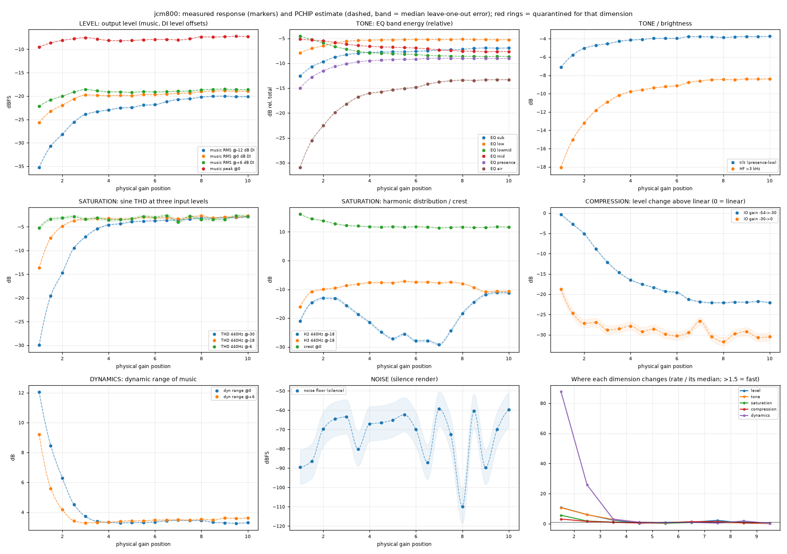
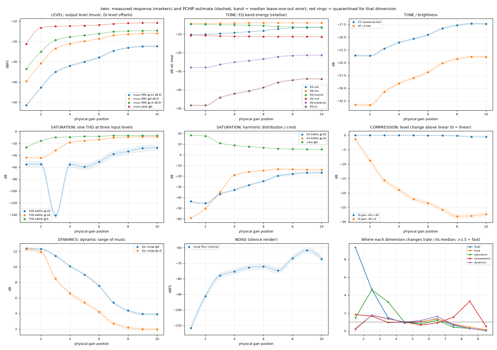
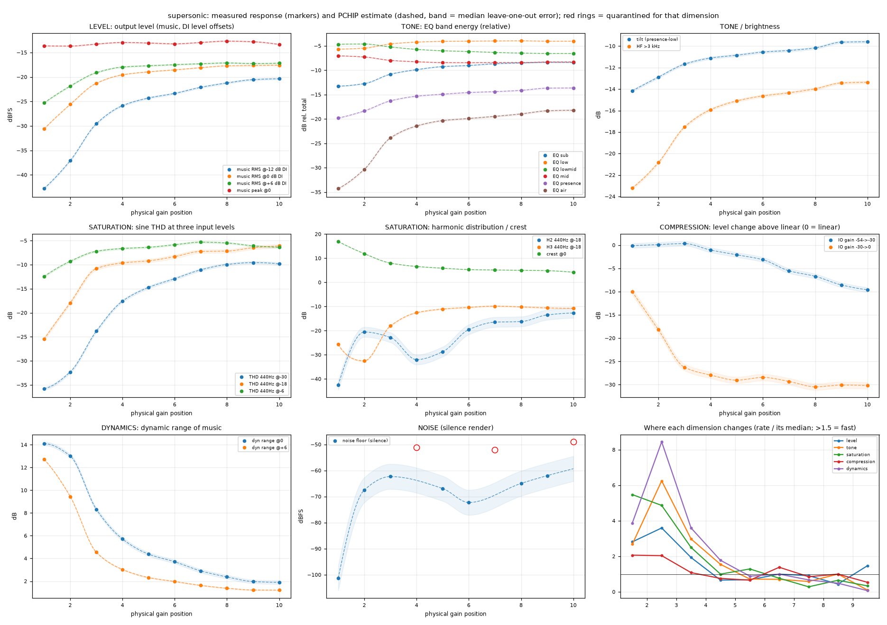
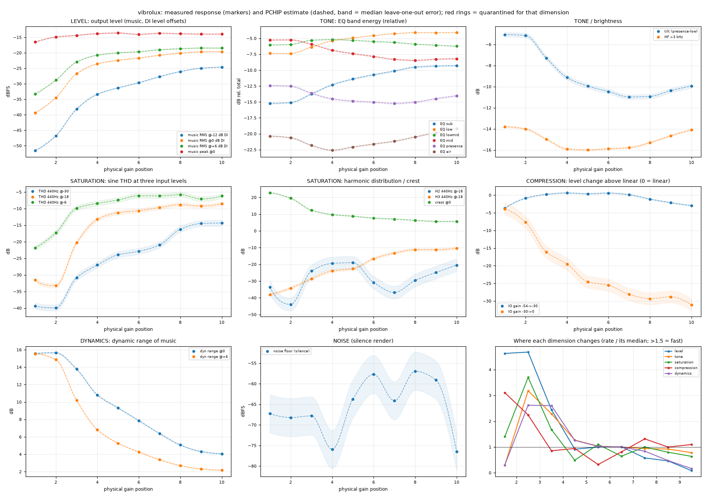
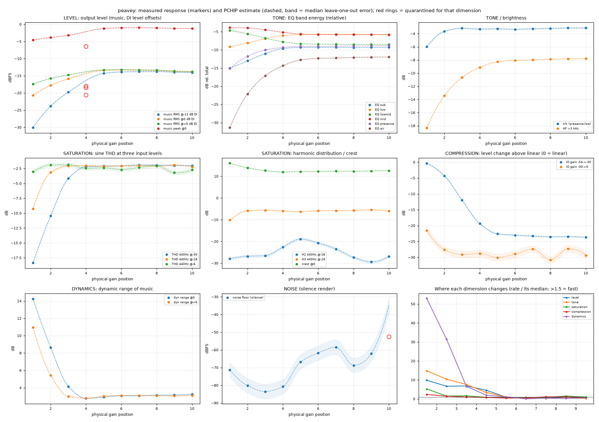
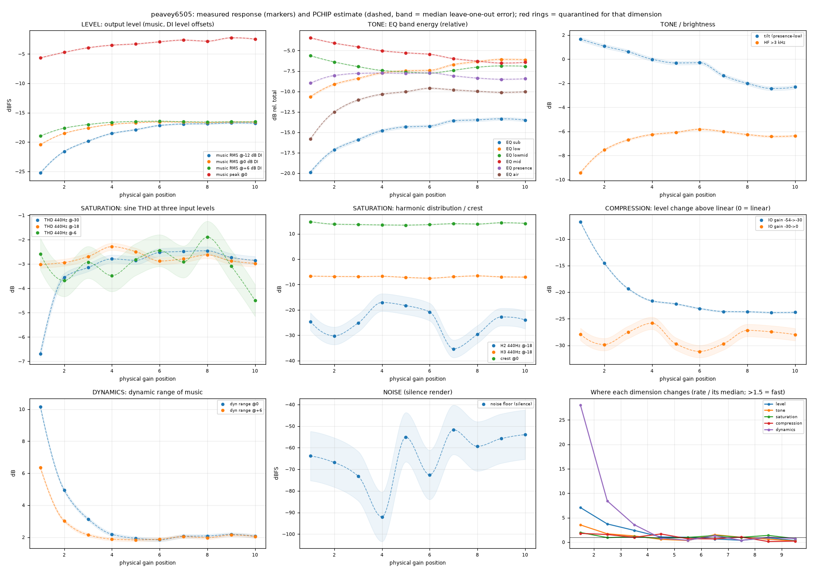
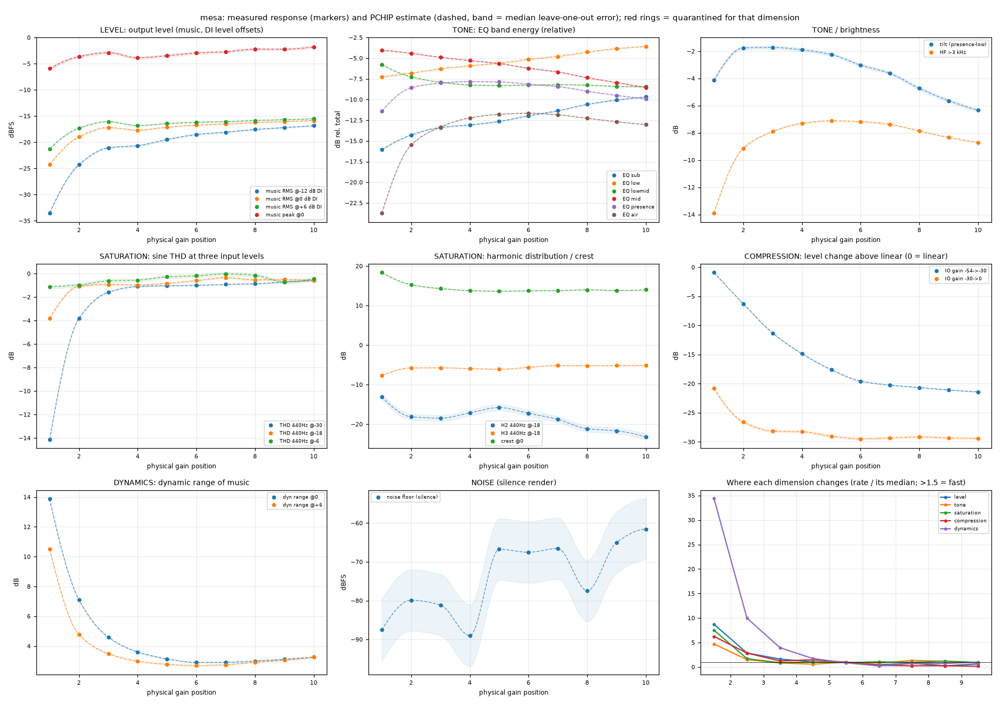
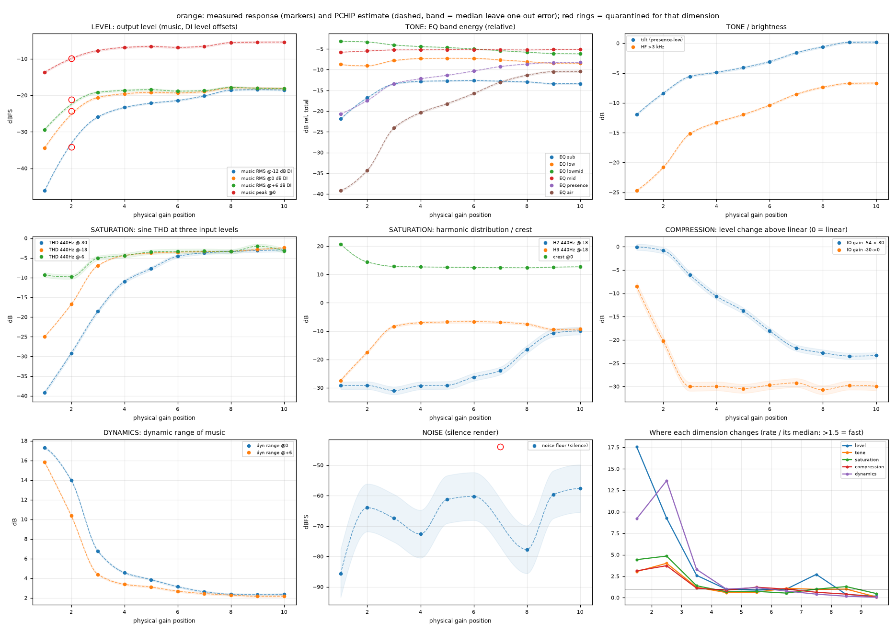

# Phase 4B: measured response profiles (all eight amps)

Built from the raw probe bank (`scripts/p4_probe_captures.py`) by `scripts/p4_profile.py`; data `work/p4/<amp>/profile.json`, plots `docs/phase4/profile_<amp>.png`. Level, tone/EQ, saturation, compression, dynamics and noise are kept as **separate dimensions**; nothing is collapsed into one gain curve. In the plots, markers are measured, dashed lines are shape-preserving (PCHIP) estimates between measured positions with a band showing the median leave-one-out error, and red rings mark a capture quarantined for that dimension only (level for Peavey G4 and Orange G2; noise for the noise-flagged captures). Plateaus and non-monotonic behaviour are kept as measured. Source material: the four fit DIs at native level and offsets -12/-6/+6 dB, plus sine sweeps (110/440 Hz, -54 to 0 dBFS RMS).

**How to read 'fast' and 'stable':** each dimension's change between adjacent positions is normalised by that dimension's total range; an interval is *fast* if it changes at more than 1.5x the amp's median rate and *stable* below 0.5x. These are relative to each amp's own behaviour.

## Marshall JCM800 2203 (High)

| Dimension | Changes quickly | Stable |
|---|---|---|
| level | G1-G4, G7-G8 | G4-G5, G8-G10 |
| tone | G1-G4 | G9-G10 |
| saturation | G1-G3 | G5-G6, G9-G10 |
| compression | G1-G3 | G9-G10 |
| dynamics | G1-G4, G8-G9 | G7-G8, G9-G10 |

- **Output-level plateau while character still changes:** none detected.
- **Quarantined from estimates:** none.
- **Last position where any dimension is still changing quickly:** G9; above it the response is comparatively stable.
- **Independent check of the estimate (genuine half-step captures, never used to fit):** the PCHIP curve through the integer positions predicts the measured half-steps to a median error of 0.8% of each series' range (worst series: noise floor (silence), 17.8%). This is the real, measured uncertainty of interpolating between captures on this amp.

## Fender 57 Custom Twin

| Dimension | Changes quickly | Stable |
|---|---|---|
| level | G1-G3 | G8-G10 |
| tone | G2-G3 | G1-G2, G8-G10 |
| saturation | G2-G4 | G7-G10 |
| compression | G1-G3, G7-G9 | none |
| dynamics | G2-G3, G6-G7 | G1-G2, G8-G10 |

- **Output-level plateau while character still changes:** none detected.
- **Quarantined from estimates:** none.
- **Last position where any dimension is still changing quickly:** G9; above it the response is comparatively stable.
- **Interpolation uncertainty (leave-one-out, no half-steps available):** median 1.9% of each series' range.

## Fender Super-Sonic, Bassman channel

| Dimension | Changes quickly | Stable |
|---|---|---|
| level | G1-G4 | G8-G9 |
| tone | G1-G5 | G9-G10 |
| saturation | G1-G4 | G7-G8, G9-G10 |
| compression | G1-G3 | none |
| dynamics | G1-G5 | G8-G10 |

- **Output-level plateau while character still changes:** none detected.
- **Quarantined from estimates:** noise: G4, G7, G10.
- **Last position where any dimension is still changing quickly:** G5; above it the response is comparatively stable.
- **Interpolation uncertainty (leave-one-out, no half-steps available):** median 1.9% of each series' range.

## Fender Super-Sonic, Vibrolux channel

| Dimension | Changes quickly | Stable |
|---|---|---|
| level | G1-G4 | G8-G10 |
| tone | G2-G4 | G1-G2 |
| saturation | G2-G4 | G4-G5 |
| compression | G1-G3 | G5-G6 |
| dynamics | G2-G4 | G1-G2, G8-G10 |

- **Output-level plateau while character still changes:** none detected.
- **Quarantined from estimates:** none.
- **Last position where any dimension is still changing quickly:** G4; above it the response is comparatively stable.
- **Interpolation uncertainty (leave-one-out, no half-steps available):** median 3.2% of each series' range.

## Peavey 5150

| Dimension | Changes quickly | Stable |
|---|---|---|
| level | G1-G5 | G6-G8 |
| tone | G1-G5 | G6-G10 |
| saturation | G1-G2, G3-G4 | none |
| compression | G1-G2 | G5-G6 |
| dynamics | G1-G5 | G6-G9 |

- **Output-level plateau while character still changes:** none detected.
- **Quarantined from estimates:** level: G4, noise: G10.
- **Last position where any dimension is still changing quickly:** G5; above it the response is comparatively stable.
- **Interpolation uncertainty (leave-one-out, no half-steps available):** median 1.2% of each series' range.

## Peavey 6505+ Scooped

| Dimension | Changes quickly | Stable |
|---|---|---|
| level | G1-G4 | G7-G8, G9-G10 |
| tone | G1-G3, G6-G7 | G5-G6, G9-G10 |
| saturation | G1-G2 | none |
| compression | G1-G3, G4-G5 | G8-G10 |
| dynamics | G1-G4 | G5-G6, G7-G8 |

- **Output-level plateau while character still changes:** none detected.
- **Quarantined from estimates:** none.
- **Last position where any dimension is still changing quickly:** G7; above it the response is comparatively stable.
- **Interpolation uncertainty (leave-one-out, no half-steps available):** median 2.8% of each series' range.

## Mesa Dual Rectifier

| Dimension | Changes quickly | Stable |
|---|---|---|
| level | G1-G4 | G6-G7, G8-G9 |
| tone | G1-G3 | none |
| saturation | G1-G3 | none |
| compression | G1-G3 | G6-G10 |
| dynamics | G1-G5 | G6-G7 |

- **Output-level plateau while character still changes:** G6-G7, G8-G9.
- **Quarantined from estimates:** none.
- **Last position where any dimension is still changing quickly:** G5; above it the response is comparatively stable.
- **Interpolation uncertainty (leave-one-out, no half-steps available):** median 1.8% of each series' range.

## Orange Dual Terror

| Dimension | Changes quickly | Stable |
|---|---|---|
| level | G1-G4, G7-G8 | G8-G10 |
| tone | G1-G3 | G9-G10 |
| saturation | G1-G3 | G9-G10 |
| compression | G1-G3 | G8-G10 |
| dynamics | G1-G4 | G7-G10 |

- **Output-level plateau while character still changes:** G8-G9.
- **Quarantined from estimates:** level: G2, noise: G7.
- **Last position where any dimension is still changing quickly:** G8; above it the response is comparatively stable.
- **Interpolation uncertainty (leave-one-out, no half-steps available):** median 1.7% of each series' range.
