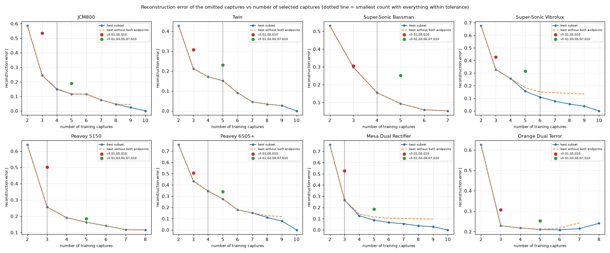

# Phase 4D: which captures carry distinct information? (selection without an imposed count)

Non-neural analysis on the validated captures; nothing here was trained. Code: `scripts/p4_select.py` (exhaustive subset search on measured profiles), `scripts/p4_select_teacher.py` (audio-domain blend check), `scripts/p4_select_report.py`; data `work/p4/<amp>/selection.json`, `teacher.json`.

## Method

- **Question asked of each subset S:** how well are the OTHER captures reproduced from S? Each omitted position is predicted by shape-preserving (PCHIP) interpolation of the selected captures' measured response along the knob axis (held flat outside the selected span), separately for **tone** (six EQ bands + tilt), **saturation** (HF>3 kHz, sine THD at three levels, H2, H3, crest) and **compression** (two input/output slopes, dynamic range). **Level is reported, not optimised** (captures are normalised). THD/harmonics are floored at -80 dB (below that is numerical floor, not signal).
- **Objective:** per dimension, half the mean and half the worst-case normalised error over all integer positions (selected positions count as zero), summed over the three dimensions. Every subset of the eligible captures is evaluated (at most 1024 per amp); no count is fixed in advance and no neural training is involved.
- **Eligible anchors:** captures whose 4A status is VALID or CORRECTED. SUSPECT captures are analysis-only: they are still scored as omitted positions, and how well their neighbours predict them is reported separately.
- **How many captures?** Not imposed. The report shows the whole error-versus-count curve; `k*` is the smallest count at which EVERY omitted position is within a working tolerance in EVERY physical group (tone 1.0 dB, HF 1.0, crest 1.0, THD 5, IO slope 2.0, dynamic range 1.5). These tolerances are working values, not perceptual measurements, so `k*` is evidence, not a rule.
- **JCM800:** searched on the 10 integer positions only; the 9 genuine half-steps are an independent check of the chosen sets.
- **Audio check:** for chosen sets the real captures (timing-aligned with the 4A corrections) are blended in the waveform domain with weight linear in knob position, and the result is compared with the real omitted captures on the fit DIs. This tests the teacher-construction step itself, and is not affected by any NAM.
- **Hypothesis test, not the criterion:** the v3 NAM's own per-position errors are compared with the profile analysis at the end; they were not used to choose subsets.

## Summary across amps

| Amp | eligible anchors | k* | best set at k* | best 3 | best 5 | v3 C3 (G1,G5,G10) J | best-3 J | v3 C5 J | best-5 J |
|---|---|---:|---|---|---|---:|---:|---:|---:|
| JCM800 | 10 | 4 | G1, G2, G4, G10 | G1, G3, G8 | G1, G2, G3, G5, G9 | 0.534 | 0.244 | 0.189 | 0.116 |
| Twin | 10 | 5 | G1, G2, G3, G4, G9 | G2, G4, G9 | G1, G2, G3, G4, G9 | 0.307 | 0.212 | 0.229 | 0.151 |
| Super-Sonic Bassman | 7 | 4 | G1, G2, G3, G9 | G1, G3, G8 | G1, G2, G3, G6, G9 | 0.305 | 0.298 | 0.251 | 0.093 |
| Super-Sonic Vibrolux | 10 | 6 | G1, G2, G3, G4, G7, G10 | G2, G5, G9 | G1, G2, G4, G8, G10 | 0.428 | 0.329 | 0.316 | 0.156 |
| Peavey 5150 | 8 | 3 | G1, G3, G6 | G1, G3, G6 | G1, G2, G3, G5, G9 | 0.501 | 0.256 | 0.185 | 0.163 |
| Peavey 6505+ | 10 | 4 | G1, G3, G5, G9 | G1, G3, G9 | G1, G2, G4, G5, G9 | 0.505 | 0.433 | 0.339 | 0.274 |
| Mesa Dual Rectifier | 10 | 3 | G1, G3, G9 | G1, G3, G9 | G1, G2, G5, G6, G10 | 0.526 | 0.266 | 0.186 | 0.087 |
| Orange Dual Terror | 8 | none | - | G1, G4, G9 | G1, G4, G6, G8, G9 | 0.307 | 0.229 | 0.254 | 0.211 |

J = objective above (lower is better). The v3 fixed sets G1/G5/G10 and G1/G3/G5/G7/G10 are compared with the best set of the same size for that amp.

## Hypothesis test: does the profile analysis predict where the v3 NAM (C3, measured mapping) struggles?

For interior positions the C3 model was NOT trained on: rank correlation between the capture's leave-one-out error (how badly its neighbours predict it, from the profile) and the C3 model's own held-out error at that position, per dimension. Positive = positions that are hard to interpolate are also where the NAM is worse. Not a selection criterion; a check that the profile analysis is measuring something the NAM also feels.

| Dimension | n positions | Spearman rho | p |
|---|---:|---:|---:|
| tone | 56 | +0.31 | 0.022 |
| saturation | 56 | +0.16 | 0.225 |
| compression | 56 | -0.20 | 0.134 |

Positions are pooled over the eight amps (single seed, one model per amp), so treat as indicative.

## Per-amp results

### JCM800

**Best subset per count** (evaluated over every subset of the eligible captures; `fails` = physical groups where some omitted position exceeds its working tolerance):

| k | best set | J | best set if not both endpoints are kept | J | fails (max error dB) |
|---:|---|---:|---|---:|---|
| 2 | G1, G3 | 0.586 | G1, G3 | 0.586 | tone EQ (dB) 1.8, HF>3k (dB) 2.5, IO slope (dB) 6.4, dyn range (dB) 1.8 |
| 3 | G1, G3, G8 | 0.244 | G1, G3, G8 | 0.244 | IO slope (dB) 2.6 |
| 4 | G1, G2, G4, G10 | 0.149 | G1, G2, G4, G9 | 0.153 | none |
| 5 | G1, G2, G3, G5, G9 | 0.116 | G1, G2, G3, G5, G9 | 0.116 | none |
| 6 | G1, G2, G3, G4, G5, G9 | 0.115 | G1, G2, G3, G4, G5, G9 | 0.115 | none |
| 7 | G1, G2, G4, G6, G7, G8, G9 | 0.076 | G1, G2, G4, G6, G7, G8, G9 | 0.076 | none |
| 8 | G1, G2, G3, G4, G6, G7, G8, G9 | 0.047 | G1, G2, G3, G4, G6, G7, G8, G9 | 0.047 | none |
| 9 | G1, G2, G3, G4, G6, G7, G8, G9, G10 | 0.023 | G1, G2, G3, G4, G5, G6, G7, G8, G9 | 0.044 | none |
| 10 | G1, G2, G3, G4, G5, G6, G7, G8, G9, G10 | 0.000 | - | - | none |

**Greedy contribution order** (each step adds the capture that reduces J most): G2 (1.389) > G5 (1.018) > G1 (0.330) > G9 (0.165) > G3 (0.116) > G4 (0.115) > G8 (0.122) > G7 (0.082) > G6 (0.044) > G10 (0.000).

**Distinctness** (leave-one-out error, normalised by each dimension's range; large = the capture is not predictable from its neighbours = carries distinct information):

| Position | tone | saturation | compression |
|---|---:|---:|---:|
| G1 (endpoint, extrapolated) | 0.451 | 0.611 | 0.594 |
| G2 | 0.058 | 0.126 | 0.078 |
| G3 | 0.024 | 0.027 | 0.056 |
| G4 | 0.017 | 0.029 | 0.026 |
| G5 | 0.008 | 0.023 | 0.012 |
| G6 | 0.022 | 0.057 | 0.064 |
| G7 | 0.020 | 0.101 | 0.100 |
| G8 | 0.014 | 0.076 | 0.083 |
| G9 | 0.015 | 0.072 | 0.050 |
| G10 (endpoint, extrapolated) | 0.006 | 0.048 | 0.025 |

**Independent check on the genuine half-step captures** (never in the search): mean error when predicted from each chosen set (tone EQ / HF / crest / IO slope / dyn range, dB):

| Set | tone | HF | crest | IO slope | dyn range |
|---|---:|---:|---:|---:|---:|
| best k=3 | 0.15 | 0.17 | 0.16 | 0.98 | 0.24 |
| best k=4 | 0.09 | 0.08 | 0.12 | 0.60 | 0.14 |
| best k=5 | 0.07 | 0.08 | 0.09 | 0.64 | 0.09 |
| best k=6 | 0.06 | 0.08 | 0.12 | 0.61 | 0.09 |
| G1,G5,G10 (v3 C3) | 0.36 | 0.55 | 0.34 | 0.99 | 0.76 |
| G1,G3,G5,G7,G10 (v3 C5) | 0.10 | 0.14 | 0.15 | 1.10 | 0.17 |

**Audio-domain check** (waveform blend of the selected captures vs the real omitted captures, fit DIs, mean absolute error in dB; lower is better):

| Set | tone EQ | HF>3k | crest | dyn range | level |
|---|---:|---:|---:|---:|---:|
| best k=3: G1, G3, G8 | 0.51 | 0.84 | 0.29 | 0.29 | 0.22 |
| best k=5: G1, G2, G3, G5, G9 | 0.52 | 1.04 | 0.26 | 0.17 | 0.29 |
| best k=4: G1, G2, G4, G10 | 0.65 | 1.35 | 0.31 | 0.23 | 0.62 |
| G1,G5,G10 (v3 C3): G1, G5, G10 | 0.64 | 1.20 | 0.48 | 0.41 | 1.38 |
| G1,G3,G5,G7,G10 (v3 C5): G1, G3, G5, G7, G10 | 0.58 | 1.04 | 0.30 | 0.48 | 0.44 |

Proposed input-gain anchors for the best k=3 set (G1, G3, G8), from the measured response distance between ALL validated captures (analysis-only captures included; range -22 to +14 dB as in v3, minimum 4 dB between anchors): G1 -22.0, G3 -3.2, G8 +14.0 dB.
Proposed input-gain anchors for the best k=4 set (G1, G2, G4, G10), from the measured response distance between ALL validated captures (analysis-only captures included; range -22 to +14 dB as in v3, minimum 4 dB between anchors): G1 -22.0, G2 -10.5, G4 -2.6, G10 +14.0 dB.
Proposed input-gain anchors for the best k=5 set (G1, G2, G3, G5, G9), from the measured response distance between ALL validated captures (analysis-only captures included; range -22 to +14 dB as in v3, minimum 4 dB between anchors): G1 -22.0, G2 -9.9, G3 -4.6, G5 +0.4, G9 +14.0 dB.

### Twin

**Best subset per count** (evaluated over every subset of the eligible captures; `fails` = physical groups where some omitted position exceeds its working tolerance):

| k | best set | J | best set if not both endpoints are kept | J | fails (max error dB) |
|---:|---|---:|---|---:|---|
| 2 | G2, G8 | 0.427 | G2, G8 | 0.427 | HF>3k (dB) 1.2, crest (dB) 4.7, THD (dB) 13.2, IO slope (dB) 3.7 |
| 3 | G2, G4, G9 | 0.212 | G2, G4, G9 | 0.212 | crest (dB) 1.2, THD (dB) 10.1, IO slope (dB) 3.7 |
| 4 | G2, G5, G8, G9 | 0.171 | G2, G5, G8, G9 | 0.171 | crest (dB) 2.3, THD (dB) 8.2, IO slope (dB) 3.7 |
| 5 | G1, G2, G3, G4, G9 | 0.151 | G1, G2, G3, G4, G9 | 0.151 | none |
| 6 | G1, G2, G3, G5, G8, G9 | 0.091 | G1, G2, G3, G5, G8, G9 | 0.091 | THD (dB) 7.0 |
| 7 | G1, G2, G3, G4, G6, G7, G9 | 0.045 | G1, G2, G3, G4, G6, G7, G9 | 0.045 | none |
| 8 | G1, G2, G3, G4, G5, G6, G7, G9 | 0.034 | G1, G2, G3, G4, G5, G6, G7, G9 | 0.034 | none |
| 9 | G1, G2, G3, G4, G5, G6, G7, G8, G9 | 0.026 | G1, G2, G3, G4, G5, G6, G7, G8, G9 | 0.026 | none |
| 10 | G1, G2, G3, G4, G5, G6, G7, G8, G9, G10 | 0.000 | - | - | none |

**Greedy contribution order** (each step adds the capture that reduces J most): G5 (1.308) > G2 (0.867) > G9 (0.216) > G8 (0.171) > G3 (0.159) > G1 (0.091) > G4 (0.054) > G7 (0.051) > G6 (0.026) > G10 (0.000).

**Distinctness** (leave-one-out error, normalised by each dimension's range; large = the capture is not predictable from its neighbours = carries distinct information):

| Position | tone | saturation | compression |
|---|---:|---:|---:|
| G1 (endpoint, extrapolated) | 0.036 | 0.128 | 0.094 |
| G2 | 0.087 | 0.170 | 0.068 |
| G3 | 0.052 | 0.144 | 0.049 |
| G4 | 0.012 | 0.084 | 0.029 |
| G5 | 0.007 | 0.028 | 0.014 |
| G6 | 0.037 | 0.026 | 0.024 |
| G7 | 0.036 | 0.031 | 0.027 |
| G8 | 0.006 | 0.008 | 0.068 |
| G9 | 0.021 | 0.010 | 0.094 |
| G10 (endpoint, extrapolated) | 0.018 | 0.006 | 0.024 |

**Audio-domain check** (waveform blend of the selected captures vs the real omitted captures, fit DIs, mean absolute error in dB; lower is better):

| Set | tone EQ | HF>3k | crest | dyn range | level |
|---|---:|---:|---:|---:|---:|
| best k=3: G2, G4, G9 | 0.22 | 0.37 | 0.40 | 0.57 | 1.75 |
| best k=5: G1, G2, G3, G4, G9 | 0.23 | 0.40 | 0.29 | 0.62 | 0.45 |
| G1,G5,G10 (v3 C3): G1, G5, G10 | 0.85 | 1.81 | 1.57 | 1.17 | 1.03 |
| G1,G3,G5,G7,G10 (v3 C5): G1, G3, G5, G7, G10 | 0.47 | 0.88 | 1.24 | 0.53 | 0.75 |

Proposed input-gain anchors for the best k=3 set (G2, G4, G9), from the measured response distance between ALL validated captures (analysis-only captures included; range -22 to +14 dB as in v3, minimum 4 dB between anchors): G2 -22.0, G4 -6.0, G9 +14.0 dB.
Proposed input-gain anchors for the best k=5 set (G1, G2, G3, G4, G9), from the measured response distance between ALL validated captures (analysis-only captures included; range -22 to +14 dB as in v3, minimum 4 dB between anchors): G1 -22.0, G2 -17.7, G3 -9.6, G4 -3.6, G9 +14.0 dB.

### Super-Sonic Bassman

Not eligible as training anchors (analysis-only, 4A status): G4 SUSPECT, G7 SUSPECT, G10 SUSPECT.

**Best subset per count** (evaluated over every subset of the eligible captures; `fails` = physical groups where some omitted position exceeds its working tolerance):

| k | best set | J | best set if not both endpoints are kept | J | fails (max error dB) |
|---:|---|---:|---|---:|---|
| 2 | G1, G5 | 0.532 | G1, G5 | 0.532 | HF>3k (dB) 1.7, crest (dB) 3.4, IO slope (dB) 4.3, dyn range (dB) 1.9 |
| 3 | G1, G3, G8 | 0.298 | G1, G3, G8 | 0.298 | HF>3k (dB) 1.0, dyn range (dB) 2.0 |
| 4 | G1, G2, G3, G9 | 0.155 | G1, G2, G3, G9 | 0.155 | none |
| 5 | G1, G2, G3, G6, G9 | 0.093 | G1, G2, G3, G6, G9 | 0.093 | none |
| 6 | G1, G2, G3, G5, G8, G9 | 0.059 | G1, G2, G3, G5, G8, G9 | 0.059 | none |
| 7 | G1, G2, G3, G5, G6, G8, G9 | 0.052 | G1, G2, G3, G5, G6, G8, G9 | 0.052 | none |

**Greedy contribution order** (each step adds the capture that reduces J most): G3 (1.295) > G1 (0.975) > G8 (0.298) > G2 (0.164) > G9 (0.118) > G5 (0.059) > G6 (0.052).

**Distinctness** (leave-one-out error, normalised by each dimension's range; large = the capture is not predictable from its neighbours = carries distinct information):

| Position | tone | saturation | compression |
|---|---:|---:|---:|
| G1 (endpoint, extrapolated) | 0.167 | 0.377 | 0.199 |
| G2 | 0.147 | 0.149 | 0.111 |
| G3 | 0.091 | 0.089 | 0.089 |
| G4 | 0.016 | 0.041 | 0.020 |
| G5 | 0.018 | 0.017 | 0.017 |
| G6 | 0.014 | 0.017 | 0.029 |
| G7 | 0.008 | 0.018 | 0.023 |
| G8 | 0.024 | 0.015 | 0.023 |
| G9 | 0.033 | 0.022 | 0.019 |
| G10 (endpoint, extrapolated) | 0.006 | 0.023 | 0.029 |

**How well neighbours predict the SUSPECT captures** (best set at k=4; physical units; large = irregular capture that cannot be inferred, so the flag may matter to the training plan): G4: tone EQ (dB) 0.3, HF>3k (dB) 0.4, crest (dB) 0.4, THD (dB) 0.9, IO slope (dB) 0.8, dyn range (dB) 0.6; G7: tone EQ (dB) 0.2, HF>3k (dB) 0.4, crest (dB) 0.0, THD (dB) 0.5, IO slope (dB) 1.2, dyn range (dB) 0.1; G10: tone EQ (dB) 0.0, HF>3k (dB) 0.1, crest (dB) 0.6, THD (dB) 0.3, IO slope (dB) 0.6, dyn range (dB) 0.0.

**Audio-domain check** (waveform blend of the selected captures vs the real omitted captures, fit DIs, mean absolute error in dB; lower is better):

| Set | tone EQ | HF>3k | crest | dyn range | level |
|---|---:|---:|---:|---:|---:|
| best k=3: G1, G3, G8 | 0.73 | 1.72 | 0.49 | 0.93 | 0.63 |
| best k=5: G1, G2, G3, G6, G9 | 0.53 | 1.45 | 0.25 | 0.18 | 0.46 |
| best k=4: G1, G2, G3, G9 | 0.59 | 1.59 | 0.65 | 0.46 | 0.92 |
| G1,G5,G10 (v3 C3): G1, G5, G10 | 0.73 | 1.30 | 0.46 | 1.42 | 0.80 |
| G1,G3,G5,G7,G10 (v3 C5): G1, G3, G5, G7, G10 | 0.71 | 1.53 | 0.42 | 0.90 | 0.36 |

Proposed input-gain anchors for the best k=3 set (G1, G3, G8), from the measured response distance between ALL validated captures (analysis-only captures included; range -22 to +14 dB as in v3, minimum 4 dB between anchors): G1 -22.0, G3 -0.9, G8 +14.0 dB.
Proposed input-gain anchors for the best k=4 set (G1, G2, G3, G9), from the measured response distance between ALL validated captures (analysis-only captures included; range -22 to +14 dB as in v3, minimum 4 dB between anchors): G1 -22.0, G2 -13.1, G3 -2.1, G9 +14.0 dB.
Proposed input-gain anchors for the best k=5 set (G1, G2, G3, G6, G9), from the measured response distance between ALL validated captures (analysis-only captures included; range -22 to +14 dB as in v3, minimum 4 dB between anchors): G1 -22.0, G2 -13.1, G3 -2.1, G6 +8.4, G9 +14.0 dB.

### Super-Sonic Vibrolux

**Best subset per count** (evaluated over every subset of the eligible captures; `fails` = physical groups where some omitted position exceeds its working tolerance):

| k | best set | J | best set if not both endpoints are kept | J | fails (max error dB) |
|---:|---|---:|---|---:|---|
| 2 | G1, G7 | 0.676 | G1, G7 | 0.676 | HF>3k (dB) 1.7, crest (dB) 5.2, THD (dB) 5.3, IO slope (dB) 3.4, dyn range (dB) 1.8 |
| 3 | G2, G5, G9 | 0.329 | G2, G5, G9 | 0.329 | crest (dB) 3.3, IO slope (dB) 3.3 |
| 4 | G1, G2, G4, G9 | 0.257 | G1, G2, G4, G9 | 0.257 | crest (dB) 1.7 |
| 5 | G1, G2, G4, G8, G10 | 0.156 | G1, G2, G4, G7, G9 | 0.184 | crest (dB) 1.7 |
| 6 | G1, G2, G3, G4, G7, G10 | 0.110 | G1, G2, G3, G4, G7, G9 | 0.151 | none |
| 7 | G1, G2, G3, G4, G7, G8, G10 | 0.078 | G1, G2, G3, G4, G7, G8, G9 | 0.145 | none |
| 8 | G1, G2, G3, G4, G5, G7, G8, G10 | 0.054 | G1, G2, G3, G4, G5, G7, G8, G9 | 0.139 | none |
| 9 | G1, G2, G3, G4, G5, G6, G7, G8, G10 | 0.038 | G1, G2, G3, G4, G5, G6, G7, G8, G9 | 0.135 | none |
| 10 | G1, G2, G3, G4, G5, G6, G7, G8, G9, G10 | 0.000 | - | - | none |

**Greedy contribution order** (each step adds the capture that reduces J most): G3 (1.460) > G8 (0.916) > G2 (0.397) > G10 (0.332) > G1 (0.220) > G4 (0.115) > G7 (0.078) > G5 (0.054) > G6 (0.038) > G9 (0.000).

**Distinctness** (leave-one-out error, normalised by each dimension's range; large = the capture is not predictable from its neighbours = carries distinct information):

| Position | tone | saturation | compression |
|---|---:|---:|---:|
| G1 (endpoint, extrapolated) | 0.033 | 0.174 | 0.212 |
| G2 | 0.151 | 0.230 | 0.091 |
| G3 | 0.070 | 0.124 | 0.047 |
| G4 | 0.070 | 0.043 | 0.057 |
| G5 | 0.011 | 0.059 | 0.034 |
| G6 | 0.019 | 0.039 | 0.031 |
| G7 | 0.033 | 0.057 | 0.013 |
| G8 | 0.027 | 0.036 | 0.021 |
| G9 | 0.023 | 0.030 | 0.016 |
| G10 (endpoint, extrapolated) | 0.088 | 0.079 | 0.078 |

**Audio-domain check** (waveform blend of the selected captures vs the real omitted captures, fit DIs, mean absolute error in dB; lower is better):

| Set | tone EQ | HF>3k | crest | dyn range | level |
|---|---:|---:|---:|---:|---:|
| best k=3: G2, G5, G9 | 0.57 | 1.11 | 1.03 | 0.86 | 1.38 |
| best k=5: G1, G2, G4, G8, G10 | 0.58 | 1.24 | 0.33 | 1.04 | 0.44 |
| best k=6: G1, G2, G3, G4, G7, G10 | 0.50 | 1.14 | 0.20 | 0.49 | 0.27 |
| G1,G5,G10 (v3 C3): G1, G5, G10 | 0.97 | 1.52 | 0.89 | 1.73 | 0.93 |
| G1,G3,G5,G7,G10 (v3 C5): G1, G3, G5, G7, G10 | 0.66 | 1.35 | 1.08 | 0.62 | 1.02 |

Proposed input-gain anchors for the best k=3 set (G2, G5, G9), from the measured response distance between ALL validated captures (analysis-only captures included; range -22 to +14 dB as in v3, minimum 4 dB between anchors): G2 -22.0, G5 -1.0, G9 +14.0 dB.
Proposed input-gain anchors for the best k=5 set (G1, G2, G4, G8, G10), from the measured response distance between ALL validated captures (analysis-only captures included; range -22 to +14 dB as in v3, minimum 4 dB between anchors): G1 -22.0, G2 -17.4, G4 -3.1, G8 +8.6, G10 +14.0 dB.
Proposed input-gain anchors for the best k=6 set (G1, G2, G3, G4, G7, G10), from the measured response distance between ALL validated captures (analysis-only captures included; range -22 to +14 dB as in v3, minimum 4 dB between anchors): G1 -22.0, G2 -17.4, G3 -8.4, G4 -3.1, G7 +5.3, G10 +14.0 dB.

### Peavey 5150

Not eligible as training anchors (analysis-only, 4A status): G4 SUSPECT, G10 SUSPECT.

**Best subset per count** (evaluated over every subset of the eligible captures; `fails` = physical groups where some omitted position exceeds its working tolerance):

| k | best set | J | best set if not both endpoints are kept | J | fails (max error dB) |
|---:|---|---:|---|---:|---|
| 2 | G1, G3 | 0.639 | G1, G3 | 0.639 | tone EQ (dB) 2.1, HF>3k (dB) 2.9, IO slope (dB) 6.6 |
| 3 | G1, G3, G6 | 0.256 | G1, G3, G6 | 0.256 | none |
| 4 | G1, G2, G5, G9 | 0.190 | G1, G2, G5, G9 | 0.190 | none |
| 5 | G1, G2, G3, G5, G9 | 0.163 | G1, G2, G3, G5, G9 | 0.163 | none |
| 6 | G1, G2, G3, G5, G8, G9 | 0.140 | G1, G2, G3, G5, G8, G9 | 0.140 | none |
| 7 | G1, G2, G3, G5, G7, G8, G9 | 0.117 | G1, G2, G3, G5, G7, G8, G9 | 0.117 | none |
| 8 | G1, G2, G3, G5, G6, G7, G8, G9 | 0.115 | G1, G2, G3, G5, G6, G7, G8, G9 | 0.115 | none |

**Greedy contribution order** (each step adds the capture that reduces J most): G2 (1.431) > G5 (0.921) > G1 (0.318) > G9 (0.190) > G3 (0.163) > G8 (0.140) > G7 (0.117) > G6 (0.115).

**Distinctness** (leave-one-out error, normalised by each dimension's range; large = the capture is not predictable from its neighbours = carries distinct information):

| Position | tone | saturation | compression |
|---|---:|---:|---:|
| G1 (endpoint, extrapolated) | 0.397 | 0.599 | 0.497 |
| G2 | 0.046 | 0.101 | 0.052 |
| G3 | 0.021 | 0.076 | 0.051 |
| G4 | 0.024 | 0.060 | 0.049 |
| G5 | 0.016 | 0.078 | 0.043 |
| G6 | 0.011 | 0.050 | 0.007 |
| G7 | 0.005 | 0.017 | 0.068 |
| G8 | 0.005 | 0.089 | 0.096 |
| G9 | 0.007 | 0.155 | 0.093 |
| G10 (endpoint, extrapolated) | 0.009 | 0.114 | 0.061 |

**How well neighbours predict the SUSPECT captures** (best set at k=3; physical units; large = irregular capture that cannot be inferred, so the flag may matter to the training plan): G4: tone EQ (dB) 0.3, HF>3k (dB) 0.2, crest (dB) 0.4, THD (dB) 0.5, IO slope (dB) 1.6, dyn range (dB) 0.5; G10: tone EQ (dB) 0.1, HF>3k (dB) 0.3, crest (dB) 0.3, THD (dB) 0.1, IO slope (dB) 0.6, dyn range (dB) 0.1.

**Audio-domain check** (waveform blend of the selected captures vs the real omitted captures, fit DIs, mean absolute error in dB; lower is better):

| Set | tone EQ | HF>3k | crest | dyn range | level |
|---|---:|---:|---:|---:|---:|
| best k=3: G1, G3, G6 | 0.52 | 0.89 | 0.38 | 0.58 | 0.82 |
| best k=5: G1, G2, G3, G5, G9 | 0.57 | 1.10 | 0.34 | 0.15 | 1.03 |
| G1,G5,G10 (v3 C3): G1, G5, G10 | 0.70 | 1.04 | 0.43 | 0.67 | 1.13 |
| G1,G3,G5,G7,G10 (v3 C5): G1, G3, G5, G7, G10 | 0.52 | 0.82 | 0.30 | 0.60 | 1.00 |

Proposed input-gain anchors for the best k=3 set (G1, G3, G6), from the measured response distance between ALL validated captures (analysis-only captures included; range -22 to +14 dB as in v3, minimum 4 dB between anchors): G1 -22.0, G3 +1.8, G6 +14.0 dB.
Proposed input-gain anchors for the best k=5 set (G1, G2, G3, G5, G9), from the measured response distance between ALL validated captures (analysis-only captures included; range -22 to +14 dB as in v3, minimum 4 dB between anchors): G1 -22.0, G2 -10.2, G3 -4.6, G5 +2.6, G9 +14.0 dB.

### Peavey 6505+

**Best subset per count** (evaluated over every subset of the eligible captures; `fails` = physical groups where some omitted position exceeds its working tolerance):

| k | best set | J | best set if not both endpoints are kept | J | fails (max error dB) |
|---:|---|---:|---|---:|---|
| 2 | G1, G3 | 0.756 | G1, G3 | 0.756 | tone EQ (dB) 1.4, IO slope (dB) 3.7 |
| 3 | G1, G3, G9 | 0.433 | G1, G3, G9 | 0.433 | IO slope (dB) 2.0 |
| 4 | G1, G3, G5, G9 | 0.345 | G1, G3, G5, G9 | 0.345 | none |
| 5 | G1, G2, G4, G5, G9 | 0.274 | G1, G2, G4, G5, G9 | 0.274 | none |
| 6 | G1, G2, G4, G6, G8, G9 | 0.178 | G1, G2, G4, G6, G8, G9 | 0.178 | none |
| 7 | G1, G2, G4, G6, G7, G8, G9 | 0.151 | G1, G2, G4, G6, G7, G8, G9 | 0.151 | none |
| 8 | G1, G2, G4, G6, G7, G8, G9, G10 | 0.111 | G1, G2, G4, G5, G6, G7, G8, G9 | 0.126 | none |
| 9 | G1, G2, G4, G5, G6, G7, G8, G9, G10 | 0.079 | G1, G2, G3, G4, G5, G6, G7, G8, G9 | 0.119 | none |
| 10 | G1, G2, G3, G4, G5, G6, G7, G8, G9, G10 | 0.000 | - | - | none |

**Greedy contribution order** (each step adds the capture that reduces J most): G3 (1.202) > G1 (0.756) > G9 (0.433) > G5 (0.345) > G7 (0.317) > G6 (0.274) > G8 (0.232) > G2 (0.187) > G4 (0.119) > G10 (0.000).

**Distinctness** (leave-one-out error, normalised by each dimension's range; large = the capture is not predictable from its neighbours = carries distinct information):

| Position | tone | saturation | compression |
|---|---:|---:|---:|
| G1 (endpoint, extrapolated) | 0.391 | 0.421 | 0.546 |
| G2 | 0.045 | 0.164 | 0.147 |
| G3 | 0.025 | 0.096 | 0.022 |
| G4 | 0.022 | 0.162 | 0.132 |
| G5 | 0.028 | 0.062 | 0.065 |
| G6 | 0.082 | 0.191 | 0.075 |
| G7 | 0.047 | 0.169 | 0.039 |
| G8 | 0.013 | 0.202 | 0.062 |
| G9 | 0.038 | 0.194 | 0.022 |
| G10 (endpoint, extrapolated) | 0.027 | 0.156 | 0.034 |

**Audio-domain check** (waveform blend of the selected captures vs the real omitted captures, fit DIs, mean absolute error in dB; lower is better):

| Set | tone EQ | HF>3k | crest | dyn range | level |
|---|---:|---:|---:|---:|---:|
| best k=3: G1, G3, G9 | 0.71 | 1.31 | 0.37 | 0.25 | 1.01 |
| best k=5: G1, G2, G4, G5, G9 | 0.61 | 1.15 | 0.26 | 0.30 | 0.64 |
| best k=4: G1, G3, G5, G9 | 0.54 | 1.01 | 0.28 | 0.28 | 0.64 |
| G1,G5,G10 (v3 C3): G1, G5, G10 | 0.75 | 1.42 | 0.39 | 0.46 | 1.15 |
| G1,G3,G5,G7,G10 (v3 C5): G1, G3, G5, G7, G10 | 0.70 | 1.33 | 0.35 | 0.36 | 0.68 |

Proposed input-gain anchors for the best k=3 set (G1, G3, G9), from the measured response distance between ALL validated captures (analysis-only captures included; range -22 to +14 dB as in v3, minimum 4 dB between anchors): G1 -22.0, G3 -9.5, G9 +14.0 dB.
Proposed input-gain anchors for the best k=4 set (G1, G3, G5, G9), from the measured response distance between ALL validated captures (analysis-only captures included; range -22 to +14 dB as in v3, minimum 4 dB between anchors): G1 -22.0, G3 -9.5, G5 -1.5, G9 +14.0 dB.
Proposed input-gain anchors for the best k=5 set (G1, G2, G4, G5, G9), from the measured response distance between ALL validated captures (analysis-only captures included; range -22 to +14 dB as in v3, minimum 4 dB between anchors): G1 -22.0, G2 -13.5, G4 -5.5, G5 -1.5, G9 +14.0 dB.

### Mesa Dual Rectifier

**Best subset per count** (evaluated over every subset of the eligible captures; `fails` = physical groups where some omitted position exceeds its working tolerance):

| k | best set | J | best set if not both endpoints are kept | J | fails (max error dB) |
|---:|---|---:|---|---:|---|
| 2 | G1, G3 | 0.759 | G1, G3 | 0.759 | tone EQ (dB) 2.1, HF>3k (dB) 1.8, crest (dB) 1.0, IO slope (dB) 5.7, dyn range (dB) 2.2 |
| 3 | G1, G3, G9 | 0.266 | G1, G3, G9 | 0.266 | none |
| 4 | G1, G2, G6, G10 | 0.125 | G1, G2, G6, G9 | 0.141 | none |
| 5 | G1, G2, G5, G6, G10 | 0.087 | G1, G2, G4, G7, G9 | 0.115 | none |
| 6 | G1, G2, G4, G7, G9, G10 | 0.067 | G1, G2, G3, G5, G7, G9 | 0.106 | none |
| 7 | G1, G2, G3, G5, G7, G9, G10 | 0.055 | G1, G2, G3, G5, G7, G8, G9 | 0.102 | none |
| 8 | G1, G2, G3, G5, G7, G8, G9, G10 | 0.037 | G1, G2, G3, G5, G6, G7, G8, G9 | 0.099 | none |
| 9 | G1, G2, G3, G5, G6, G7, G8, G9, G10 | 0.028 | G1, G2, G3, G4, G5, G6, G7, G8, G9 | 0.097 | none |
| 10 | G1, G2, G3, G4, G5, G6, G7, G8, G9, G10 | 0.000 | - | - | none |

**Greedy contribution order** (each step adds the capture that reduces J most): G2 (1.391) > G7 (1.007) > G1 (0.369) > G10 (0.186) > G5 (0.092) > G9 (0.071) > G3 (0.055) > G8 (0.037) > G6 (0.028) > G4 (0.000).

**Distinctness** (leave-one-out error, normalised by each dimension's range; large = the capture is not predictable from its neighbours = carries distinct information):

| Position | tone | saturation | compression |
|---|---:|---:|---:|
| G1 (endpoint, extrapolated) | 0.432 | 0.613 | 0.570 |
| G2 | 0.072 | 0.144 | 0.074 |
| G3 | 0.011 | 0.043 | 0.025 |
| G4 | 0.011 | 0.026 | 0.014 |
| G5 | 0.018 | 0.056 | 0.005 |
| G6 | 0.021 | 0.022 | 0.015 |
| G7 | 0.025 | 0.051 | 0.002 |
| G8 | 0.015 | 0.055 | 0.007 |
| G9 | 0.007 | 0.078 | 0.005 |
| G10 (endpoint, extrapolated) | 0.083 | 0.077 | 0.016 |

**Audio-domain check** (waveform blend of the selected captures vs the real omitted captures, fit DIs, mean absolute error in dB; lower is better):

| Set | tone EQ | HF>3k | crest | dyn range | level |
|---|---:|---:|---:|---:|---:|
| best k=3: G1, G3, G9 | 0.99 | 1.55 | 0.31 | 0.55 | 0.93 |
| best k=5: G1, G2, G5, G6, G10 | 1.00 | 1.89 | 0.46 | 0.49 | 1.07 |
| G1,G5,G10 (v3 C3): G1, G5, G10 | 0.84 | 1.53 | 0.47 | 0.66 | 1.93 |
| G1,G3,G5,G7,G10 (v3 C5): G1, G3, G5, G7, G10 | 0.95 | 1.85 | 0.41 | 0.61 | 0.89 |

Proposed input-gain anchors for the best k=3 set (G1, G3, G9), from the measured response distance between ALL validated captures (analysis-only captures included; range -22 to +14 dB as in v3, minimum 4 dB between anchors): G1 -22.0, G3 -2.1, G9 +14.0 dB.
Proposed input-gain anchors for the best k=5 set (G1, G2, G5, G6, G10), from the measured response distance between ALL validated captures (analysis-only captures included; range -22 to +14 dB as in v3, minimum 4 dB between anchors): G1 -22.0, G2 -7.7, G5 +1.0, G6 +5.0, G10 +14.0 dB.

### Orange Dual Terror

Not eligible as training anchors (analysis-only, 4A status): G2 SUSPECT, G7 SUSPECT.

**Best subset per count** (evaluated over every subset of the eligible captures; `fails` = physical groups where some omitted position exceeds its working tolerance):

| k | best set | J | best set if not both endpoints are kept | J | fails (max error dB) |
|---:|---|---:|---|---:|---|
| 2 | G1, G4 | 0.626 | G1, G4 | 0.626 | tone EQ (dB) 2.9, HF>3k (dB) 6.6, crest (dB) 3.6, IO slope (dB) 6.5, dyn range (dB) 2.6 |
| 3 | G1, G4, G9 | 0.229 | G1, G4, G9 | 0.229 | crest (dB) 2.6, IO slope (dB) 2.4 |
| 4 | G1, G4, G6, G9 | 0.218 | G1, G4, G6, G9 | 0.218 | crest (dB) 2.4, IO slope (dB) 2.0, dyn range (dB) 1.5 |
| 5 | G1, G4, G6, G8, G9 | 0.211 | G1, G4, G6, G8, G9 | 0.211 | crest (dB) 2.4, IO slope (dB) 2.0, dyn range (dB) 1.5 |
| 6 | G1, G4, G6, G8, G9, G10 | 0.208 | G1, G4, G5, G6, G8, G9 | 0.217 | crest (dB) 2.4, IO slope (dB) 2.0, dyn range (dB) 1.5 |
| 7 | G1, G4, G5, G6, G8, G9, G10 | 0.215 | G1, G3, G4, G5, G6, G8, G9 | 0.243 | tone EQ (dB) 1.0, HF>3k (dB) 1.2, crest (dB) 2.2, IO slope (dB) 2.3, dyn range (dB) 1.8 |
| 8 | G1, G3, G4, G5, G6, G8, G9, G10 | 0.241 | - | - | tone EQ (dB) 1.2, HF>3k (dB) 1.9, IO slope (dB) 2.7, dyn range (dB) 2.5 |

**Greedy contribution order** (each step adds the capture that reduces J most): G3 (1.364) > G1 (0.787) > G9 (0.277) > G6 (0.252) > G8 (0.245) > G10 (0.243) > G4 (0.243) > G5 (0.241).

**Distinctness** (leave-one-out error, normalised by each dimension's range; large = the capture is not predictable from its neighbours = carries distinct information):

| Position | tone | saturation | compression |
|---|---:|---:|---:|
| G1 (endpoint, extrapolated) | 0.281 | 0.309 | 0.295 |
| G2 | 0.143 | 0.142 | 0.148 |
| G3 | 0.101 | 0.101 | 0.106 |
| G4 | 0.020 | 0.024 | 0.020 |
| G5 | 0.010 | 0.018 | 0.020 |
| G6 | 0.019 | 0.013 | 0.005 |
| G7 | 0.015 | 0.018 | 0.020 |
| G8 | 0.030 | 0.025 | 0.018 |
| G9 | 0.040 | 0.046 | 0.015 |
| G10 (endpoint, extrapolated) | 0.009 | 0.034 | 0.004 |

**How well neighbours predict the SUSPECT captures** (best set at k=5; physical units; large = irregular capture that cannot be inferred, so the flag may matter to the training plan): G2: tone EQ (dB) 0.9, HF>3k (dB) 0.9, crest (dB) 2.4, THD (dB) 2.2, IO slope (dB) 1.9, dyn range (dB) 1.5; G7: tone EQ (dB) 0.1, HF>3k (dB) 0.2, crest (dB) 0.0, THD (dB) 0.1, IO slope (dB) 0.9, dyn range (dB) 0.0.

**Audio-domain check** (waveform blend of the selected captures vs the real omitted captures, fit DIs, mean absolute error in dB; lower is better):

| Set | tone EQ | HF>3k | crest | dyn range | level |
|---|---:|---:|---:|---:|---:|
| best k=3: G1, G4, G9 | 0.97 | 1.79 | 0.50 | 1.63 | 1.04 |
| best k=5: G1, G4, G6, G8, G9 | 1.09 | 1.89 | 0.40 | 1.98 | 1.03 |
| best k=7: G1, G4, G5, G6, G8, G9, G10 | 1.74 | 3.00 | 0.53 | 3.23 | 1.54 |
| G1,G5,G10 (v3 C3): G1, G5, G10 | 1.40 | 2.71 | 0.43 | 1.70 | 1.78 |
| G1,G3,G5,G7,G10 (v3 C5): G1, G3, G5, G7, G10 | 1.20 | 2.31 | 0.86 | 1.52 | 0.74 |

Proposed input-gain anchors for the best k=3 set (G1, G4, G9), from the measured response distance between ALL validated captures (analysis-only captures included; range -22 to +14 dB as in v3, minimum 4 dB between anchors): G1 -22.0, G4 +1.7, G9 +14.0 dB.
Proposed input-gain anchors for the best k=5 set (G1, G4, G6, G8, G9), from the measured response distance between ALL validated captures (analysis-only captures included; range -22 to +14 dB as in v3, minimum 4 dB between anchors): G1 -22.0, G4 +1.0, G6 +5.0, G8 +10.0, G9 +14.0 dB.
