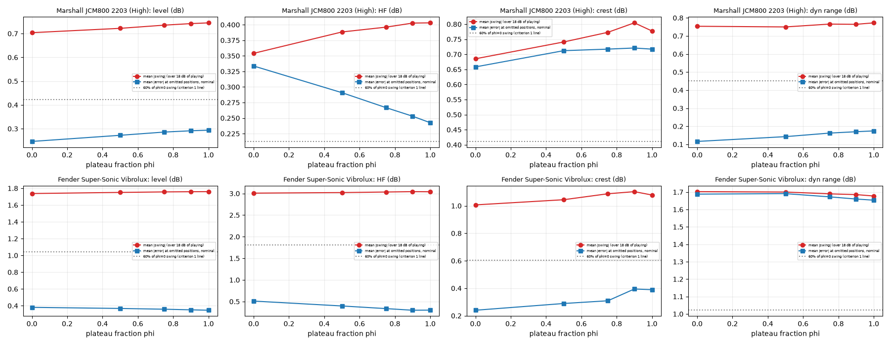

# Teacher-only weight-band test

**No NAM was trained and no exported model was used.** Scope, variant and the criteria for calling a variant promising were committed BEFORE any result: `docs/phase4e/weight_band_criteria.md` (commit `d688755`). Code: `scripts/pl_band_common.py` (variant weights; verified equal to `hybrid.multi_blend.chain_weights` at plateau fraction 0, maximum difference 0.0), `pl_band_cases.py`, `pl_band_sweep.py`, `pl_band_eval.py`, `pl_ambiguity.py`, `pl_band_report.py`; data `work/p4e/playability/band_*.json`. Cases, DIs and offsets are the same as the fixed-virtual-gain playability diagnostic (`docs/CONTINUOUS_GAIN_FIXED_GAIN_PLAYABILITY.md`). `hybrid/multi_blend.py` was not modified. Human listening remains pending.

**Variant.** Plateau fraction phi holds each anchor's capture at full weight over a band and concentrates the crossfade in the middle of the gap between adjacent anchors (`t = smoothstep(clip((p-(0.5-w/2))/w, 0, 1))`, `p` the position inside the gap, `w = 1-phi`). phi = 0 is the current teacher; phi = 1 is a hard switch at the midpoint. Swing = error at +6 minus error at -12 dB musical input (teacher minus real capture, same fixed virtual gain).

## Marshall JCM800 2203 (High)

### Primary configuration B (frozen Phase 4E anchors): mean over positions

| phi | |swing| level | HF | crest | dyn range | EQ | fixed |offset| level | HF | crest | dyn range | centre-of-mass swing (positions) | nearest-anchor weight at nominal | median crossfade (ms) | switches/s | HF>10 kHz excess vs real (dB) | mean ESR |
|---:|---:|---:|---:|---:|---:|---:|---:|---:|---:|---:|---:|---:|---:|---:|---:|
| 0 | 0.70 | 0.35 | 0.69 | 0.75 | 0.37 | 0.26 | 0.26 | 0.57 | 0.41 | 4.08 | 0.72 | 9.1 | 10.8 | -0.60 | 0.041 |
| 0.5 | 0.72 | 0.39 | 0.74 | 0.75 | 0.38 | 0.27 | 0.21 | 0.63 | 0.43 | 4.20 | 0.75 | 7.2 | 10.8 | -0.46 | 0.044 |
| 0.75 | 0.74 | 0.40 | 0.77 | 0.77 | 0.39 | 0.27 | 0.19 | 0.67 | 0.43 | 4.24 | 0.77 | 5.6 | 10.8 | -0.39 | 0.045 |
| 0.9 | 0.74 | 0.40 | 0.80 | 0.76 | 0.39 | 0.27 | 0.18 | 0.68 | 0.43 | 4.26 | 0.77 | 2.7 | 10.8 | -0.35 | 0.047 |
| 1 | 0.75 | 0.40 | 0.78 | 0.77 | 0.39 | 0.27 | 0.17 | 0.70 | 0.43 | 4.26 | 0.77 | - | 10.8 | -0.26 | 0.047 |

### Predeclared criteria (B)

| phi | 1: swing reduction level / HF / crest / dyn (need >= 40% each) | 2: omitted-position mean error change level / HF / crest / dyn (need <= +0.5 dB each; worst position <= +1.5) | 3: median crossfade ms (>= 5) / HF>10k excess vs phi 0 (<= 1.5 dB) | 1 | 2 | 3 | promising |
|---:|---|---|---|---|---|---|---|
| 0.5 | -3% / -10% / -8% / +0% | +0.03 / -0.04 / +0.05 / +0.03 (worst pos +0.2) | 7.2 / +0.14 | FAIL | pass | pass | no |
| 0.75 | -4% / -12% / -13% / -2% | +0.04 / -0.07 / +0.06 / +0.05 (worst pos +0.2) | 5.6 / +0.21 | FAIL | pass | pass | no |
| 0.9 | -5% / -14% / -17% / -1% | +0.04 / -0.08 / +0.06 / +0.05 (worst pos +0.2) | 2.7 / +0.25 | FAIL | pass | FAIL | no |
| 1 | -6% / -14% / -13% / -3% | +0.05 / -0.09 / +0.06 / +0.06 (worst pos +0.2) | - / +0.33 | FAIL | pass | FAIL | no |

### Swing by position, phi = 0 (current) versus phi = 0.75 and 1.0 (dB; teacher B minus real capture)

| Position | level phi 0 / 0.75 / 1.0 | HF | crest | dyn range |
|---|---|---|---|---|
| G1 | -1.6 / -1.7 / -1.7 | +0.0 / +0.1 / +0.1 | +0.4 / +0.6 / +0.8 | -1.9 / -1.9 / -1.9 |
| G2 | -2.2 / -2.3 / -2.3 | +0.9 / +1.1 / +1.1 | +0.3 / +0.6 / +0.7 | -0.3 / -0.3 / -0.4 |
| G3 | -0.7 / -0.5 / -0.5 | +0.7 / +0.8 / +0.8 | -1.0 / -1.5 / -1.6 | -0.4 / -0.2 / -0.2 |
| G4 | -0.1 / +0.0 / +0.0 | +0.4 / +0.7 / +0.7 | -1.1 / -0.8 / -0.8 | -1.2 / -1.1 / -1.2 |
| G5 | -0.0 / +0.1 / +0.1 | +0.2 / +0.4 / +0.4 | -1.1 / -0.7 / -0.6 | -1.2 / -1.2 / -1.2 |
| G6.5 | +0.2 / +0.3 / +0.3 | +0.1 / +0.2 / +0.2 | -0.5 / -0.7 / -0.6 | -1.2 / -1.3 / -1.3 |
| G8 | -0.4 / -0.5 / -0.5 | +0.2 / +0.1 / +0.1 | -0.7 / -0.9 / -0.8 | -0.4 / -0.6 / -0.6 |
| G9 | -0.5 / -0.6 / -0.6 | +0.4 / +0.2 / +0.2 | -0.7 / -0.4 / -0.3 | -0.0 / -0.1 / -0.1 |
| G10 | -0.5 / -0.6 / -0.6 | +0.2 / +0.1 / +0.0 | -0.5 / -0.8 / -0.7 | +0.2 / +0.0 / -0.0 |

### Same test on configuration A (fixed anchors), for comparison: swing reduction relative to phi 0 (level / HF / crest / dyn range)

| phi | reduction |
|---:|---|
| 0.5 | -6% / -6% / +1% / +2% |
| 0.75 | -8% / -10% / -0% / +3% |
| 0.9 | -9% / -11% / -1% / +5% |
| 1 | -9% / -12% / +1% / +5% |

### Progression cost: continuous Input-gain sweep, nominal musical input (teacher B and A)

Steps of the teacher's features between Input gains 2 dB apart over the tested range (-22 to +14 dB), mean over three held-out DIs. Larger maximum steps or a higher max/median ratio mean a more stair-stepped progression.

| config | phi | max step level / HF / crest / dyn (dB per 2 dB) | max/median step (worst of the four) |
|---|---:|---|---:|
| B | 0 | 0.89 / 0.54 / 0.77 / 1.38 | 3.9 |
| B | 0.5 | 0.81 / 0.62 / 0.84 / 1.53 | 5.8 |
| B | 0.75 | 0.78 / 0.68 / 0.97 / 1.57 | 5.4 |
| B | 0.9 | 0.78 / 0.71 / 1.11 / 1.56 | 8.2 |
| B | 1 | 0.78 / 0.72 / 1.15 / 1.53 | 8.7 |
| A | 0 | 1.24 / 0.62 / 0.91 / 2.09 | 13.5 |
| A | 0.5 | 1.24 / 0.65 / 0.92 / 2.05 | 11.9 |
| A | 0.75 | 1.24 / 0.66 / 0.99 / 2.02 | 11.3 |
| A | 0.9 | 1.23 / 0.67 / 1.00 / 2.01 | 10.4 |
| A | 1 | 1.23 / 0.68 / 0.99 / 2.01 | 9.9 |

## Fender Super-Sonic Vibrolux

### Primary configuration B (frozen Phase 4E anchors): mean over positions

| phi | |swing| level | HF | crest | dyn range | EQ | fixed |offset| level | HF | crest | dyn range | centre-of-mass swing (positions) | nearest-anchor weight at nominal | median crossfade (ms) | switches/s | HF>10 kHz excess vs real (dB) | mean ESR |
|---:|---:|---:|---:|---:|---:|---:|---:|---:|---:|---:|---:|---:|---:|---:|---:|
| 0 | 1.74 | 3.01 | 1.01 | 1.70 | 0.78 | 0.32 | 0.45 | 0.28 | 1.16 | 3.64 | 0.57 | 8.0 | 16.9 | -0.21 | 0.053 |
| 0.5 | 1.75 | 3.02 | 1.04 | 1.70 | 0.81 | 0.32 | 0.47 | 0.27 | 1.13 | 3.66 | 0.58 | 6.1 | 16.9 | +0.11 | 0.056 |
| 0.75 | 1.76 | 3.03 | 1.09 | 1.69 | 0.82 | 0.32 | 0.49 | 0.28 | 1.11 | 3.66 | 0.58 | 3.8 | 16.9 | +0.27 | 0.058 |
| 0.9 | 1.76 | 3.04 | 1.10 | 1.69 | 0.84 | 0.32 | 0.50 | 0.29 | 1.09 | 3.66 | 0.59 | 1.6 | 16.9 | +0.36 | 0.059 |
| 1 | 1.76 | 3.04 | 1.08 | 1.68 | 0.85 | 0.33 | 0.51 | 0.28 | 1.09 | 3.67 | 0.59 | - | 16.9 | +0.49 | 0.060 |

### Predeclared criteria (B)

| phi | 1: swing reduction level / HF / crest / dyn (need >= 40% each) | 2: omitted-position mean error change level / HF / crest / dyn (need <= +0.5 dB each; worst position <= +1.5) | 3: median crossfade ms (>= 5) / HF>10k excess vs phi 0 (<= 1.5 dB) | 1 | 2 | 3 | promising |
|---:|---|---|---|---|---|---|---|
| 0.5 | -1% / -0% / -4% / +0% | -0.01 / -0.11 / +0.05 / +0.00 (worst pos +0.1) | 6.1 / +0.33 | FAIL | pass | pass | no |
| 0.75 | -1% / -1% / -8% / +1% | -0.02 / -0.17 / +0.07 / -0.02 (worst pos +0.1) | 3.8 / +0.49 | FAIL | pass | FAIL | no |
| 0.9 | -1% / -1% / -10% / +1% | -0.03 / -0.21 / +0.15 / -0.03 (worst pos +0.2) | 1.6 / +0.58 | FAIL | pass | FAIL | no |
| 1 | -1% / -1% / -7% / +1% | -0.03 / -0.21 / +0.15 / -0.03 (worst pos +0.2) | - / +0.70 | FAIL | pass | FAIL | no |

### Swing by position, phi = 0 (current) versus phi = 0.75 and 1.0 (dB; teacher B minus real capture)

| Position | level phi 0 / 0.75 / 1.0 | HF | crest | dyn range |
|---|---|---|---|---|
| G1 | -0.4 / -0.4 / -0.4 | -1.3 / -1.2 / -1.1 | -0.1 / +0.0 / +0.0 | -0.7 / -0.7 / -0.7 |
| G2 | -0.7 / -0.6 / -0.6 | -2.7 / -2.6 / -2.6 | +0.6 / +0.7 / +0.7 | -0.9 / -0.8 / -0.8 |
| G3 | -1.4 / -1.4 / -1.4 | -4.4 / -4.4 / -4.4 | +0.6 / +0.8 / +0.9 | -1.6 / -1.8 / -1.7 |
| G4 | -1.8 / -1.7 / -1.7 | -5.1 / -5.0 / -5.0 | +0.0 / -0.1 / -0.1 | -1.7 / -1.7 / -1.7 |
| G5 | -2.0 / -2.0 / -2.0 | -4.8 / -4.7 / -4.7 | +0.6 / +0.7 / +0.7 | -0.9 / -0.9 / -0.9 |
| G7 | -2.5 / -2.6 / -2.6 | -3.4 / -3.7 / -3.8 | +1.9 / +2.1 / +2.0 | +0.9 / +0.7 / +0.7 |
| G8 | -2.5 / -2.6 / -2.6 | -2.3 / -2.4 / -2.4 | +1.8 / +1.9 / +1.8 | +2.5 / +2.5 / +2.5 |
| G10 | -2.7 / -2.7 / -2.7 | -0.1 / -0.3 / -0.4 | +2.4 / +2.3 / +2.3 | +4.5 / +4.4 / +4.4 |

### Same test on configuration A (fixed anchors), for comparison: swing reduction relative to phi 0 (level / HF / crest / dyn range)

| phi | reduction |
|---:|---|
| 0.5 | -3% / +3% / +0% / +1% |
| 0.75 | -5% / +4% / -2% / +4% |
| 0.9 | -5% / +5% / -2% / +5% |
| 1 | -6% / +5% / -2% / +6% |

### Progression cost: continuous Input-gain sweep, nominal musical input (teacher B and A)

Steps of the teacher's features between Input gains 2 dB apart over the tested range (-22 to +14 dB), mean over three held-out DIs. Larger maximum steps or a higher max/median ratio mean a more stair-stepped progression.

| config | phi | max step level / HF / crest / dyn (dB per 2 dB) | max/median step (worst of the four) |
|---|---:|---|---:|
| B | 0 | 1.82 / 0.82 / 1.58 / 1.50 | 2.2 |
| B | 0.5 | 1.80 / 0.89 / 1.60 / 1.62 | 2.4 |
| B | 0.75 | 1.81 / 0.91 / 1.62 / 1.64 | 2.4 |
| B | 0.9 | 1.81 / 0.90 / 1.57 / 1.66 | 2.4 |
| B | 1 | 1.82 / 0.89 / 1.51 / 1.67 | 2.4 |
| A | 0 | 3.02 / 1.16 / 2.38 / 3.26 | 5.4 |
| A | 0.5 | 3.06 / 1.14 / 2.22 / 3.67 | 5.9 |
| A | 0.75 | 3.06 / 1.12 / 2.28 / 3.71 | 6.1 |
| A | 0.9 | 3.07 / 1.11 / 2.28 / 3.69 | 6.1 |
| A | 1 | 3.07 / 1.12 / 2.27 / 3.69 | 6.1 |

## Supplementary: the intrinsic gain/level ambiguity measured on the real captures (no teacher, no NAM)

Two different situations hand the SAME waveform to a standard NAM: capture a played at offset `o + gap` and capture b played at offset `o`, where gap is the difference between their virtual-gain settings. Whatever a single NAM outputs must sit between what the two real amps would do. The table is the difference between the two real amps for identical input (mean absolute over four offsets and three DIs).

| Amp | rule | adjacent anchors | gap (dB) | |level| | |HF| | |crest| | |dyn range| | EQ (mean abs) |
|---|---|---|---:|---:|---:|---:|---:|---:|
| Marshall JCM800 2203 | B | G1 to G2 | 11.5 | 2.16 | 0.35 | 0.11 | 0.04 | 0.23 |
| Marshall JCM800 2203 | B | G2 to G4 | 7.9 | 0.54 | 0.78 | 0.86 | 1.48 | 0.75 |
| Marshall JCM800 2203 | B | G4 to G10 | 16.6 | 0.74 | 0.29 | 0.32 | 0.11 | 0.30 |
| Marshall JCM800 2203 | A | G1 to G2 | 4.0 | 1.82 | 1.51 | 2.27 | 3.14 | 1.32 |
| Marshall JCM800 2203 | A | G2 to G4 | 8.0 | 0.54 | 0.76 | 0.84 | 1.46 | 0.74 |
| Marshall JCM800 2203 | A | G4 to G10 | 24.0 | 1.35 | 1.24 | 1.67 | 0.57 | 0.72 |
| Fender Super-Sonic Vibrolux | B | G1 to G2 | 4.6 | 0.21 | 0.25 | 0.40 | 0.14 | 0.20 |
| Fender Super-Sonic Vibrolux | B | G2 to G3 | 9.0 | 0.53 | 1.74 | 0.36 | 0.32 | 1.05 |
| Fender Super-Sonic Vibrolux | B | G3 to G4 | 5.3 | 0.44 | 1.69 | 0.57 | 0.57 | 0.97 |
| Fender Super-Sonic Vibrolux | B | G4 to G7 | 8.4 | 1.08 | 2.20 | 0.80 | 1.11 | 1.07 |
| Fender Super-Sonic Vibrolux | B | G7 to G10 | 8.7 | 1.34 | 0.08 | 0.99 | 1.91 | 0.34 |
| Fender Super-Sonic Vibrolux | A | G1 to G2 | 4.0 | 0.77 | 0.28 | 0.72 | 0.17 | 0.21 |
| Fender Super-Sonic Vibrolux | A | G2 to G3 | 4.0 | 3.49 | 2.12 | 3.69 | 1.97 | 1.34 |
| Fender Super-Sonic Vibrolux | A | G3 to G4 | 4.0 | 0.39 | 1.75 | 0.50 | 0.87 | 1.04 |
| Fender Super-Sonic Vibrolux | A | G4 to G7 | 12.0 | 2.29 | 2.35 | 1.57 | 2.90 | 1.15 |
| Fender Super-Sonic Vibrolux | A | G7 to G10 | 12.0 | 1.92 | 0.33 | 1.62 | 3.17 | 0.52 |

## Findings

### Result against the predeclared criteria: no variant is promising

- **Criterion 1 (fixed-gain swing falls by at least 40% for each of level, HF, crest and dynamic range) fails for every plateau fraction on both amps, and by a wide margin.** On the JCM800 (configuration B) the change relative to the current teacher at phi = 1 (hard switching) is -6% level, -14% HF, -13% crest, -3% dynamic range (negative = swing got larger); on the Vibrolux it is about -1% level, -1% HF, -7% crest, +1% dynamic range. Configuration A behaves the same (no reduction beyond +5%, and slightly worse for level and HF on both amps). The per-position table shows the same: swing at phi 0.75 and 1.0 is within a few tenths of a dB of phi 0 at every position.
- **Criterion 2 (progression cost at omitted positions) passes**, but only because nothing changed: the mean omitted-position error moves by 0.21 dB or less. That is not a virtue, since criterion 1 already fails. The continuous Input-gain sweep gets more stair-stepped with hard plateaus for the JCM800 in configuration B (worst max/median step ratio 3.9 at phi 0 to 8.7 at phi 1, dynamic-range step 1.38 to 1.53 dB per 2 dB) and barely changes for the Vibrolux (2.2 to 2.4), so a cost appears on one amp without any benefit on either.
- **Criterion 3 (no switching side effects) fails for the harder settings**: the median crossfade shortens to 2.7 ms at phi 0.9 on the JCM800 and 3.8 ms (phi 0.75) and 1.6 ms (phi 0.9) on the Vibrolux, below the 5 ms line, and HF energy above 10 kHz rises relative to phi 0 by up to +0.33 dB (JCM800) and +0.70 dB (Vibrolux) at phi 1, within the 1.5 dB allowance but in the wrong direction.
- **Nothing passes criteria 1-3 together, so the weight-band remedy is not supported.** That is the finding.

### Why reshaping the crossfades cannot work here

The centre-of-mass swing (how far the weighted physical position moves over 18 dB of playing intensity) is unchanged by the plateau fraction (Vibrolux 3.64 at phi 0 and 3.66 at phi 1). The reason is geometric: anchors sit 4.6 to 9.0 dB apart on the Vibrolux (7.9 to 16.6 dB on the JCM800), and playing harder or softer by 6 to 18 dB moves the whole envelope across several of them. A plateau can hold a capture over at most about half a gap on each side, far short of the playing range it would have to absorb. The dominant capture at any moment is the nearest anchor at every phi (switch rate 16.9 per second at all settings on the Vibrolux), so which capture leads is fixed by the envelope, and only the shape of the mix between two of them changes.

### Supplementary: the drift is the size of the real amps' own difference for identical input

No teacher or NAM is involved (real captures only; table above). For each pair of adjacent anchors, the waveform that reaches the NAM when capture a is played `gap` dB harder is the same waveform that reaches it when capture b is played normally, yet the real amps answer differently. On the Vibrolux (B anchors) those differences are 1.7 dB in HF for G2 to G3 and for G3 to G4, 2.2 dB HF plus 1.1 dB level plus 1.1 dB dynamic range for G4 to G7, and 1.3 dB level plus 1.9 dB dynamic range for G7 to G10; they accumulate over an 18 dB change in playing, which is the same order as the 3-4 dB HF and 2.5-3 dB level swings measured on the students. On the JCM800 the top zone is intrinsically unambiguous: G4 to G10 (a 16.6 dB gap) differ by only 0.7 dB in level, 0.3 dB in HF, 0.3 dB in crest and 0.1 dB in dynamic range. So the drift tracks how different neighbouring real captures sound at their spacing (a property of the amp and of the anchor gaps), not the shape of the teacher's crossfade. Any standard NAM trained to reproduce both captures for identical waveforms must compromise by roughly half of this difference.

### What this means for the current training target

The current envelope-driven teacher is not improved by any plateau setting tested, and the identical ambiguity would bind any other way of assigning targets from a single waveform. Two levers remain that change the size of the ambiguity: (1) larger gaps between virtual-gain zones relative to the playing dynamics (fewer zones, or a wider Input-gain span), and (2) choosing zones where neighbouring captures already sound alike (as the JCM800's G4 to G10 do). The smallest experiment that tests this needs no training: score candidate zone layouts built from the existing captures with the same ambiguity table and teacher-only swing test (a teacher-only anchor-layout test), and check the trade-off in progression fidelity at the settings between zones.

The decision that gates it is not only technical. It is whether the real amps' 2-4 dB differences on the Vibrolux are audible enough to matter to a guitarist when they play harder at a fixed setting. That is what the listening evaluation (still pending) can answer, and it is cheaper than any further build: a listening set built for this specific question (same virtual gain, soft/normal/hard playing, real amp versus B versus v3 C3) would show whether the drift is objectionable before anything else is changed.

### Recommendation (not implemented)

1. Do not adopt any weight-band variant.
2. Do not add G8 or train another model; the drift is not caused by too few captures (the C10 teacher shows this) and not by the crossfade shape.
3. The most informative next step is a listening check of the fixed-gain cases, using the existing models. If the drift is not objectionable, the current models already provide the intended experience apart from the top-end hard-playing crest issue and validation in the official plugin. If it is, the next teacher-only test is the anchor-layout test above, with the number of virtual-gain zones as a product decision.

### Limits of this test

Teacher-only; three DIs at four global offsets; measures are aggregate features, not audible judgements; the variant family is one parameterisation of the crossfade (a non-monotone or level-dependent weighting was not explored); the ambiguity table uses two-anchor gaps and does not capture multi-anchor accumulation exactly; NAMCore was not needed for the teacher and no student behaviour is inferred.
