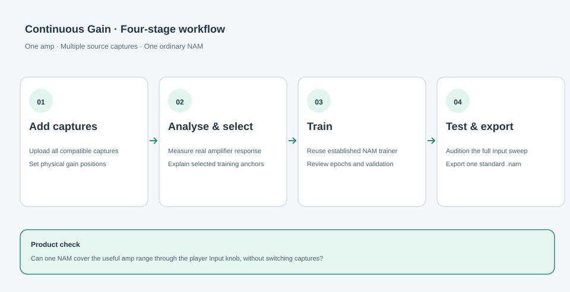
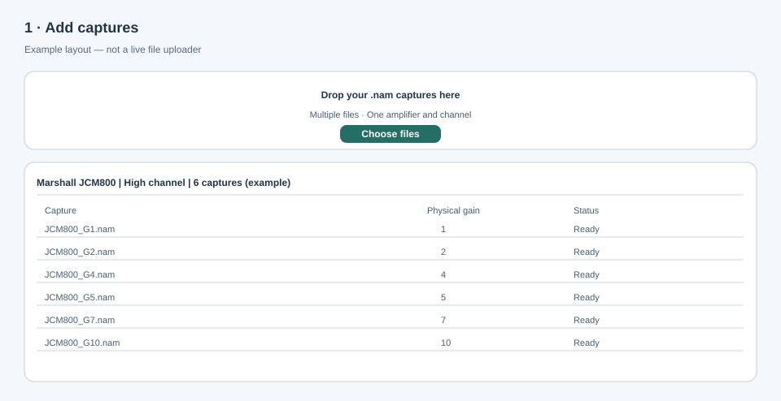
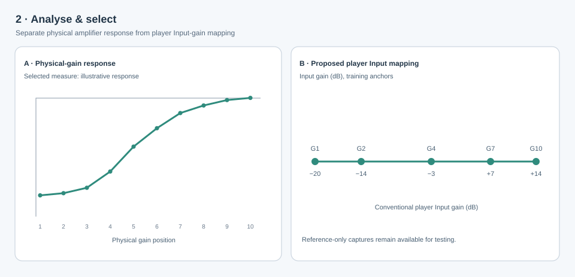
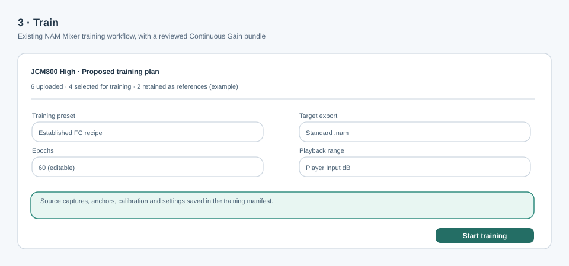
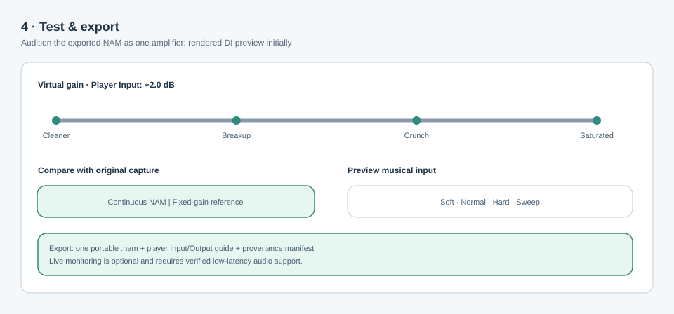

# Continuous Gain — NAM Mixer UI proposal

**Status:** Initial product/UI proposal, not an implemented feature.  
**Goal:** Turn multiple fixed-gain captures from **one amplifier and channel** into **one portable standard `.nam`**, whose useful gain range is explored with an ordinary NAM player's **Input gain** control.

The interface should help users provide their captures, understand how the system will use them, train with NAM Mixer's established training infrastructure, and audition the result as one continuous amplifier. It should not promise exact reproduction of every physical knob position or treat the lowest number of captures as the objective.

## Recommendation at a glance

Add a **Continuous Gain** tab with four stages: **Add captures → Analyse & select → Train → Test & export**. Your proposed flow is broadly right; the important adjustments are:

- Allow any practical number of uploaded captures, while selecting a *justified subset* for training by default. Preserve non-selected captures as references for evaluation.
- Separate the **physical gain position**, the **measured amplifier response**, and the **assigned player Input-gain position**. Do not collapse those into a single, potentially misleading “gain curve.”
- Make automatic selection transparent and overridable, showing what each chosen capture contributes and what sound might be lost if it is removed.
- Reuse the existing training workflow rather than adding a separate trainer. Keep most research settings hidden behind an Advanced section.
- Add a final **whole-amplifier audition** stage. The key question is whether the single NAM covers the amplifier's useful range and replaces frequent switching among captures.

## Stage 1 — Add captures

### User flow

1. Enter an amplifier name and channel; optionally record the cabinet/signal-chain details.
2. Drag in all available fixed-gain `.nam` files. Do not impose a ten-capture limit or assume all gain knobs use a G1–G10 scale.
3. Assign each file a **physical gain position**. Filename parsing may suggest values, but the user confirms or edits them. A capture may also use a custom descriptive position if the amplifier has an unnumbered control; its order must be unambiguous.
4. Sort the list in physical gain order. Surface duplicate positions, missing positions, conflicting channels or inconsistent capture metadata.
5. Run compatibility and capture-quality checks *before* selection or training. Flag suspected latency/alignment, level-calibration or sample-rate problems; do not silently “fix” uncertain source material.

**Design principle:** “Upload all” means the system has the fullest possible picture of the amp. It does **not** mean all captures must be used to train the model.

### Proposed UI elements

- Drop zone and file picker; a table of filename, gain position, channel/capture notes, analysis status and included/excluded state.
- Editable physical gain positions and drag-to-reorder support, with explicit validation of monotonic ordering.
- A short consistency summary: “N captures; positions X–Y; Z need review.”
- **Analyse captures** button enabled only after the required metadata and blocking checks pass.

## Stage 2 — Analyse & select

The user should see **two linked views**, not one unexplained line:

### A. How the source amplifier changes

Horizontal axis: original **physical gain positions**. Vertical axis: one **measured response dimension**, selected by the user (for example, output level, saturation/harmonic content, brightness or dynamic range). Distinctive transitions and plateaus should be visible; the actual graph must label measurement units and test conditions. An optional overview could show several normalised *separate* trends, but should not imply that an aggregated score is a physical gain measurement.

This graph answers: **Which capture positions contain meaningfully different amplifier behaviours?**

### B. How the finished NAM will be controlled

Horizontal axis: **conventional player Input gain (dB)**, restricted or annotated for the selected target player. Show proposed training anchors as labelled markers linked back to physical captures. Draw the intended mapping between anchors and shade untested regions. Show which physical positions were **selected for training** and which remain **validation/reference captures**.

This graph answers: **Where on the player's Input knob should users find the amp's useful sounds?** The mapping is an intended control guide, not a claim that the generated NAM has a separate physical-gain parameter.

### Explain each capture decision

| Capture status | Example explanation to show only when supported by analysis |
|---|---|
| **Selected: cleaner endpoint** | Preserves a distinct low-gain response not represented by louder captures. |
| **Selected: transition** | Captures a substantial change in amp character between neighbouring settings. |
| **Selected: driven endpoint** | Preserves a distinct higher-gain response. |
| **Reference only** | Similar to adjacent chosen captures on the measured dimensions; retain to validate intermediate sounds. |
| **Needs review** | Capture alignment, calibration or provenance is uncertain; selection is deferred. |

These are **illustrative explanations**, not automatic conclusions about any specific amplifier. Actual text should be generated from observed data and the explicit selection criteria. Avoid a vague “AI chose these” statement.

### Control and safeguards

- **Automatic / Custom** selection mode. Custom allows capture inclusion/exclusion and, in Advanced mode, editing of anchors. Recalculate warnings and the proposed mapping after an override.
- Explain that adding captures is not guaranteed to improve the result; reducing captures is not the goal either.
- Keep all suitable unselected captures for testing. Label evidence from a reference capture differently if it was involved in selection, as it is not then an entirely independent benchmark.
- Explicitly mark unsupported control ranges (for instance, an intended anchor below a particular player's minimum Input gain). Do not silently apply external gain correction and present it as ordinary player behaviour.
- **Review training plan** button should freeze or snapshot the selected sources, anchors, calibration and analysis settings into a reproducible manifest.

## Stage 3 — Train

Reuse **NAM Mixer's existing training UI, backend and status reporting**. Continuous Gain should supply a validated training bundle and its manifest; it should not duplicate the trainer, invent a new architecture or require a proprietary player.

### Simple default panel

- Amplifier/channel and final model name.
- Number of uploaded captures versus number **selected for training**.
- The proposed conventional Input-gain range and output-level compensation, if required.
- **Training preset** (for example, standard established recipe) with a clearly described duration estimate, based on measured local/cloud performance where available.
- **Epochs** shown as a setting, with an explanatory note that more epochs do not guarantee a better model; use the existing validation/checkpoint strategy.
- Output: **one standard `.nam`** plus the manifest and a player-knob guide.

### Advanced options

Expose only parameters already supported and understood by the current training stack, such as architecture, training backend, data coverage, seeds or gain-anchor overrides where appropriate. Do **not** present experimental teacher variants, envelope parameters or “optimal capture count” controls as established production features.

### Training safeguards

Before starting, display the selected source hashes/identities, physical positions, anchor settings, QA findings, target-build method and intended playback calibration. Make the training run reproducible and resumable where existing infrastructure permits. Keep the original captures untouched.

## Stage 4 — Test & export

**This is the missing step in a capture → analyse → train workflow.** After training, the user should explore the exported model *as one amplifier*, not merely inspect an average validation error.

### Audition controls

- One **Virtual gain / player Input** control across the intended usable range. Display actual dB, not just a made-up G1–G10 label.
- Fixed Output gain setting with a clear headroom/peak warning.
- Playback of a reproducible test DI across the sweep, with markers at representative cleaner, breakup, driven and saturated regions **where the source amp actually exhibits them**.
- Comparison toggle: **continuous model / original physical capture**. Clearly show which fixed capture is being used as a reference; do not imply there is a real captured sound at every interpolated point.
- Optional soft/normal/hard DI previews at a fixed player Input setting, and an optional sweep render.

**Live guitar monitoring** is a separate capability: offer it only if the app has a verified low-latency audio path. A browser UI playing a rendered DI should not pretend to provide an interactive live amp.

### Export package

Export one ordinary `.nam` and accompanying human-readable/JSON metadata containing: selected source captures, original physical gain values, designated Input-gain anchors, usable player Input range, recommended constant Output-gain setting, training configuration, QA/validation status and known limits. That metadata is a guide and provenance record, **not required runtime processing** for the NAM to work.

## Initial-scope decisions

| Area | Initial implementation | Defer |
|---|---|---|
| Capture intake | Multiple captures from one amp/channel; ordered editable physical positions; QA | Automatic mixing of channels or cabinet configurations |
| Analysis | Per-dimension real-amp response + separate player Input mapping | One opaque overall “gain quality score” |
| Selection | Explained automatic subset + user override + preserved references | Exhaustive subset/seed search |
| Training | Reuse established FC-oriented bundle/trainer/export path | Entirely new trainer or custom NAM format |
| Testing | Rendered DI, fixed-gain playability and full Input sweep | Unverified low-latency live browser processing |
| EQ | Keep existing FC baseline; document optional future tonal refinement | Automatic EQ fitting or mandatory post-NAM EQ |

## Product acceptance criteria

The first release should allow a user to take a set of compatible captures from one amp, review and adjust a transparent training plan, export one standard NAM, and **find useful cleaner-through-driven sounds through the ordinary player Input control without swapping model files**. It should expose missing/uncertain regions and let the user compare against their originals. It need not claim perfect reproduction at every position or universal generalisation to every amplifier; listening remains the user's final acceptance test.

---

**Illustrations:** SVG mock-ups in [`images/`](images/) are conceptual layouts and contain **sample, invented UI data**. They are not actual analysis of the JCM800, Vibrolux or another amp, and are not screenshots of a working implementation.
