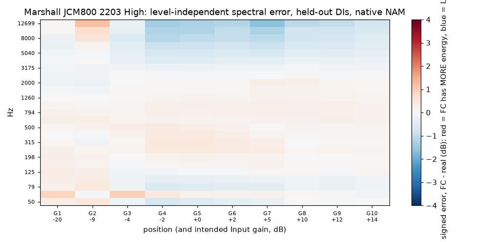
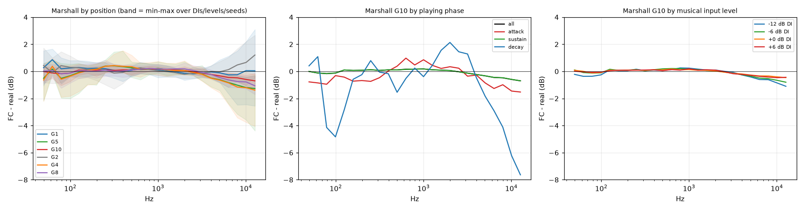
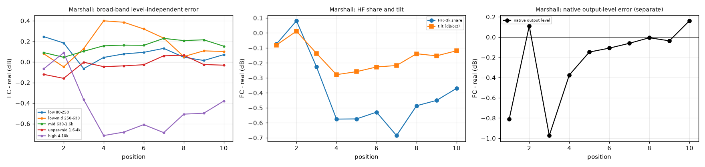
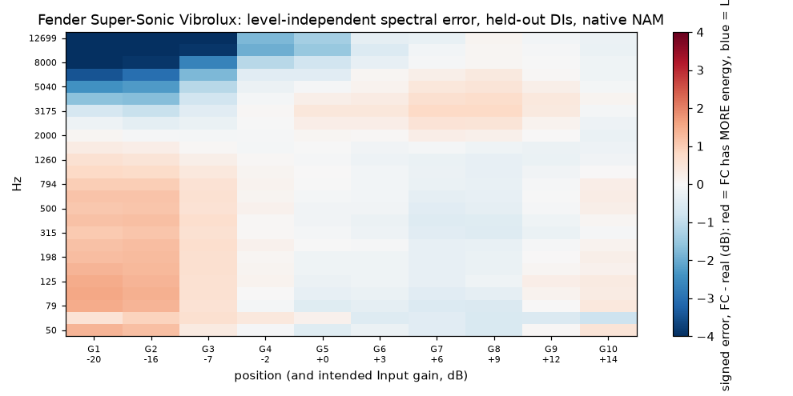
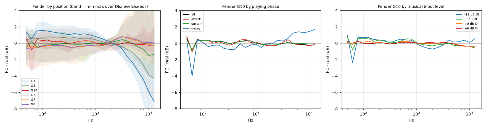
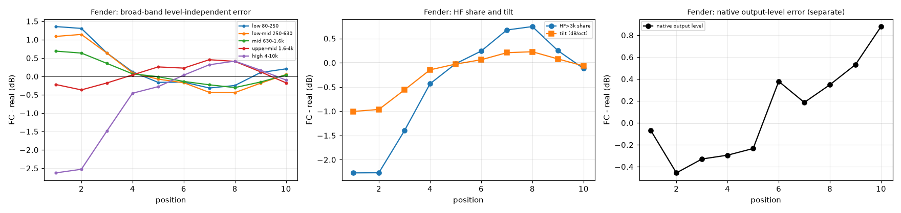

# Continuous Gain: tonal refinement (measurements and audition package)

Branch `research/continuous-gain-model`, code at `cb635a5` plus the `scripts/tr_*.py` files added here. No model was trained, and no frozen result, capture or model export was changed. Outputs are under `work/tr/` (measurements, audition WAVs) and `docs/tonal/` (plots).

## Summary

**Answer to the central question: a modest static EQ does not improve the whole virtual amplifier for either amp, so none should go into the NAM yet.**

- **Marshall JCM800.** The native FC model is already spectrally very close to the real captures. At G10 the largest level-independent error on held-out DIs is -0.7 dB at 12.7 kHz and -0.4 dB over 4-10 kHz (FC slightly duller). The error changes sign across the sweep (G2 is up to +1.2 dB too bright at 12.7 kHz (+2.9 dB on the fit DIs), G4-G10 are up to 1.4 dB too dull at 12.7 kHz), so an EQ fitted across the sweep comes out at 0.3 dB or less. That is far below what is audible. **The measured native tone does not explain the 'less open and full' G10 you hear after CLO and an IR.** With the repo test IR the spectral difference is unchanged (0.20 dB mean absolute band error native, 0.20 dB with the IR), because a cabinet IR is linear and cannot create a spectral difference. The CLO stage could not be tested (see below), so the cause is unresolved.
- **Fender Vibrolux.** There is a real, consistent tonal error, but only at the clean positions: G1-G3 are 0.6-1.5 dB too full at 80-800 Hz and 1-7 dB too dark above 5 kHz (worst at 12.7 kHz), on every DI, every level and both seeds, but the two FC seeds differ (HF at G1: 4 dB apart). G7-G10 are within 0.8 dB in every band. A static EQ that fixes the clean sound (candidate B) adds +1.6 dB of HF error at crunch and saturated positions and roughly triples the G9-G10 band error. A gain-dependent curve would be needed, which the brief rules out for now. The clean-end darkness is a training limitation of these FC seeds, not an EQ problem.
- **Recommendation.** Keep the existing FC models. Do not retrain for tone yet. If the Marshall G10 fullness difference persists, do the CLO/IR isolation protocol in section 2 first, because the native NAM does not show it.

## 1. Source identities

- Real references: the original fixed-gain NAM captures, rendered with NAMCore (`native/nam_render`) and the verified Phase 4A alignment (no corrections were needed for the pilot captures). JCM800 integer positions G1-G10 (the half-steps were not used here); Vibrolux G1-G10 integers.
- Models: `docs/history/Continuous Gain/deliverables/<amp>/alt_FC_s0.nam` and `alt_FC_s1.nam` (FC seeds 0 and 1, frozen at `99ca9b6`, trained at `work/p4e/final/<amp>/FC_bundle/`); output scale c from each bundle manifest (JCM800 0.7219, Vibrolux 1.0). No output-gain change was applied.
- Mapping: the frozen FC anchor mapping (JCM800 G1/G2/G4/G10 at -20/-9.2/-1.7/+14 dB; Vibrolux G1/G2/G3/G4/G7/G10 at -20/-15.6/-7.1/-2.2/+5.7/+14 dB) with position-to-Input-gain interpolation in the response coordinate. It was not refitted per DI or gain. Intended Input gain per position is in the tables below.
- DIs: held-out `moderate_brit`, `clean_mayer`, `bass_rollin` at -12/-6/0/+6 dB for all evaluation; fit DIs `clean_smooth`, `moderate_hotrod`, `high_thrash`, `high_metalcore` at -6/0 dB for EQ fitting only.

## 2. Native NAM versus CLO conversion and IR: status

| Stage | Status |
|---|---|
| Original .nam vs FC .nam, no cab/CLO/EQ | **Done** (section 3) |
| Same signals through the repo test IR (`V30 LL 4FB 4x12 SM57 1.00in 0.0in SA73.wav`) | **Done, analytically.** An IR is a linear filter, so it multiplies both spectra by the same |IR|^2. Mean absolute band error, native vs with IR: JCM800 G1 0.14 vs 0.15 dB, G5 0.39 vs 0.39, G10 0.20 vs 0.20. HF 4-10 kHz at G10: -0.38 vs -0.29 dB. **This is not your IR**; it is the test IR shipped in `assets/nam_models`. So the IR does not increase the spectral difference, but a different IR could weight the region differently by at most the small errors above. |
| Original capture -> CLO -> IR vs FC -> CLO -> IR | **Pending: the converter is not in this codebase** (NAMtoClo is a separate project; this repository shares no code with it). No substitute IR or converter was treated as your setup. |

Protocol for the pending stage (to run once the converter and your IR are at hand): (1) render one DI (`moderate_brit`, offset 0) through the original G10 `.nam` and through `alt_FC_s0.nam` at its intended G10 setting (+14 dB Input gain, output gain +2.8 dB for the JCM800 FC model, see `docs/CONTINUOUS_GAIN_FINAL_CANDIDATES.md`) with **no** cab; (2) convert both to CLO with identical settings, including whatever input-level calibration and output level the converter applies, and note that a converted model normally has a **fixed input level, so the +14 dB virtual gain must be reproduced by adding the gain in the DI** before conversion or by a comparable gain stage, otherwise the FC model is playing at the wrong virtual gain; (3) render the same DI through both CLOs with the identical IR at identical output level; (4) run `scripts/tr_measure.py`-style band analysis on the WAVs. If the FC-vs-original difference appears only at step 3, it comes from CLO conversion (or its gain staging); if it is already in step 1, it is the NAM. That gain-staging point is a hypothesis, not a finding.

## 3. Tonal difference across the whole gain sweep (native NAM, held-out DIs)

Method: NAMCore renders of each held-out clip at every DI level; average power spectra over Hann-windowed 2048-sample frames (hop 512), the first 0.5 s and frames more than 55 dB below the loudest frame dropped, so silence and noise floor never enter; 1/3-octave bands 50 Hz to 12.7 kHz; frames classified from the REAL signal into attack (rising at least 4 dB over the preceding 43 ms), decay (falling at least 4 dB) and sustain. **Signed convention: FC minus real. Positive means FC has MORE energy in that band than the real amp; negative means FC has LESS.** Level-independent errors have the mean difference over 200-6400 Hz removed; the native output-level error is reported separately.

Plots: `docs/tonal/tonal_heatmap_<amp>.png` (position by band), `tonal_curves_<amp>.png` (by position, playing phase, input level), `tonal_broad_<amp>.png` (broad bands, HF share, tilt, native level), `tonal_eq_<amp>.png` (candidates).

### Marshall JCM800 2203 (High)

| Position | Input gain (dB) | low 80-250 | low-mid 250-630 | mid 630-1.6k | upper-mid 1.6-4k | high 4-10k | HF>3k share | tilt (dB/oct) | native level err (dB) | seed spread, high band |
|---|---:|---:|---:|---:|---:|---:|---:|---:|---:|---:|
| G1 | -20.0 | +0.25 | +0.08 | +0.09 | -0.12 | -0.07 | -0.07 | -0.08 | -0.81 | 0.33 |
| G2 | -9.2 | +0.18 | -0.05 | +0.05 | -0.16 | +0.09 | +0.08 | +0.01 | +0.11 | 0.25 |
| G3 | -4.4 | -0.07 | +0.13 | +0.10 | -0.00 | -0.37 | -0.23 | -0.14 | -0.97 | 0.20 |
| G4 | -1.7 | +0.04 | +0.40 | +0.16 | -0.05 | -0.72 | -0.58 | -0.28 | -0.37 | 0.19 |
| G5 | +0.0 | +0.08 | +0.39 | +0.16 | -0.04 | -0.68 | -0.57 | -0.26 | -0.15 | 0.18 |
| G6 | +1.8 | +0.09 | +0.32 | +0.16 | -0.03 | -0.61 | -0.53 | -0.23 | -0.11 | 0.16 |
| G7 | +5.3 | +0.13 | +0.23 | +0.23 | +0.06 | -0.69 | -0.68 | -0.22 | -0.06 | 0.15 |
| G8 | +9.8 | +0.05 | +0.05 | +0.21 | +0.07 | -0.51 | -0.49 | -0.14 | -0.01 | 0.14 |
| G9 | +12.2 | +0.01 | +0.11 | +0.22 | -0.03 | -0.50 | -0.45 | -0.15 | -0.04 | 0.15 |
| G10 | +14.0 | +0.07 | +0.10 | +0.15 | -0.03 | -0.38 | -0.37 | -0.12 | +0.16 | 0.16 |

By playing phase at the top and clean ends (high 4-10 kHz signed error, dB; n = number of DI/level/seed cases with enough frames):

| Position | all | attack | sustain | decay |
|---|---:|---:|---:|---:|
| G1 | -0.07 | -0.04 | +0.04 | -0.20 |
| G6 | -0.61 | -0.94 | -0.61 | -1.96 |
| G10 | -0.38 | -0.86 | -0.38 | -2.23 |

By musical input level (HF>3k share error, dB):

| Position | -12 dB DI | -6 dB DI | 0 dB DI | 6 dB DI |
|---|---:|---:|---:|---:|
| G1 | -0.35 | -0.27 | -0.03 | +0.36 |
| G6 | -0.64 | -0.43 | -0.54 | -0.51 |
| G10 | -0.42 | -0.39 | -0.30 | -0.36 |

### Fender Super-Sonic Vibrolux

| Position | Input gain (dB) | low 80-250 | low-mid 250-630 | mid 630-1.6k | upper-mid 1.6-4k | high 4-10k | HF>3k share | tilt (dB/oct) | native level err (dB) | seed spread, high band |
|---|---:|---:|---:|---:|---:|---:|---:|---:|---:|---:|
| G1 | -20.0 | +1.36 | +1.09 | +0.69 | -0.22 | -2.63 | -2.27 | -1.00 | -0.07 | 1.58 |
| G2 | -15.6 | +1.31 | +1.14 | +0.63 | -0.37 | -2.53 | -2.27 | -0.96 | -0.46 | 1.41 |
| G3 | -7.1 | +0.64 | +0.63 | +0.35 | -0.18 | -1.48 | -1.40 | -0.56 | -0.33 | 1.05 |
| G4 | -2.2 | +0.12 | +0.10 | +0.07 | +0.04 | -0.46 | -0.43 | -0.15 | -0.30 | 0.81 |
| G5 | +0.2 | -0.16 | -0.08 | -0.01 | +0.26 | -0.28 | -0.02 | -0.03 | -0.23 | 0.66 |
| G6 | +3.4 | -0.16 | -0.17 | -0.14 | +0.23 | +0.03 | +0.24 | +0.06 | +0.38 | 0.47 |
| G7 | +5.7 | -0.32 | -0.43 | -0.23 | +0.45 | +0.32 | +0.68 | +0.21 | +0.19 | 0.38 |
| G8 | +8.8 | -0.25 | -0.44 | -0.31 | +0.41 | +0.42 | +0.75 | +0.23 | +0.35 | 0.25 |
| G9 | +11.6 | +0.10 | -0.19 | -0.15 | +0.13 | +0.17 | +0.25 | +0.08 | +0.53 | 0.17 |
| G10 | +14.0 | +0.21 | +0.05 | +0.04 | -0.18 | -0.10 | -0.12 | -0.06 | +0.88 | 0.14 |

By playing phase at the top and clean ends (high 4-10 kHz signed error, dB; n = number of DI/level/seed cases with enough frames):

| Position | all | attack | sustain | decay |
|---|---:|---:|---:|---:|
| G1 | -2.63 | -2.73 | -2.54 | -2.41 |
| G6 | +0.03 | +0.39 | +0.10 | +1.74 |
| G10 | -0.10 | -0.09 | -0.06 | +1.08 |

By musical input level (HF>3k share error, dB):

| Position | -12 dB DI | -6 dB DI | 0 dB DI | 6 dB DI |
|---|---:|---:|---:|---:|
| G1 | -2.15 | -2.07 | -2.15 | -2.71 |
| G6 | +2.43 | +0.41 | -0.96 | -0.91 |
| G10 | +0.06 | -0.33 | -0.11 | -0.09 |

Reading the result: the JCM800 errors are small at every position and change sign (G2 bright, G4-G10 slightly dull); the decay phase carries the largest HF shortfall at high gain (-2 to -8 dB above 5 kHz at G10, but from few, quiet frames, so it is noisy), which no static EQ addresses without also changing the sustain. The Vibrolux error is large, consistent and only at G1-G3, and it depends on the seed. Distortion texture, compression and transient behaviour are not captured by a long-term spectrum, so a spectrum that matches within 0.5 dB does not prove the sounds are identical.

## 4. EQ candidates (fitted without training, on the fit DIs at the FC anchor positions only)

Structure: low shelf, one peaking band, high shelf (RBJ biquads, causal minimum-phase IIR, 48 kHz), so at most 3 sections. Limits: each band within +-3 dB (B) or +-4 dB (C), peak Q 0.5-1.5, shelf slope 0.7, small gain penalty in the fit, and the fit ignores overall level so the EQ does not change loudness by design. Reason: the measured errors are at most a few dB and only a broad correction can generalise across DIs. A: no EQ (existing FC). C is the same fit with the top anchor positions weighted 3x to favour the high-gain sound.

### Marshall JCM800 2203 (High)

| Candidate | Section | Type | Freq (Hz) | Gain (dB) | Q / slope | Max boost / cut in the audio band (dB) | Max group delay (ms) |
|---|---|---|---:|---:|---:|---|---:|
| B | 1 | low shelf | 400 | -0.17 | 0.70 | -0.07 / -0.30 | 0.005 |
| B | 2 | peak | 922 | -0.28 | 0.50 |  | |
| B | 3 | high shelf | 9000 | -0.29 | 0.70 |  | |
| C | 1 | low shelf | 128 | +0.11 | 0.70 | +0.27 / -0.06 | 0.013 |
| C | 2 | peak | 901 | -0.07 | 1.50 |  | |
| C | 3 | high shelf | 2870 | +0.27 | 0.70 |  | |

Latency and phase: the filters are causal biquads with no look-ahead (zero added latency in a plugin), and the group delay above is the worst-case delay across sections below Nyquist/2, well under 0.1 ms. Headroom: the maximum boost above is the worst-case peak increase; time-domain peaks measured at the hardest musical input (+6 dB DI, no cab) are in the table below.
JCM800 candidate B is a fit result of at most 0.3 dB; C is +0.27 dB above 2.9 kHz. Both are inaudible in isolation.

### Fender Super-Sonic Vibrolux

| Candidate | Section | Type | Freq (Hz) | Gain (dB) | Q / slope | Max boost / cut in the audio band (dB) | Max group delay (ms) |
|---|---|---|---:|---:|---:|---|---:|
| B | 1 | low shelf | 400 | -1.41 | 0.70 | +3.00 / -1.41 | 0.031 |
| B | 2 | peak | 1180 | -1.07 | 0.50 |  | |
| B | 3 | high shelf | 6915 | +3.00 | 0.70 |  | |
| C | 1 | low shelf | 223 | -0.62 | 0.70 | +2.78 / -0.61 | 0.043 |
| C | 2 | peak | 1097 | -0.19 | 0.50 |  | |
| C | 3 | high shelf | 6506 | +2.78 | 0.70 |  | |

Latency and phase: the filters are causal biquads with no look-ahead (zero added latency in a plugin), and the group delay above is the worst-case delay across sections below Nyquist/2, well under 0.1 ms. Headroom: the maximum boost above is the worst-case peak increase; time-domain peaks measured at the hardest musical input (+6 dB DI, no cab) are in the table below.

Time-domain peak check (dBFS, no cab, +6 dB DI):

| Amp | Position | real | FC | FC + B | FC + C |
|---|---|---:|---:|---:|---:|
| jcm800 | G1 | -5.8 | -8.1 | -8.2 | nan |
| jcm800 | G2 | -6.8 | -8.8 | -8.9 | nan |
| jcm800 | G5 | -8.5 | -8.6 | -8.7 | nan |
| jcm800 | G8 | -7.6 | -7.2 | -7.4 | nan |
| jcm800 | G10 | -7.5 | -6.3 | -6.5 | nan |
| vibrolux | G1 | -5.2 | -13.6 | -13.0 | -13.1 |
| vibrolux | G3 | -13.6 | -13.2 | -11.3 | -11.3 |
| vibrolux | G5 | -7.4 | -13.1 | -11.1 | -11.2 |
| vibrolux | G7 | -12.9 | -13.1 | -10.7 | -10.9 |
| vibrolux | G10 | -7.1 | -12.8 | -10.2 | -10.4 |

Candidate C for the JCM800 is not built into the audition set: at 0.27 dB it does not differ audibly from B. The Vibrolux C is included because it is the only candidate that trades clean-end improvement against crunch regression differently.

## 5. Validation across the amplifier (held-out DIs, all positions, both seeds)

Measure: mean absolute 1/3-octave error from 80 Hz to 12.7 kHz (level-independent), separately for the whole clip, the attack phase and the decay phase; signed 4-10 kHz error and tilt; the level shift the EQ adds (the native output-level progression must not change). Regions: clean G1-2, edge G3-4, crunch G5-8, saturated G9-10. 'Intermediate positions' are the ones not used for the fit; 'anchors' are the fitted positions.

### Marshall JCM800 2203 (High)

| Region | Cand. | mean abs band err | attack | decay | signed 4-10k | tilt (dB/oct) | EQ level shift (dB) |
|---|---|---:|---:|---:|---:|---:|---:|
| clean (G1-2) | A_no_EQ | 0.38 | 0.33 | 0.38 | +0.01 | -0.03 | +0.00 |
| clean (G1-2) | B | 0.37 | 0.31 | 0.36 | +0.12 | +0.00 | -0.20 |
| clean (G1-2) | C | 0.38 | 0.32 | 0.35 | +0.18 | +0.03 | +0.04 |
| edge (G3-4) | A_no_EQ | 0.40 | 0.48 | 0.61 | -0.54 | -0.21 | +0.00 |
| edge (G3-4) | B | 0.38 | 0.44 | 0.60 | -0.44 | -0.17 | -0.19 |
| edge (G3-4) | C | 0.36 | 0.41 | 0.58 | -0.37 | -0.15 | +0.05 |
| crunch (G5-8) | A_no_EQ | 0.42 | 0.59 | 1.53 | -0.62 | -0.21 | +0.00 |
| crunch (G5-8) | B | 0.39 | 0.55 | 1.51 | -0.52 | -0.17 | -0.19 |
| crunch (G5-8) | C | 0.35 | 0.52 | 1.48 | -0.45 | -0.15 | +0.06 |
| saturated (G9-10) | A_no_EQ | 0.27 | 0.70 | 2.16 | -0.44 | -0.14 | +0.00 |
| saturated (G9-10) | B | 0.23 | 0.66 | 2.14 | -0.34 | -0.10 | -0.19 |
| saturated (G9-10) | C | 0.20 | 0.63 | 2.10 | -0.26 | -0.08 | +0.07 |
| intermediate positions (not fitted) | A_no_EQ | 0.39 | 0.54 | 1.29 | -0.56 | -0.19 | +0.00 |
| intermediate positions (not fitted) | B | 0.35 | 0.51 | 1.27 | -0.46 | -0.15 | -0.19 |
| intermediate positions (not fitted) | C | 0.33 | 0.47 | 1.24 | -0.39 | -0.13 | +0.06 |
| fitted anchor positions | A_no_EQ | 0.37 | 0.38 | 0.55 | -0.27 | -0.12 | +0.00 |
| fitted anchor positions | B | 0.35 | 0.36 | 0.53 | -0.16 | -0.08 | -0.19 |
| fitted anchor positions | C | 0.33 | 0.35 | 0.51 | -0.10 | -0.06 | +0.05 |

### Fender Super-Sonic Vibrolux

| Region | Cand. | mean abs band err | attack | decay | signed 4-10k | tilt (dB/oct) | EQ level shift (dB) |
|---|---|---:|---:|---:|---:|---:|---:|
| clean (G1-2) | A_no_EQ | 1.78 | 1.82 | 1.60 | -2.58 | -0.98 | +0.00 |
| clean (G1-2) | B | 0.96 | 0.98 | 0.87 | -1.25 | -0.47 | -0.93 |
| clean (G1-2) | C | 1.19 | 1.23 | 1.06 | -1.75 | -0.66 | -0.16 |
| edge (G3-4) | A_no_EQ | 1.06 | 0.99 | 0.91 | -0.97 | -0.35 | +0.00 |
| edge (G3-4) | B | 0.82 | 0.77 | 1.11 | +0.46 | +0.16 | -1.03 |
| edge (G3-4) | C | 0.83 | 0.77 | 0.97 | -0.06 | -0.03 | -0.21 |
| crunch (G5-8) | A_no_EQ | 0.73 | 0.74 | 1.61 | +0.12 | +0.12 | +0.00 |
| crunch (G5-8) | B | 1.12 | 1.30 | 2.37 | +1.64 | +0.63 | -1.08 |
| crunch (G5-8) | C | 0.88 | 1.02 | 2.07 | +1.11 | +0.44 | -0.25 |
| saturated (G9-10) | A_no_EQ | 0.33 | 0.44 | 0.96 | +0.04 | +0.01 | +0.00 |
| saturated (G9-10) | B | 0.94 | 1.07 | 1.74 | +1.61 | +0.52 | -1.09 |
| saturated (G9-10) | C | 0.67 | 0.80 | 1.45 | +1.07 | +0.33 | -0.25 |
| intermediate positions (not fitted) | A_no_EQ | 0.64 | 0.67 | 1.44 | +0.08 | +0.09 | +0.00 |
| intermediate positions (not fitted) | B | 1.06 | 1.24 | 2.21 | +1.61 | +0.60 | -1.09 |
| intermediate positions (not fitted) | C | 0.83 | 0.97 | 1.91 | +1.08 | +0.41 | -0.25 |
| fitted anchor positions | A_no_EQ | 1.11 | 1.22 | 1.32 | -1.15 | -0.42 | +0.00 |
| fitted anchor positions | B | 0.94 | 0.96 | 1.22 | +0.29 | +0.09 | -1.02 |
| fitted anchor positions | C | 0.93 | 0.99 | 1.20 | -0.23 | -0.10 | -0.21 |

Interpretation:

- **JCM800:** B and C reduce the mean absolute band error by 0.02-0.07 dB (0.27 to 0.20 at saturated G9-G10). The signed 4-10 kHz shortfall at G10 only goes from -0.44 to -0.26 dB (C). There is no regression in any region and the level shift is constant (B -0.19 dB, C +0.06 dB), so the progression is not changed, but the gain is too small to matter, and attack and decay errors are unchanged. The reported openness difference is therefore not something these EQs address.
- **Vibrolux:** B improves the clean region (1.78 to 0.96 dB) and the edge region, but doubles or triples the error at crunch (0.73 to 1.12) and saturated (0.33 to 0.94), turns the 4-10 kHz error at G5-G10 into +1.6 dB (too bright), and shifts native level by -1 dB. C is a smaller version of the same trade-off (saturated 0.33 to 0.67). **Neither passes the criterion that the rest of the amp must not get noticeably worse**, and the decay-phase error worsens (1.6 to 2.4 dB at crunch with B).
- Both fits were made on the fit DIs and tested on different held-out DIs at positions not used for fitting; the conclusions are the same on the anchors and the intermediate positions.

## 6. Audition package

Location: `work/tr/audition/<amp>/` (WAV, 24-bit, 48 kHz, 15 s clips; not committed because of size), file list in `work/tr/audition/manifest.json`. Non-blind by design (the purpose is to hear what the EQ changes), so beware expectation bias.

- **JCM800** (moderate_brit, normal level): real, FC no EQ (A), FC + EQ B at G1, G2, G5, G8, G10, native and level-matched, through the repo test IR (`V30 LL 4FB 4x12 SM57 1.00in 0.0in SA73.wav`, not your IR); plus G10 with no IR. The G10 files are the comparison that prompted this work.
- **Vibrolux** (clean_mayer, normal level): real, A, B and C at G1, G3, G5, G7, G10, both level modes, with the test IR; plus G10 without IR; and FC seed 1 (no EQ) at G1 and G3 because the seeds differ most on the clean tone.
- Native files share one output gain per amp/IR setting (JCM800 IR set 0.417, Vibrolux IR set 0.368) so the peaks are at most -1 dBFS; level-matched files equal the real capture's active-material RMS.
- Filter settings for a live plugin test are in the tables of section 4 (low shelf / peak / high shelf; slope 0.7 shelves). In a normal parametric EQ, the JCM800 candidate B is the three settings listed, all within -0.3 dB, so for a live test use a brighter, deliberately audible probe (for example +1.5 dB high shelf at 5 kHz) rather than B to learn what it would take to hear a difference. That probe is a listening aid, not a candidate.
- Nothing measured here is claimed as audible until you have listened.

## 7. Recommendation and smallest next step

1. **Do not add a post-NAM EQ to the FC models** and do not retrain with a corrected teacher: for the JCM800 the correction is inaudible and mixed in sign, and for the Vibrolux a static curve fixes the clean sound at the cost of the crunch and saturated sounds.
2. **First find where the reported Marshall difference comes from.** Run the section 2 protocol (needs the CLO converter and your IR). If it is CLO gain staging (the +14 dB virtual gain not reproduced), that is a workflow fix, not a model fix.
3. **If the difference is audible in the native audition WAVs**, it is not in the long-term spectrum, and the next measurement should look at harmonic distortion at low levels, the decay tails (the only place the JCM800 error exceeds 2 dB) and transients, not at EQ.
4. **The Vibrolux clean-end darkness (G1-G3, seed dependent)** is a real finding for the training side (for example clean-anchor weighting or seed choice), separate from this request and not to be attempted until you decide.

Limitations: one listener, no human listening on the EQ candidates yet, held-out spectra are long-term averages, and the repo IR is not your IR.

## 8. Addendum: EQ probe audition (scope clarified: post-training EQ on the NAM, not CLO)

The CLO/IR stage is out of scope. Because the fitted candidates are inaudibly small for the JCM800 (section 4), the measured spectrum cannot say which EQ direction matches what is heard at G10. `scripts/tr_probe.py` therefore renders FC seed 0 (moderate_brit, normal level) at G1, G5 and G10 through five predefined, deliberately audible post-NAM EQs, next to the real capture and FC with no EQ, all level-matched to the real capture, with and without the repo test IR (`work/tr/probe/`, 42 files, manifest `manifest.json`):

| Probe | Filter |
|---|---|
| P1 | high shelf +1.5 dB at 4 kHz |
| P2 | high shelf +3.0 dB at 4 kHz |
| P3 | low shelf +1.5 dB at 150 Hz |
| P4 | P3 + P1 together |
| P5 | peak +2.0 dB at 400 Hz, Q 0.7 |

Procedure: listen at G10 first; pick the probe (or none) that sounds closest. Then the chosen shape is measured across the whole sweep (G1 and G5 files are included for a first check of side effects) and fitted properly with the same held-out validation as section 5. These probes are listening aids chosen by ear, not measurement-derived candidates, and no audible improvement is claimed.
